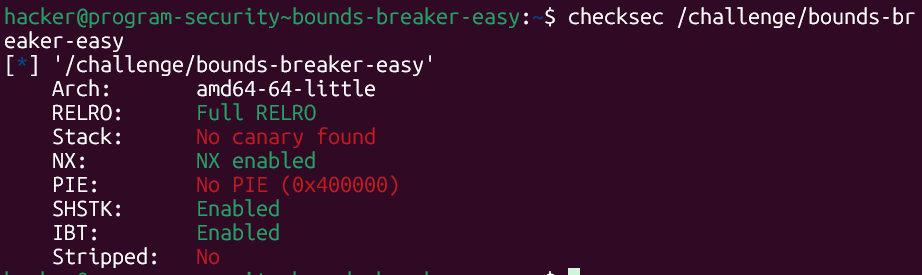
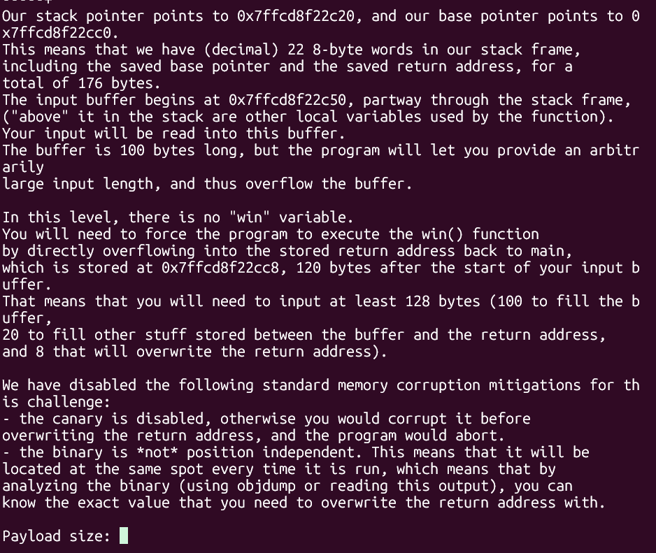
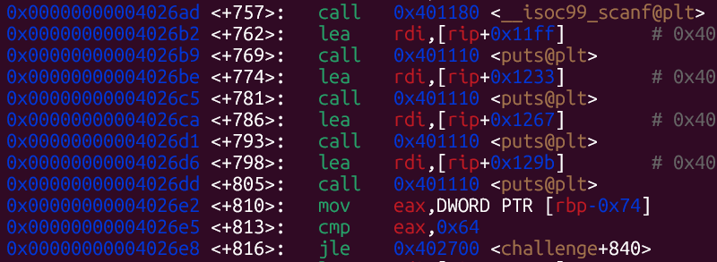
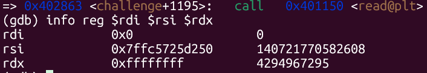
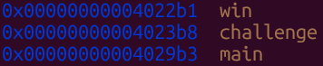
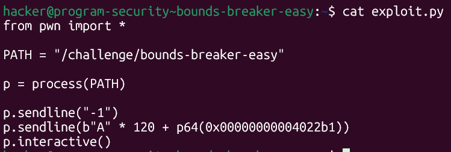
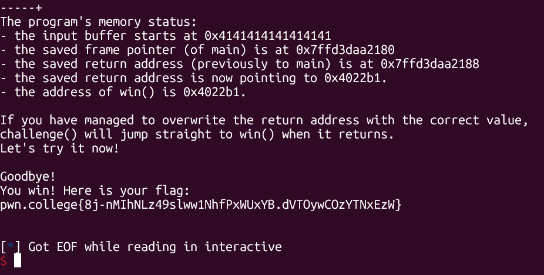

# pwn.college — Bounds Breaker Easy (Memory Corruption)
### Intro to Cybersecurity · Orange Belt · Binary Exploitation

> **Autor:** Pedro Tuttman  
> **Plataforma:** [pwn.college](https://pwn.college)  
> **Categoria:** Binary Exploitation — Memory Corruption  
> **Técnicas:** Signed/unsigned integer confusion · `jle` signed comparison bypass · `read` unsigned size exploit · ret2win · Return address overwrite · Stack layout analysis

---

## Descrição do Desafio

O desafio `bounds-breaker-easy` é um ret2win com uma restrição: o binário tenta limitar o número de bytes do payload a 100. A vulnerabilidade está justamente na forma como essa limitação é implementada — uma confusão entre inteiros com sinal (signed) e sem sinal (unsigned) permite contorná-la completamente.

As proteções do binário:



- **Sem PIE** — os endereços do binário são fixos em todas as execuções. O endereço de `win` é sempre o mesmo: `0x4022b1`
- **Sem canary** — é possível sobrescrever o return address sem detecção
- **NX habilitado** — a stack não é executável, mas como é um ret2win, isso não importa

---

## Reconhecimento Inicial

Ao rodar o binário, ele imprime o layout completo do stack frame da função `challenge()`:



Informações reveladas pelo binário:

- Buffer começa em `0x7ffcd8f22c50`
- Return address em `0x7ffcd8f22cc8` — **120 bytes após o início do buffer**
- Buffer tem 100 bytes, mais 20 bytes de outras variáveis locais até o return address
- O binário não tem PIE — o endereço de `win` é fixo e pode ser descoberto com `objdump` ou GDB
- O binário informa: você precisa de pelo menos 128 bytes (100 + 20 + 8) para sobrescrever o return address

O problema: o binário pede o tamanho do payload antes de ler o payload em si, e em teoria limita o input a 100 bytes.

---

## A Vulnerabilidade — Confusão Signed/Unsigned

### Como o binário limita o tamanho

Analisando o disassembly da função `challenge` no GDB:



```asm
call  __isoc99_scanf@plt    ; lê o tamanho do payload (inteiro)
...
mov   eax, DWORD PTR [rbp-0x74]   ; carrega o valor digitado em eax
cmp   eax, 0x64                   ; compara com 100 (0x64)
jle   challenge+840               ; se <= 100, pula o exit e continua
```

O `cmp` compara `eax` com `0x64` (100), e o `jle` (**Jump if Less or Equal**) só deixa o programa continuar se o valor for menor ou igual a 100. Caso contrário, o programa chama `exit`.

### O ponto crítico: `jle` é signed

A instrução `jle` interpreta os operandos como **inteiros com sinal (signed)**. Em aritmética com sinal de 32 bits, o intervalo válido é de `-2.147.483.648` a `2.147.483.647`. Qualquer número negativo é menor que 100 — portanto, **enviar um número negativo passa na verificação do `jle` sem problemas**.

Por exemplo, enviando `-1`:
```
-1 <= 100 → condição verdadeira → jle pula o exit → programa continua
```

### Por que isso permite enviar bytes ilimitados

Depois que o `jle` deixa o programa continuar, o valor digitado é usado como argumento `rdx` para o `read` — que define quantos bytes serão lidos do payload:



```
rdi = 0x0              → stdin
rsi = 0x7ffc5725d250   → endereço do buffer
rdx = 0xffffffff       → 4.294.967.295 bytes!
```

O `read` interpreta `rdx` como **unsigned (sem sinal)**. O valor `-1` em complemento de dois de 32 bits é `0xffffffff` = **4.294.967.295**. O `read` então aceita até ~4GB de input — efetivamente ilimitado.

### Por que números negativos são representados assim?

Em sistemas de 64 bits, inteiros negativos são representados em **complemento de dois**: para obter `-1`, inverte-se todos os bits de `1` (`0x00000001`) e soma-se 1, resultando em `0xffffffff` (32 bits) ou `0xffffffffffffffff` (64 bits). Esse mesmo padrão de bits, quando interpretado como unsigned, representa o maior valor possível do tipo.

Essa é a confusão clássica **signed/unsigned**: o mesmo valor de bits (`0xffffffff`) significa `-1` para código que usa `jle` (signed) e `4.294.967.295` para o `read` (unsigned).

---

## Descobrindo o Endereço de `win`

Como o binário não tem PIE, o endereço de `win` é fixo. O GDB confirma:



```
win     → 0x00000000004022b1
```

Como não há PIE, esse endereço é o mesmo em todas as execuções — pode ser escrito diretamente no exploit sem precisar de leak.

---

## Montando o Exploit

Com todas as informações em mãos:

- **Offset até o return address:** 120 bytes (informado pelo próprio binário)
- **Endereço de `win`:** `0x4022b1` (fixo, sem PIE)
- **Bypass do limite:** enviar `-1` como tamanho do payload

O payload é:

```
[ 120 bytes de padding ] + [ endereço de win em little-endian ]
```

Quando `challenge()` executa `ret`, em vez de retornar para `main`, o processador carrega `0x4022b1` no `rip` e salta direto para `win`.



```python
from pwn import *

PATH = "/challenge/bounds-breaker-easy"

p = process(PATH)

p.sendline("-1")
p.sendline(b"A" * 120 + p64(0x00000000004022b1))
p.interactive()
```

---

## Resultado Final



```
the saved return address is now pointing to 0x4022b1.
challenge() will jump straight to win() when it returns.

You win! Here is your flag:
pwn.college{8j-nMIhNLz49slww1NhfPxWUxYB.dVTOywCOzYTNxEzW}
```

---

## Resumo do Fluxo de Exploração

```
1. checksec → sem PIE, sem canary → endereço de win fixo, overflow sem detecção
2. Binário imprime stack → offset buffer→RA = 120 bytes
3. disas challenge → cmp eax, 0x64 + jle → limitação de 100 bytes
4. jle é signed → enviar -1 passa na verificação (-1 < 100)
5. read recebe rdx = 0xffffffff (unsigned) → aceita payload ilimitado
6. Padding de 120 As + p64(0x4022b1) → sobrescreve RA com endereço de win
7. challenge() retorna → rip = 0x4022b1 → win executa → flag obtida
```

---

## A Vulnerabilidade em Detalhe

| Instrução | Interpretação | Valor de `-1` |
|---|---|---|
| `cmp` + `jle` | Signed (com sinal) | `-1` → menor que 100 ✅ passa |
| `read` (argumento `rdx`) | Unsigned (sem sinal) | `0xffffffff` → ~4GB de leitura ✅ |

A raiz do problema é usar `jle` (signed) para validar um valor que depois é passado para `read` (unsigned). Qualquer número negativo passa na verificação signed mas se torna um valor enorme quando interpretado como unsigned.
