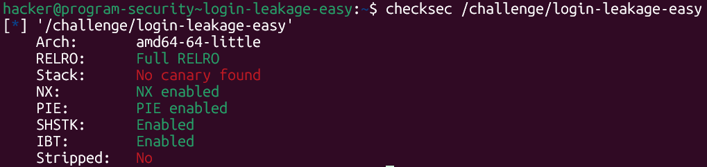
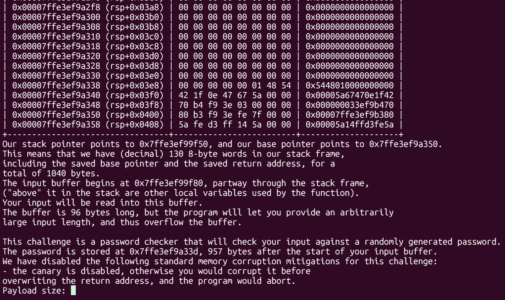
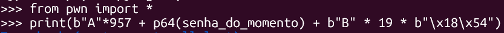
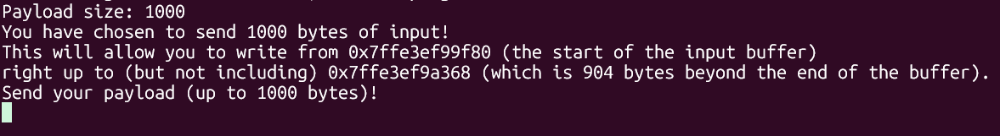
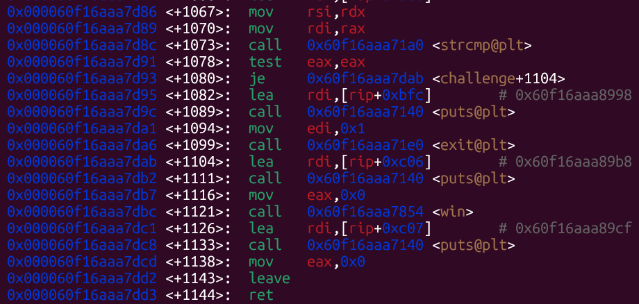
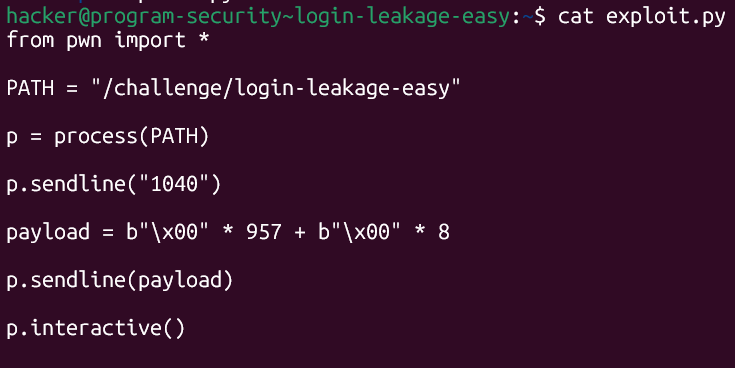
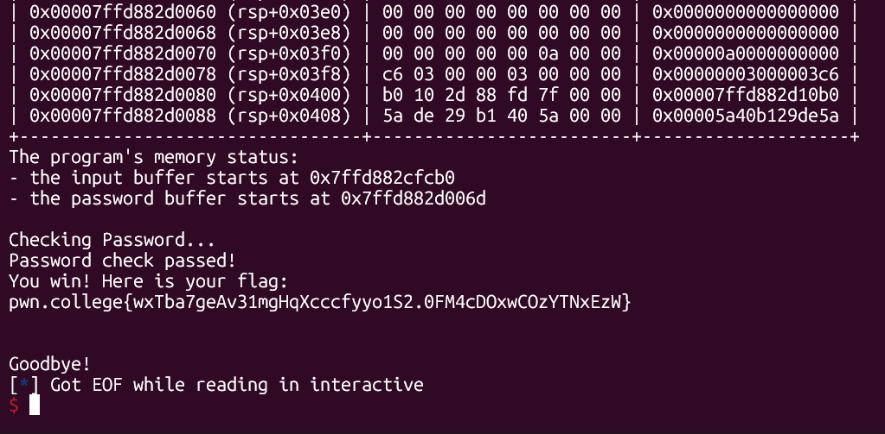

# pwn.college — Login Leakage Easy (Memory Corruption)
### Intro to Cybersecurity · Orange Belt · Binary Exploitation

> **Autor:** Pedro Tuttman  
> **Plataforma:** [pwn.college](https://pwn.college)  
> **Categoria:** Binary Exploitation — Memory Corruption  
> **Técnicas:** Stack layout analysis · `strcmp` null-byte bypass · Buffer overflow to overwrite password · PIE-aware return address partial overwrite · GDB disassembly analysis · pwntools exploit scripting

---

## Descrição do Desafio

O binário simula um sistema de login com uma senha gerada aleatoriamente a cada execução. O programa imprime o layout completo da stack, incluindo os endereços de todas as variáveis, e pede um input que será comparado com a senha via `strcmp`. O objetivo é bypassar essa verificação e chegar à função `win`.

As proteções do binário:



- **PIE habilitado** — os endereços do binário são aleatorizados a cada execução
- **Sem canary** — é possível sobrescrever o return address sem detecção
- **NX habilitado** — a stack não é executável

---

## Reconhecimento Inicial

Ao rodar o binário, ele imprime o stack frame completo da função `challenge()`, revelando:

- O endereço do buffer de input
- O endereço da senha gerada aleatoriamente
- A distância entre os dois: **957 bytes**
- O tamanho do stack frame: **1040 bytes** (130 palavras de 8 bytes)



A senha está armazenada **957 bytes após o início do buffer de input**. O binário deixa claro que é possível fazer overflow — ele aceita um input arbitrariamente grande.

A ideia inicial foi direta: reescrever a senha com seu valor exato para passar na verificação do `strcmp`, e depois sobrescrever o return address com o endereço de `win`.

---

## Primeira Abordagem — Colar o Payload Manualmente (Falhou)

A primeira tentativa foi simples: ler o valor da senha impresso na stack, montar o payload em outro terminal e colar no input do binário que estava rodando.



```python
print(b"A"*957 + p64(senha_do_momento) + b"B" * 19 * b"\x18\x54")
```



Os últimos 2 bytes do payload eram `\x18\x54` — o offset da função `win` dentro do binário. Com PIE habilitado, os endereços base mudam a cada execução, mas os **2 bytes menos significativos do return address permanecem fixos** entre execuções do mesmo binário — apenas a base muda. Sobrescrever apenas esses 2 bytes é suficiente para redirecionar a execução para `win` sem precisar conhecer o endereço completo.

Essa abordagem **não funcionou**. O motivo: ao colar o payload no terminal, o `stdin` interpreta tudo como texto. Os bytes não-ASCII que deveriam ser enviados como valores brutos (como `\x18\x54`) eram interpretados como os caracteres ASCII de cada dígito — o que chegava à stack era o valor hexadecimal do código ASCII de cada caractere, não os bytes em si.

---

## Analisando o Binário com GDB

Com dificuldades para enviar a senha dinamicamente, fui analisar a função `challenge` no GDB para entender melhor o fluxo:

```bash
gdb /challenge/login-leakage-easy
disas challenge
```



Duas descobertas importantes:

**1. O programa já chama `win` diretamente** — caso o `strcmp` retorne 0 (strings iguais), o fluxo cai em `challenge+1104` que chama `win`. Não é necessário fazer um ret2win — basta passar na verificação da senha.

**2. O `strcmp` compara strings, não bytes.** Uma string em C é definida como uma sequência de caracteres terminada por um **null byte (`\x00`)**. O `strcmp` compara os dois argumentos byte a byte e para assim que encontra um null byte em qualquer um dos lados — ou quando encontra uma diferença. Isso significa que se o input começar com `\x00`, o `strcmp` considera a string como vazia e retorna 0 imediatamente, independente do valor real da senha.

Analisando os argumentos do `strcmp` (`rdi` e `rsi`), confirmei que `rdi` apontava para `rbp-0x3d0` — exatamente o início do buffer de input. O programa comparava **todo o input** com a senha armazenada na stack.

---

## A Solução — Zerar Tudo até a Senha

Com esse entendimento, a solução ficou clara: enviar **957 bytes nulos** para preencher o espaço até a senha, seguidos de **8 bytes nulos** para sobrescrever a própria senha com zeros.

Quando o `strcmp` for executado:
- O input começa com `\x00` → string vazia
- A senha foi sobrescrita com `\x00` → string vazia
- `strcmp("", "")` retorna 0 → verificação passa
- O programa chama `win` por conta própria



```python
from pwn import *

PATH = "/challenge/login-leakage-easy"

p = process(PATH)

p.sendline("1040")

payload = b"\x00" * 957 + b"\x00" * 8

p.sendline(payload)

p.interactive()
```

> **Por que 1040 como tamanho?** O stack frame tem 1040 bytes — enviar esse valor garante que o binário aceite o payload completo sem truncar.

---

## Resultado Final



```
Password check passed!
You win! Here is your flag:
pwn.college{wxTba7geAv31mgHqXcccfyyo1S2.0FM4cDOxwCOzYTNxEzW}
```

---

## Resumo do Fluxo de Exploração

```
1. Binário imprime a stack → senha 957 bytes após o buffer, stack frame de 1040 bytes
2. Primeira abordagem: colar payload com senha exata → falha (stdin interpreta como texto)
3. GDB revela: strcmp compara input com senha, win já é chamado se strcmp retorna 0
4. strcmp para no primeiro null byte → enviar \x00 como input bypassa a verificação
5. 957 null bytes preenchem até a senha + 8 null bytes sobrescrevem a senha
6. strcmp("", "") = 0 → verificação passa → programa chama win → flag obtida
```

---

## Comparação de Abordagens

| Abordagem | Resultado | Motivo |
|---|---|---|
| Colar senha exata via terminal | ❌ | stdin interpreta bytes como texto ASCII |
| Enviar senha exata via pwntools | ❌ | Senha muda a cada execução do processo |
| Enviar `\x00` * 957 + `\x00` * 8 | ✅ | `strcmp` para no null byte — bypassa verificação |
