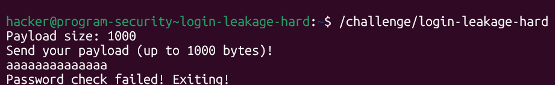
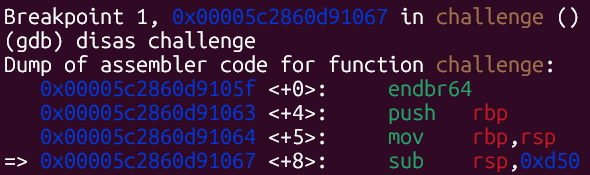
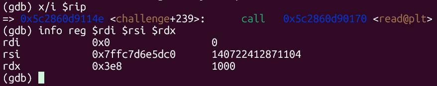
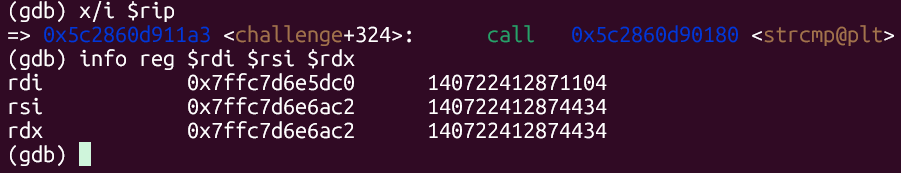
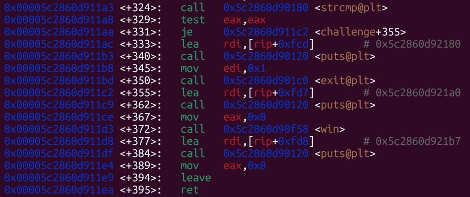
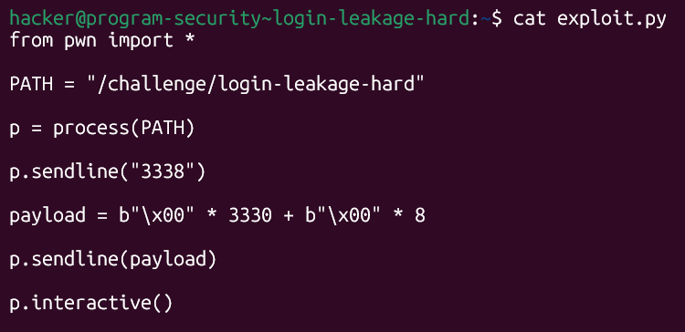
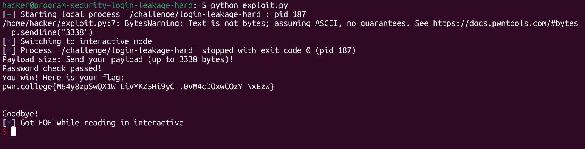

# pwn.college — Login Leakage Hard (Memory Corruption)
### Intro to Cybersecurity · Orange Belt · Binary Exploitation

> **Autor:** Pedro Tuttman  
> **Plataforma:** [pwn.college](https://pwn.college)  
> **Categoria:** Binary Exploitation — Memory Corruption  
> **Técnicas:** GDB dynamic analysis · `strcmp` null-byte bypass · Buffer overflow to overwrite password · PIE offset discovery via GDB · pwntools exploit scripting

---

## Descrição do Desafio

O desafio `login-leakage-hard` é a versão difícil do [login-leakage-easy](login-leakage-easy.md). A mecânica é a mesma — um verificador de senha com buffer overflow — mas desta vez o binário **não imprime o layout da stack**. Toda a informação necessária (endereço do buffer, endereço da senha, tamanho do stack frame) precisa ser descoberta via GDB.



O binário pede apenas o tamanho do payload e o payload em si, sem revelar nenhuma informação sobre a memória.

---

## Por que não dá para adivinhar a senha

Antes de partir para o GDB, é importante entender por que não é possível simplesmente tentar descobrir o valor da senha de outra forma.

O binário tem **PIE habilitado** (Position Independent Executable). Com PIE, o sistema operacional carrega o binário em um endereço base aleatório a cada execução — isso é parte do mecanismo de segurança chamado ASLR (Address Space Layout Randomization). Como consequência:

- Os endereços de todas as variáveis, funções e da stack mudam a cada execução
- A senha é gerada aleatoriamente pelo binário em tempo de execução
- Não há como saber o valor da senha antes de rodar o processo

A única forma de resolver o desafio é **entender o layout da memória via GDB** e explorar o comportamento do `strcmp` — exatamente como foi feito no desafio fácil.

---

## Analisando o Binário com GDB

### Passo 1 — Tamanho do stack frame

Com o GDB, coloquei um breakpoint no início da função `challenge` e executei `disas challenge` para ver o tamanho do stack frame alocado:



```asm
challenge+8: sub rsp, 0xd50
```

O stack frame tem **`0xd50` = 3408 bytes**.

### Passo 2 — Endereço do buffer e tamanho de leitura

Coloquei um breakpoint antes da chamada ao `read` e inspecionei os registradores:



```
rdi = 0x0                    → fd = stdin
rsi = 0x7ffc7d6e5dc0         → endereço do início do buffer
rdx = 0x3e8                  → 1000 bytes de leitura
```

O `read` lê do `stdin` para o buffer em `rsi`, com limite de 1000 bytes. O tamanho do payload é pedido anteriormente via `__isoc99_scanf` — uma variante do `scanf` da glibc.

### Passo 3 — Endereço da senha via `strcmp`

Coloquei um breakpoint antes da chamada ao `strcmp` e inspecionei os registradores:



```
rdi = 0x7ffc7d6e5dc0         → endereço do buffer (o input do usuário)
rsi = 0x7ffc7d6e6ac2         → endereço da senha
```

O `strcmp` compara duas strings byte a byte até encontrar um null byte ou uma diferença entre os caracteres. Em C, uma string é definida como uma sequência de bytes terminada por `\x00` (null byte) — o `strcmp` não sabe o tamanho das strings de antemão, ele simplesmente avança até encontrar esse terminador.

Sabendo os dois endereços, calcula-se o offset da senha a partir do início do buffer:

```
0x7ffc7d6e6ac2 - 0x7ffc7d6e5dc0 = 0xD02 = 3330 bytes
```

### Passo 4 — Confirmar que `win` é chamada automaticamente

Olhando o disassembly da função `challenge` após o `strcmp`:



```asm
call  strcmp@plt
test  eax, eax
je    challenge+355          → se strcmp == 0, salta para...
...
challenge+355: ...
call  win                    → o próprio binário chama win!
```

Assim como no desafio fácil, **não é necessário fazer ret2win**. O próprio binário chama `win` se o `strcmp` retornar 0. Basta passar na verificação da senha.

---

## A Solução — Zerar Tudo até a Senha

A lógica é idêntica ao desafio anterior: enviar null bytes suficientes para cobrir o espaço até a senha e sobrescrever a própria senha com zeros.

Quando o `strcmp` for executado:
- O input começa com `\x00` → string vazia do ponto de vista do `strcmp`
- A senha foi sobrescrita com `\x00` → string vazia
- `strcmp("", "")` retorna 0 → verificação passa
- O binário chama `win` automaticamente

**Por que vários zeros funcionam?** O `strcmp` lê o primeiro argumento (`rdi` = buffer) byte a byte. No primeiro byte, encontra `\x00` e considera a string terminada. Faz o mesmo com o segundo argumento (`rsi` = senha), que também foi sobrescrito com `\x00`. Como ambas as strings são "vazias", retorna 0 — igual.

O tamanho do payload enviado ao `scanf` precisa ser grande o suficiente para cobrir os 3330 bytes até a senha mais os 8 bytes da própria senha: `3330 + 8 = 3338 bytes`.

---

## O Exploit Final



```python
from pwn import *

PATH = "/challenge/login-leakage-hard"

p = process(PATH)

p.sendline("3338")

payload = b"\x00" * 3330 + b"\x00" * 8

p.sendline(payload)

p.interactive()
```

---

## Resultado Final



```
Password check passed!
You win! Here is your flag:
pwn.college{M64y8zpSwQX1W-LiVYKZ5Hi9yC-.0VM4cDOxwCOzYTNxEzW}
```

---

## Resumo do Fluxo de Exploração

```
1. Binário hard não imprime a stack → toda análise via GDB
2. disas challenge → sub rsp, 0xd50 → stack frame de 3408 bytes
3. Breakpoint antes do read → rsi = endereço do buffer, rdx = 1000
4. Breakpoint antes do strcmp → rdi = buffer, rsi = senha
5. Offset senha - buffer = 0xD02 = 3330 bytes
6. disas challenge → win é chamada diretamente se strcmp == 0
7. 3330 null bytes + 8 null bytes → strcmp("","") = 0 → win → flag
```

---

## Comparação entre Easy e Hard

| | login-leakage-easy | login-leakage-hard |
|---|---|---|
| Stack impressa pelo binário | ✅ Sim | ❌ Não |
| Endereço do buffer | Lido do output | GDB → registradores do `read` |
| Endereço da senha | Lido do output | GDB → registradores do `strcmp` |
| Offset senha→buffer | 957 bytes | 3330 bytes |
| Tamanho do payload | 957 + 8 = 965 | 3330 + 8 = 3338 |
| Técnica de bypass | `\x00` × 965 | `\x00` × 3338 |
| `win` chamada diretamente | ✅ | ✅ |
