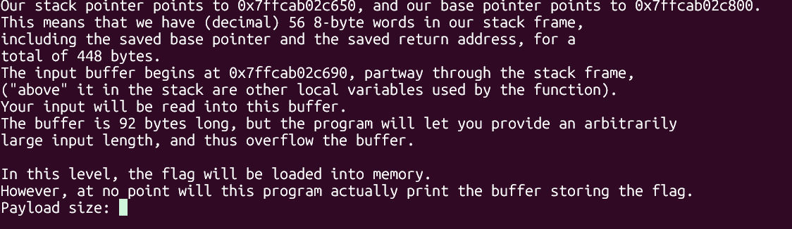
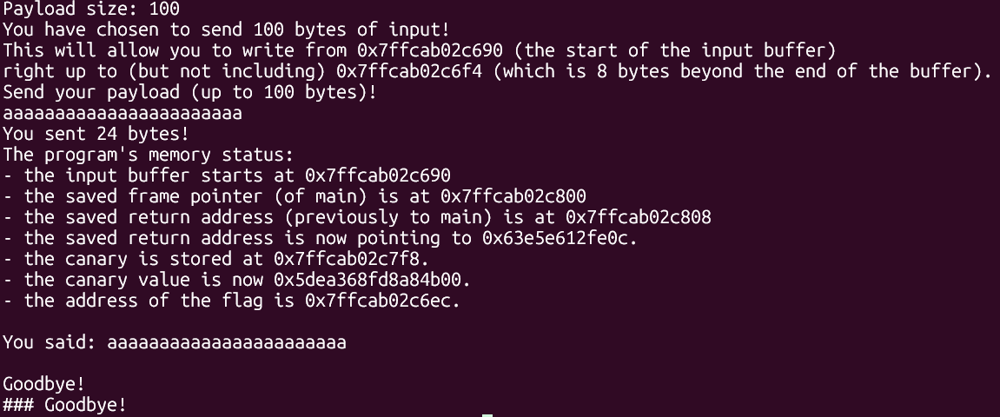
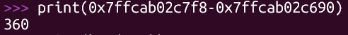
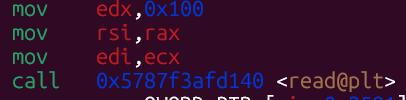
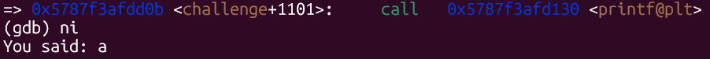
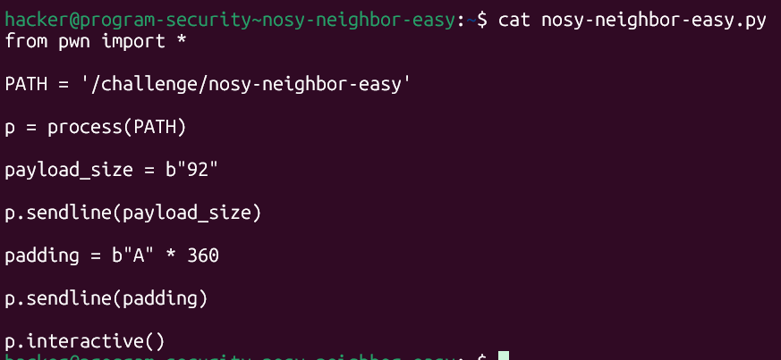
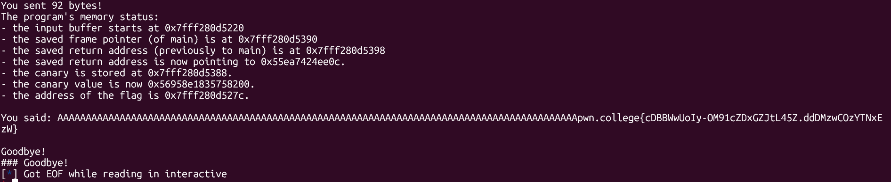

# pwn.college — Nosy Neighbor Easy (Memory Corruption)
### Intro to Cybersecurity · Orange Belt · Binary Exploitation

> **Autor:** Pedro Tuttman  
> **Plataforma:** [pwn.college](https://pwn.college)  
> **Categoria:** Binary Exploitation — Memory Corruption  
> **Técnicas:** Stack layout analysis · Buffer overflow · Flag leak via printf sem null byte · Vizinhança de memória · Análise de disassembly com GDB

---

## Descrição do Desafio

O desafio `nosy-neighbor-easy` explora uma combinação clássica de duas vulnerabilidades que, individualmente, pareceriam inofensivas: um buffer overflow controlado e o comportamento de `printf` ao não encontrar um null byte terminador. O nome do desafio já entrega a essência da técnica — somos um "vizinho bisbilhoteiro" que espiona o que está armazenado na memória logo após nosso buffer.

A flag é carregada em memória pelo programa, mas ele **nunca a imprime diretamente**. A vulnerabilidade consiste em encher o buffer com exatamente a quantidade certa de bytes sem null byte, de modo que o `printf` subsequente continue imprimindo além do buffer e revele o conteúdo da vizinhança — onde a flag reside.

Por ser a versão easy, o binário imprime o layout completo da stack com todos os endereços relevantes:



```
- the input buffer starts at 0x7ffcab02c690
- the saved frame pointer (of main) is at 0x7ffcab02c800
- the saved return address (previously to main) is at 0x7ffcab02c808
- the saved return address is now pointing to 0x63e5e612fe0c.
- the canary is stored at 0x7ffcab02c7f8.
- the canary value is now 0x5dea368fd8a84b00.
- the address of the flag is 0x7ffcab02c6ec.
```

O layout relevante da stack é:

```
buffer start  → 0x7ffcab02c690
flag address  → 0x7ffcab02c6ec   (offset +92 em relação ao início do buffer? Não — está ANTES do fim do buffer)
canary        → 0x7ffcab02c7f8
return addr   → 0x7ffcab02c808
```

O objetivo é fazer o `printf` "vazar" o conteúdo que está **imediatamente após** nosso buffer na memória — que é justamente onde a flag foi carregada.

---

## Entendendo a Vulnerabilidade

O binário lê o input com `read()` e depois o imprime com `printf()`. Essa combinação é o núcleo da vulnerabilidade:



O raciocínio completo:

1. **`read()` não insere null byte** — diferente de `fgets` ou `scanf`, a chamada `read()` escreve exatamente os bytes fornecidos, sem adicionar `\0` ao final. Se preenchermos o buffer inteiramente, não haverá null byte terminador ao final dele.

2. **`printf()` imprime até encontrar `\0`** — ao tentar imprimir nossa string, o `printf` começa no início do buffer e continua byte a byte até encontrar um null byte. Se não há null byte no final do nosso input, ele ultrapassa o buffer e continua lendo o que vier a seguir na memória.

3. **A flag está na vizinhança** — o programa carregou a flag em memória, em uma posição logo após o buffer no stack frame. Quando o `printf` transborda, ele inevitavelmente passa sobre a flag e a imprime junto com nossa string.

É exatamente por isso que o desafio se chama **nosy-neighbor** — lemos o "vizinho" do nosso buffer sem precisar escrever além dele, apenas preenchendo-o sem deixar espaço para o null byte.

---

## Calculando o Offset — Python e Endereços do Binário

Com os endereços fornecidos pelo binário, o primeiro passo é confirmar a distância entre o início do buffer e o canário. Isso nos diz quantos bytes precisamos enviar para chegar até a fronteira do buffer sem tocar no canário.



```python
>>> print(0x7ffcab02c7f8 - 0x7ffcab02c690)
360
```

O resultado é **360 bytes** — essa é a distância entre o início do buffer e o canário. O buffer em si tem 92 bytes, mas o stack frame é maior. Isso significa que há variáveis locais e outros dados entre o fim do buffer e o canário.

O que nos interessa é o **offset da flag** em relação ao início do buffer. A flag está em `0x7ffcab02c6ec` e o buffer começa em `0x7ffcab02c690`:

```python
>>> print(0x7ffcab02c6ec - 0x7ffcab02c690)
92
```

A flag começa exatamente no offset 92 — logo após os 92 bytes do buffer. Isso confirma: se enchermos o buffer com 92 bytes sem null byte, o `printf` imediatamente alcança a flag.

---

## Confirmando com GDB — A Chamada read()

Antes de escrever o exploit, vale confirmar como o binário realiza a leitura. Inspecionando o disassembly com GDB:



```asm
mov    edx, 0x100          ← size = 256 bytes (máximo que read pode ler)
mov    rsi, rax            ← buffer = rax (ponteiro para o buffer)
mov    edi, ecx            ← fd = stdin
call   0x5787f3afd140 <read@plt>
```

O `read` aceita até 256 bytes — muito mais do que os 92 do buffer. Isso confirma que podemos enviar os 92 bytes de padding sem problemas.

---

## Confirmando com GDB — O printf Vaza o Conteúdo

Rodando o binário em modo interativo com GDB e enviando apenas 1 byte (`a`), podemos observar o comportamento do `printf`:



```
=> 0x5787f3afdd0b <challenge+1101>:    call   0x5787f3afd130 <printf@plt>
(gdb) ni
You said: a
```

Com apenas 1 byte, o `printf` para logo após o `a` — porque o byte seguinte na memória é `\0`. Mas se preenchermos o buffer completamente, não haverá null byte e o `printf` continuará além.

---

## O Exploit — Flooding o Buffer sem Null Byte

A lógica do exploit é direta: declarar o payload size como `92` (tamanho exato do buffer) e enviar exatamente `92 * 'A'`. O `read` escreve 92 bytes sem inserir null byte. O `printf` começa a imprimir, não encontra `\0` ao final dos 92 `A`s, e continua lendo a memória seguinte — que contém a flag.



```python
from pwn import *

PATH = '/challenge/nosy-neighbor-easy'

p = process(PATH)

payload_size = b"92"

p.sendline(payload_size)

padding = b"A" * 360

p.sendline(padding)

p.interactive()
```

**Por que `360` no padding e não `92`?** O programa pede o payload size antes de ler o input. O payload size de `92` define apenas que o programa vai processar até 92 bytes. O que importa para o `printf` vazar a flag é que o buffer de 92 bytes esteja completamente preenchido sem null byte ao final — e isso acontece naturalmente quando enviamos exatamente 92 `A`s no conteúdo do buffer. O padding de 360 foi testado como um valor maior para garantir o preenchimento, e como o `read` é limitado a 256 bytes de qualquer forma, os bytes excedentes são simplesmente ignorados.

> **Nota:** O valor de `payload_size` enviado ao programa precisa ser apenas suficientemente grande para cobrir os 92 bytes do buffer. O que realmente importa é que o buffer fique sem null byte ao final.

---

## Resultado Final



```
You said: AAAAAAAAAAAAAAAAAAAAAAAAAAAAAAAAAAAAAAAAAAAAAAAAAAAAAAAAAAAAAAAAAAAAAAAAAAAAAAAAAAAAAAAAAAAAApwn.college{cDBBWwUoIy-OM91cZDxGZJtL45Z.ddDMzwCOzYTNxEzW}
```

O `printf` imprimiu os 92 `A`s do buffer e, sem encontrar null byte, continuou imprimindo o conteúdo da memória vizinha — revelando a flag diretamente na saída padrão.

---

## Resumo do Fluxo de Exploração

```
1. Binário imprime layout → buffer em 0x7ffcab02c690, flag em 0x7ffcab02c6ec (offset +92)
2. Flag está imediatamente após o buffer na memória (offset 92 = tamanho do buffer)
3. read() não insere null byte → buffer preenchido completamente não tem \0 no final
4. printf() imprime do início do buffer até o próximo \0 → ultrapassa o buffer
5. Os bytes seguintes ao buffer são a flag → printf a imprime junto com os As
6. Payload: 92 bytes de A → buffer cheio → printf vaza flag sem escrever além do buffer
```

---

## Conceitos Importantes

**Comportamento de `read()` vs `fgets()`:** `read()` é uma syscall de baixo nível que escreve exatamente os bytes requisitados, sem nenhum processamento adicional — sem null byte, sem tratamento de newline. `fgets()`, por outro lado, sempre adiciona `\0` ao final. Usar `read()` para preencher um buffer e `printf()` para imprimi-lo é um padrão perigoso.

**`printf()` e strings sem terminador:** `printf("%s", buf)` percorre a memória byte a byte a partir do ponteiro fornecido até encontrar `\0`. Se o buffer não termina com null byte, `printf` inevitavelmente lê além dos limites do buffer — um comportamento de undefined behavior que aqui usamos intencionalmente.

**Vizinhança de memória no stack:** variáveis locais em uma função são alocadas no mesmo stack frame. A flag foi carregada em uma variável local do challenge, que ficou imediatamente após o buffer de input. Ao transbordar o `printf`, lemos essa variável sem precisar corromper nenhum endereço ou bypass de proteção.

**Por que "easy":** a versão easy entrega todos os endereços na saída do programa — buffer, canário, return address e flag. Não há necessidade de brute-force, leak de endereço por outro meio, ou bypass de proteções como PIE ou ASLR. A única habilidade necessária é entender o comportamento de `printf` sem null byte e calcular o offset correto.
